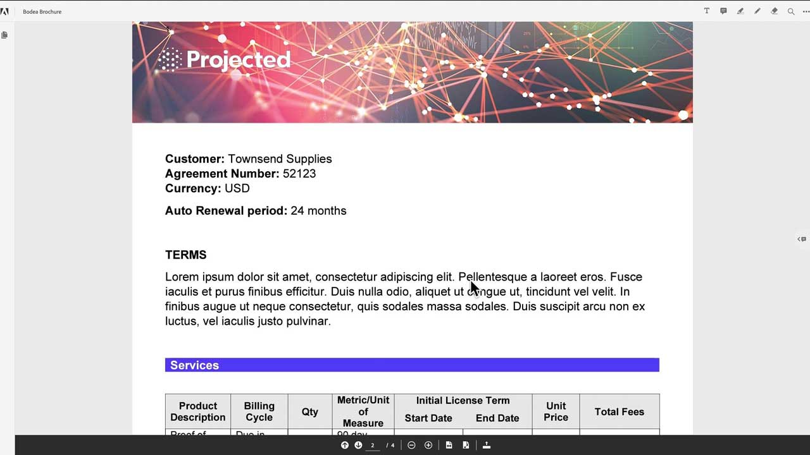
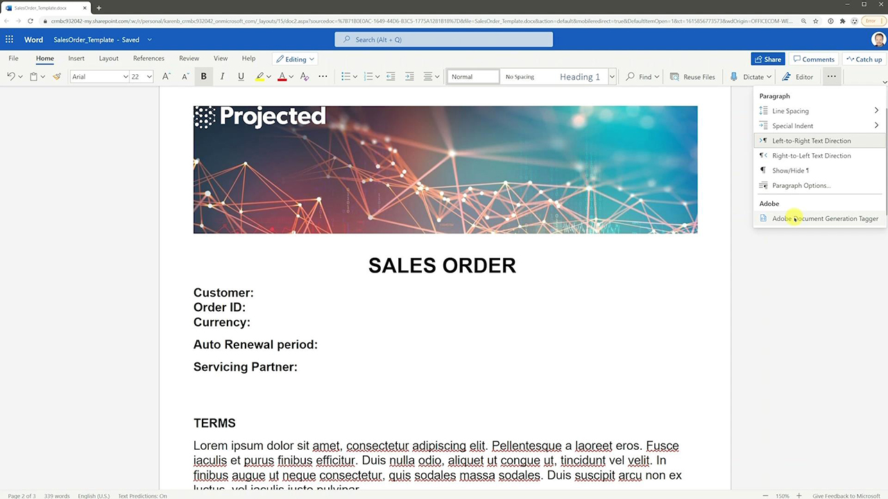
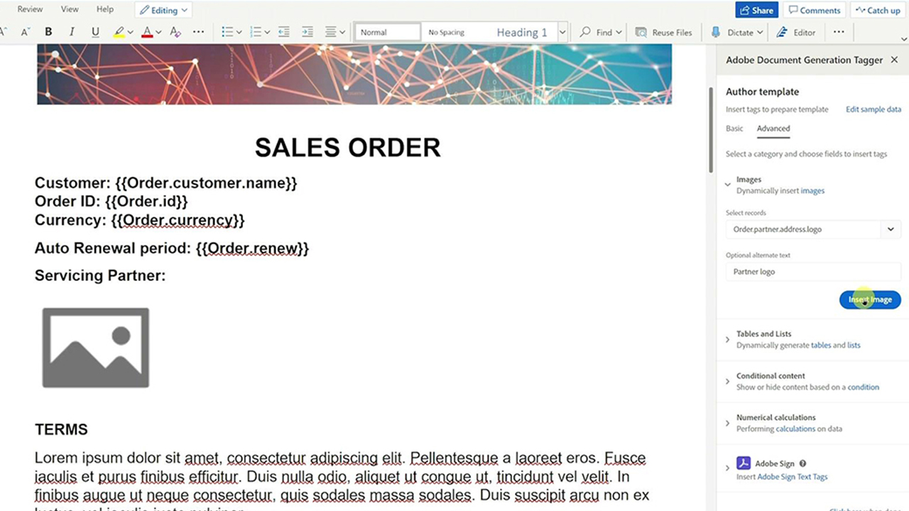
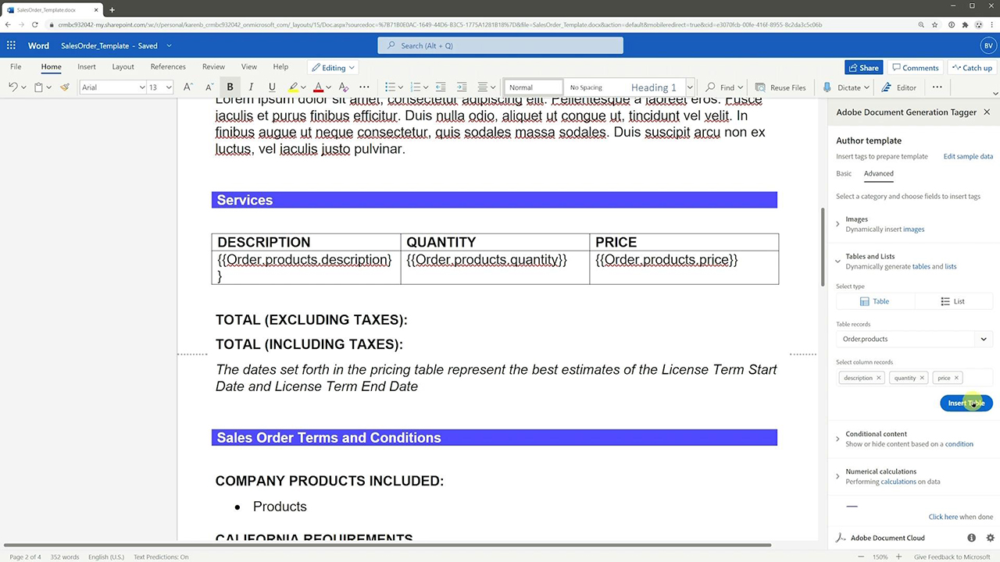
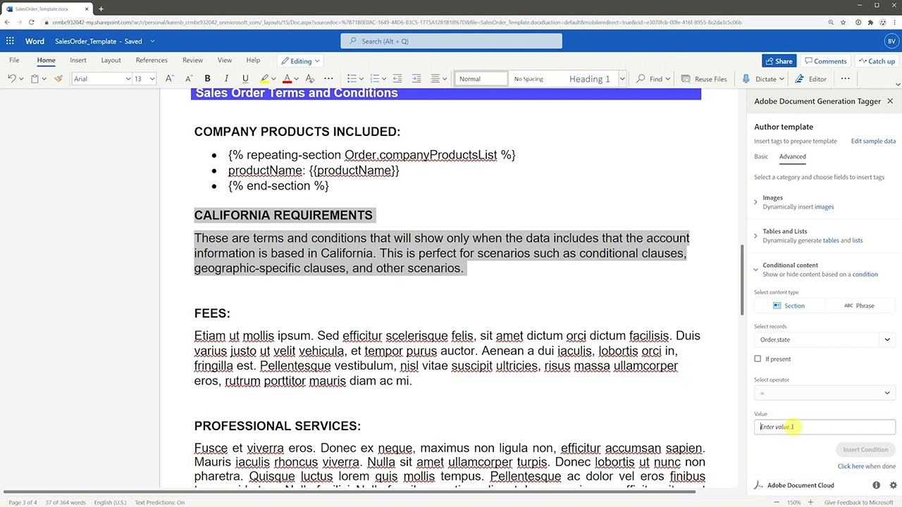

# Document Generation API Tutorials

Document Generation API accepts a document template (with template tags) along with the input data to generate the final document. The final document is generated by replacing all the template tags in the document template with the dynamic content based on the actual values corresponding to the data input.

## Creating templates

<table style="table-layout:fixed">
<tr>
 <td>
   
    

   <a href="taggeroverview.md"><strong>Overview of the Adobe Document Generation Tagger</strong></a>
    

    <em>Get an overview of the Adobe Document Generation Tagger that's designed for use with the Adobe Document Generation API</em>
     
  </td>
  <td>
   
    

   <a href="taggeraddtexttags.md"><strong>Adding text tags</strong></a>
    

    <em>Learn how to add text tags to Microsoft Word templates using Adobe Document Generation Tagger for use with Adobe Document Generation API</em>
     
  </td>
  <td>
   
    

   <a href="taggeraddimagetags.md"><strong>Adding image tags</strong></a>
    

    <em>Learn how to add image tags to Microsoft Word templates using Adobe Document Generation Tagger to dynamically push images into documents using Adobe Document Generation API</em>
     
  </td>
</tr>
<tr>
 <td>
   
    

   <a href="taggertables.md"><strong>Adding tables and list tags</strong></a>
    

    <em>Learn how to add tables and list tags to Microsoft Word templates using Adobe Document Generation Tagger to dynamically add table or list rows based on data using Adobe Document Generation API</em>
     
  </td>
  <td>
   
    

   <a href="taggercalculations.md"><strong>Setting numerical calculation tags</strong></a>
    

    <em>Learn how to set numerical calculation tags in Microsoft Word templates using Adobe Document Generation Tagger to calculate aggregations or arithmetic of data values using Adobe Document Generation API</em>
     
  </td>
  <td>
   
    

   <a href="taggerconditional.md"><strong>Setting conditional content</strong></a>
    

    <em>Learn how to set sections in Microsoft Word templates using Adobe Document Generation Tagger to dynamically include or exclude sections of a document based on data using Adobe Document Generation API</em>
     
  </td>
</tr>
</table>
