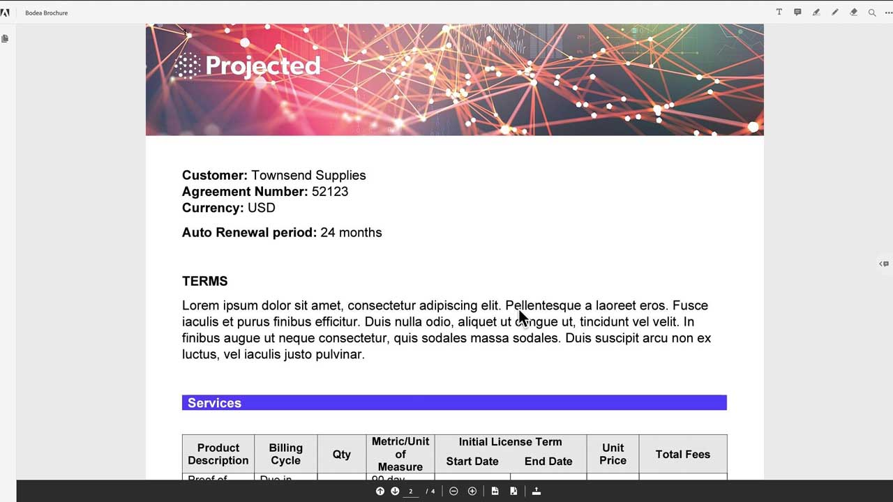
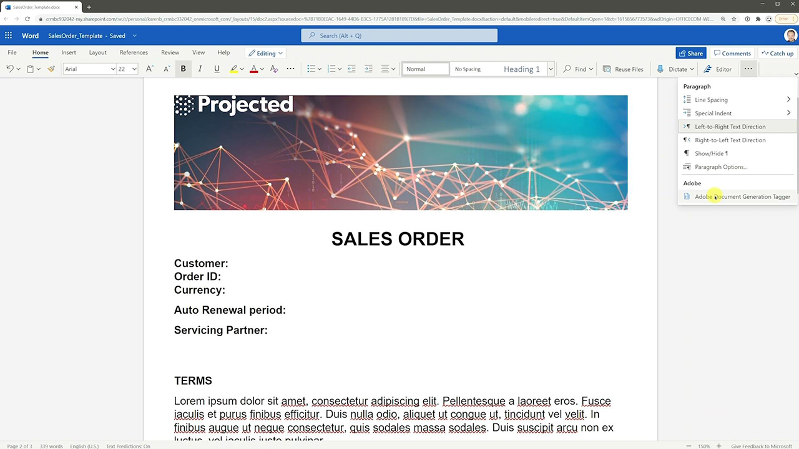
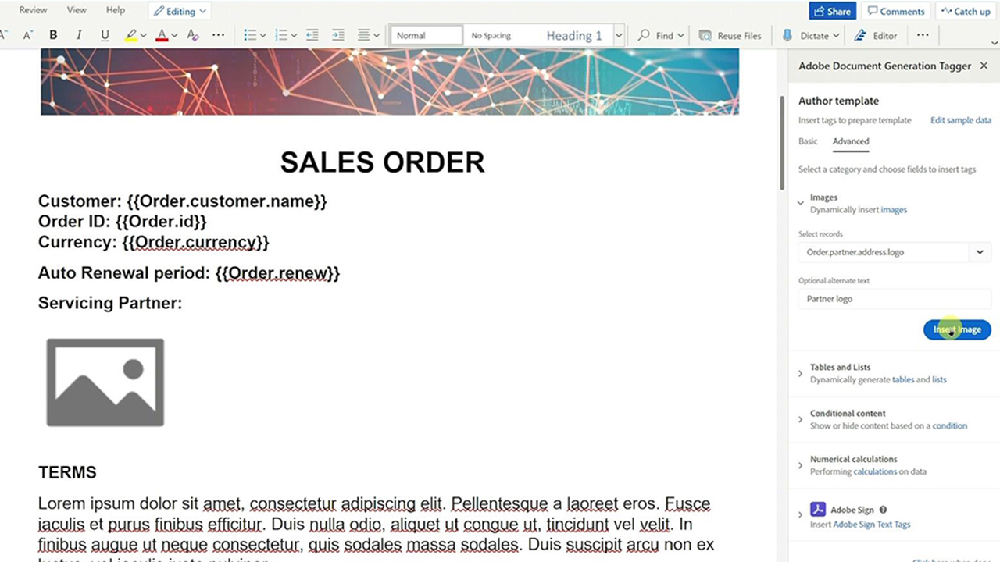
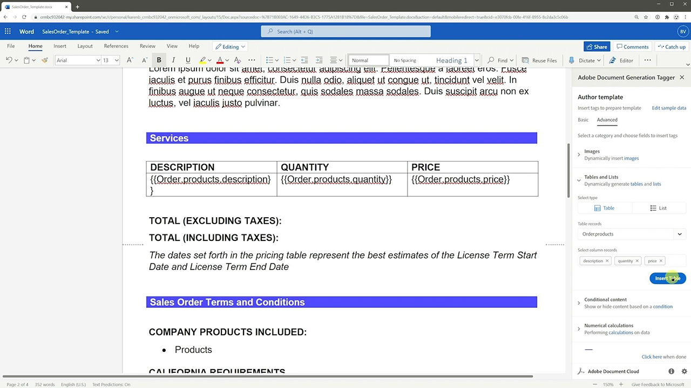
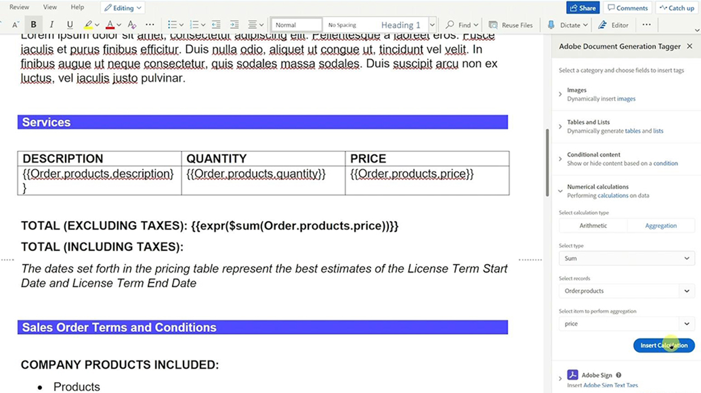
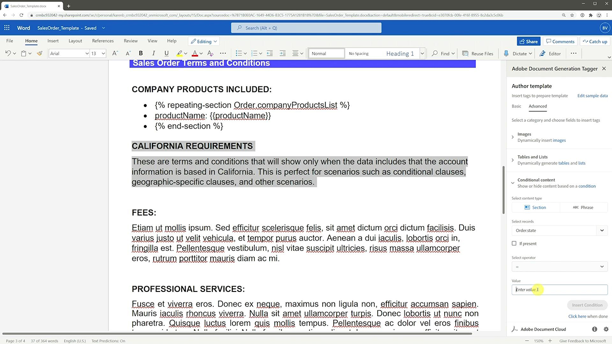
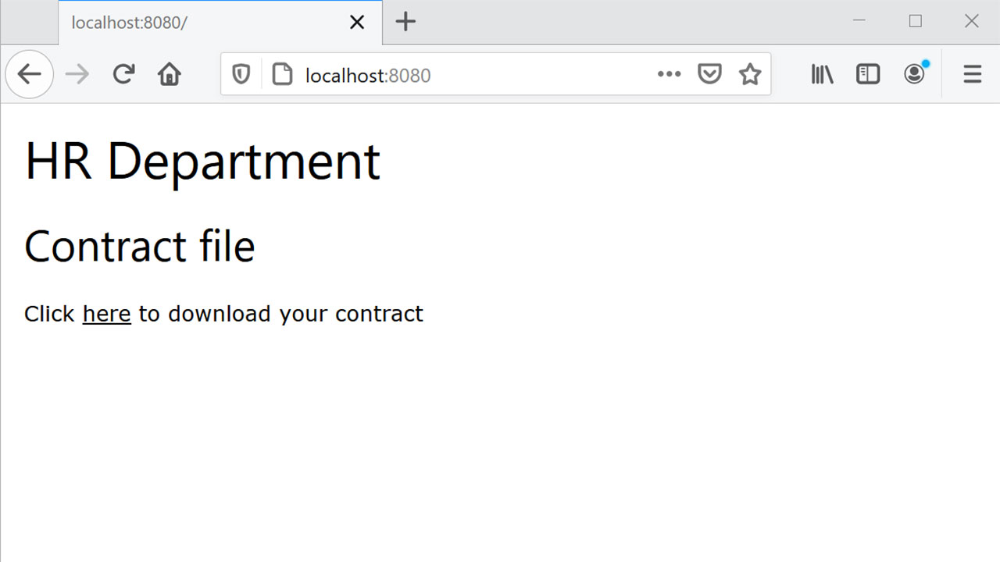
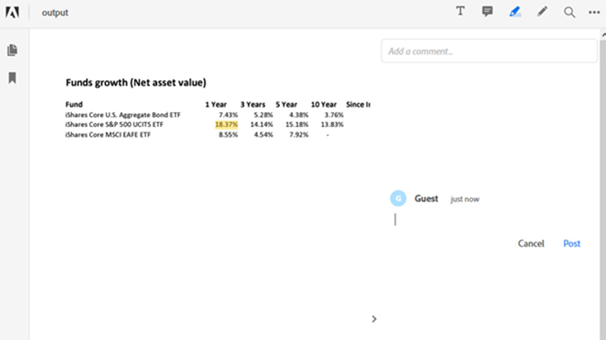

# Adobe Document Services tutorials

Adobe Document Services, an Adobe Document Cloud solution, offers three APIs: the Adobe PDF Tools API , the Adobe PDF Embed API and the Adobe Document Generation API. Whether you’re developing a web app or web site, these APIs automate the generation, manipulation, and transformation of PDF content via a set of modern cloud-based web services. These tutorials can help you get up-to-speed delivering simpler, faster, branded experiences with the Adobe Document Services APIs.

## PDF Services API

<table style="table-layout:fixed">
<tr>
 <td>
   
    

   <a href="pdfservices/createpdffromhtml.md"><strong>Create a PDF from HTML or MS Office in a few minutes with PDF Tools API and Node.js</strong></a>
    

    <em>Digitizing document workflows has never been easier with the new Adobe PDF Tools API which provides developers free range to pick and choose between several powerful PDF manipulation services to meet the needs of complicated business workflows</em>
     
  </td>
  <td>
   
    

   <a href="pdfservices/exportpdf.md"><strong>Leveraging PDF Tools API to export PDF to Word, PowerPoint, and more</strong></a>
    

    <em>Adobe PDF Tools API provides the ability to convert PDF files to MS Office, text, and images using APIs</em>
     
  </td>
  <td>
   
    

   <a href="pdfservices/gettingstartedjava.md"><strong>Getting started with Adobe PDF Tools API and Java</strong></a>
    

    <em>Developers can get started in just a few minutes with the ready to run sample files provided for accessing all the available web services</em>
     
  </td>
</tr>
<tr>
 <td>
   
    

   <a href="pdfservices/gettingstartednet.md"><strong>Getting started with Adobe PDF Tools API and .Net</strong></a>
    

    <em>Digitizing document workflows has never been easier with the new Adobe PDF Tools API which provides developers free range to pick and choose between several powerful PDF manipulation services to meet the needs of complicated business workflows</em>
     
  </td>
  <td>
   
    

   <a href="pdfservices/ocr.md"><strong>Using Adobe PDF Tools API to OCR PDF files</strong></a>
    

    <em>With OCR (Optical Character Recognition) you can unlock scanned PDFs to extract text and create searchable files</em>
     
  </td>
  <td>
    
    

     
  </td>
</tr>
</table>

## Document Generation API

<table style="table-layout:fixed">
<tr>
 <td>
   
    

   <a href="docgen/taggeroverview.md"><strong>Overview of the Adobe Document Generation Tagger</strong></a>
    

    <em>Get an overview of the Adobe Document Generation Tagger that's designed for use with the Adobe Document Generation API</em>
     
  </td>
  <td>
   
    

   <a href="docgen/taggeraddtexttags.md"><strong>Adding text tags</strong></a>
    

    <em>Learn how to add text tags to Microsoft Word templates using Adobe Document Generation Tagger for use with Adobe Document Generation API</em>
     
  </td>
  <td>
   
    

   <a href="docgen/taggeraddimagetags.md"><strong>Adding image tags</strong></a>
    

    <em>Learn how to add image tags to Microsoft Word templates using Adobe Document Generation Tagger to dynamically push images into documents using Adobe Document Generation API</em>
     
  </td>
</tr>
<tr>
 <td>
   
    

   <a href="docgen/taggertables.md"><strong>Adding tables and list tags</strong></a>
    

    <em>Learn how to add tables and list tags to Microsoft Word templates using Adobe Document Generation Tagger to dynamically add table or list rows based on data using Adobe Document Generation API</em>
     
  </td>
  <td>
   
    

   <a href="docgen/taggercalculations.md"><strong>Setting numerical calculation tags</strong></a>
    

    <em>Learn how to set numerical calculation tags in Microsoft Word templates using Adobe Document Generation Tagger to calculate aggregations or arithmetic of data values using Adobe Document Generation API</em>
     
  </td>
  <td>
   
    

   <a href="docgen/taggerconditional.md"><strong>Setting conditional content</strong></a>
    

    <em>Learn how to set sections in Microsoft Word templates using Adobe Document Generation Tagger to dynamically include or exclude sections of a document based on data using Adobe Document Generation API</em>
     
  </td>
</tr>
</table>

## PDF Embed API

<table style="table-layout:fixed">
<tr>
 <td>
   
    

   <a href="pdfembed/controlpdfexperience.md"><strong>Control your PDF online experience and gather analytics</strong></a>
    

    <em>learn how to use the Adobe PDF Embed API to control appearance, enable collaboration, and gather analytics about how user’s interact with PDFs, including time spent on a page and searches</em>
     
  </td>
  <td>
    
    

     
  </td>
  <td>
    
    

     
  </td>
</tr>
</table>

## Use Cases

<table style="table-layout:fixed">
<tr>
 <td>
   
    

   <a href="usecases/AgreementWorkflowsNodejs.md"><strong>Agreement workflows with Adobe Document Services APIs in Node.js</strong></a>
    

    <em>Adobe Document Services APIs easily incorporate PDF capabilities into your web applications</em>
     
  </td>
  <td>
   
    

   <a href="usecases/HRAgreementWorkflowsJava.md"><strong>HR document workflows with Adobe Document Services APIs in Java</strong></a>
    

    <em>Adobe Document Services APIs easily incorporate PDF capabilities into your HR web applications</em>
     
  </td>
  <td>
   
    

   <a href="usecases/FinanceWorkflowsJava.md"><strong>Managing financial document workflows with Adobe Document Services APIs in Java</strong></a>
    

    <em>Adobe Document Services provides all the necessary tools, services, and features to process and extract data from PDF financial documents</em>
     
  </td>
</tr>
</table>