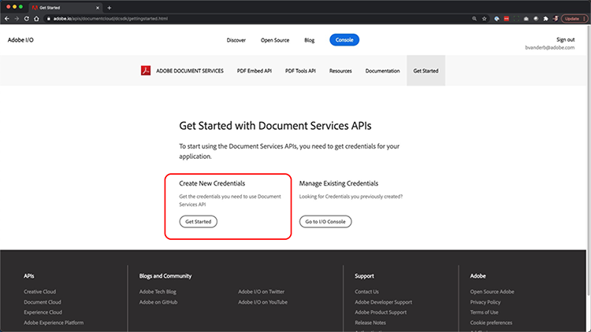
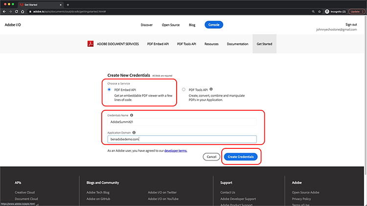
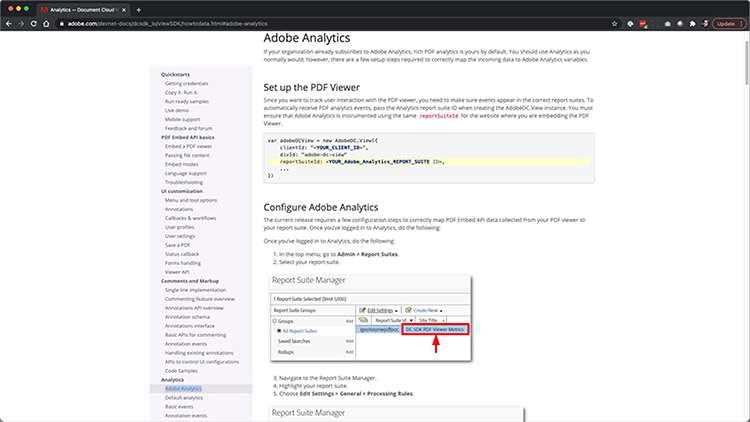
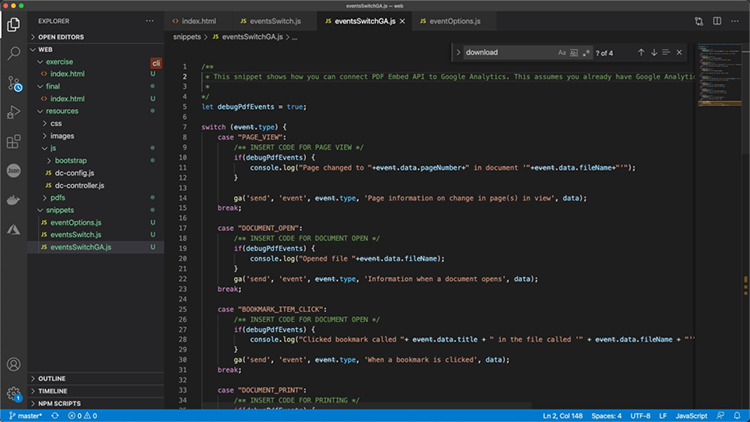
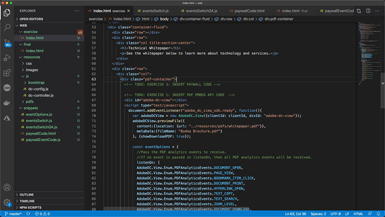

# Control your PDF online experience and gather analytics

Does your organization post PDFs on your website? Learn how to use the Adobe PDF Embed API to control appearance, enable collaboration, and gather analytics about how user’s interact with PDFs, including time spent on a page and searches. To begin this 4-part hands-on tutorial, click on *Getting started with PDF Embed API*.

<table style="table-layout:fixed">
<tr>
  <td>
    <a href="controlpdfexperience.md#part1">
        
    </a>
    <div>
    <a href="controlpdfexperience.md#part1"><strong>Part 1: Getting started with PDF Embed API</strong></a>
    </div>
  </td>
  <td>
    <a href="controlpdfexperience.md#part2">
        
    </a>
    <div>
    <a href="controlpdfexperience.md#part2"><strong>Part 2: Adding PDF Embed API to a webpage</strong></a>
    </div>
  </td>
  <td>
   <a href="controlpdfexperience.md#part3">
      
   </a>
    <div>
    <a href="controlpdfexperience.md#part3"><strong>Part 3: Accessing Analytics APIs</strong></a>
    </div>
  </td>
  <td>
   <a href="controlpdfexperience.md#part4">
      
   </a>
    <div>
    <a href="controlpdfexperience.md#part4"><strong>Part 4: Add interactivity based on events</strong></a>
    </div>
  </td>
</tr>
</table>

## Part 1: Getting started with PDF Embed API {#part1}

In part 1, you'll learn how to get started with everything you need for parts 1-3. You'll begin with getting API credentials.

**Resources**

* Tutorial resources [download](https://github.com/benvanderberg/adobe-pdf-embed-api-tutorial)
* Adobe ID [get one here](https://accounts.adobe.com/)
* Web server (Node JS, PHP, etc.)
* Working knowledge of HTML / JavaScript / CSS

**Applications**

* A basic web server (Node)
* Visual Studio Code
* GitHub

### Getting credentials

1. Go to the [Adobe.io website](https://www.adobe.io/).
1. Click **Learn more** under Build engaging document experiences.

   

   This takes you to the Adobe Document Services home page.

1. Click **Get Started** in the navigation bar.

   You’ll see an option in **Get Started with Document Services APIs** to **Create New Credentials** or **Manage Existing Credentials**. 
   
1. Click **Get Started** button under **Create New Credentials**.

   

1. Choose the **PDF Embed API** radio button and add a credential name of your choice and an application domain in the next window.

   >[!NOTE]
   >
   >These credentials can only be used on the application domain that is listed here. You can use any domain you choose.

   

1. Click **Create Credentials**.

   The final page of the wizard provides you with your client credential details. Leave this window open so you can come back to it and copy the Client ID (API Key) for later use. 
   
1. Click **View Documentation** to go to the documentation with detailed information on how to use this API.

   

## Part 2: Adding PDF Embed API to a webpage {#part2}

In part 2, you'll learn how to easily embed PDF Embed API into a webpage. You'll do this by using the Adobe PDF Embed API online demo to create our code.

### Get the exercise code

We created code for you to utilize. While you can use your own code, demonstrations will be in the context of the tutorial resources. Download sample code [here](https://github.com/benvanderberg/adobe-pdf-embed-api-tutorial).

1. Go to [Adobe Document Services website](https://www.adobe.io/apis/documentcloud/dcsdk/).

   

1. Click **APIs** in the navigation bar, then go to the PDF Embed API page in the drop-down link.

   

1. Click **Try the demo**. 

   A new window pops up with the developer sandbox for PDF Embed API.

   

   Here you can see the options for the different viewing modes. 

1. Click the different viewing modes for Full Window, Sized Container, In-Line, and Lightbox.

   

1. Click **Full Window** viewing mode, then click the **Customize** button to toggle options on and off.

   

1. Disable **Download** PDF option.
1. Click **Generate Code** button to see the code preview.
1. Copy **Client ID** from the Client Credentials window from Part 1.

   

1. Open the **Web -> resources -> js -> dc-config.js** file in your code editor. 

   You’ll see that the clientID variable is there.

1. Paste your client credentials between the double quotes to set the clientID to your credential.

1. Go back to the developer sandbox code preview.

1. Copy the second line that has the Adobe script: 

   ```
   <script src=https://documentccloud.adobe.com/view-sdk/main.js></script>
   ```

   

1. Go to your code editor and open the **Web -> exercise -> index.html** file. 

1. Paste the script code into the `<head>` of the file on line 18 under the comment that says: **TODO: EXERCISE 1: INSERT EMBED API SCRIPT TAG**.

   

1. Go back to the developer sandbox code preview and copy the first line of code that has: 

   ```
   <div id=”adobe-dc-view”></div>
   ```

   

1. Go to your code editor and open the **Web -> exercise -> index.html** file again. 

1. Paste the `<div>` code into the `<body>` of the file on line 67 under the comment that says **TODO: EXERCISE 1: INSERT PDF EMBED API CODE**.

   

1. Go back to the developer sandbox code preview and copy the lines of code for the `<script>` below:

   ```
   <script type=”text/javascript”>
  	 document.addEventListener(“adobe_dc_view_sdk.ready”, 			function(){ 
	  	 var adobeDCView = new AdobeDC.View({clientId: 					“<YOUR_CLIENT_ID>”, divId: “adobe-dc-view”});
		   adobeDCView.previewFile({
			   content:{location: {url: “https://documentcloud.				adobe.com/view-sdk-demo/PDFs/Bodea Brochure.					pdf”}},
			   metaData:{fileName: “Bodea Brochure.pdf”}
	  	 }, {showDownloadPDF: false});
  	 });
   </script>
   ```

1. Go to your code editor and open the **Web -> exercise -> index.html** file again. 

1. Paste the `<script>` code into the `<body>` of the file on line 68 under the `<div>` tag.

1. Modify line 70 of the same **index.html** file to include the clientID variable that was created previously. 

   

1. Modify line 72 of the same **index.html** file to update the location of the PDF file to use a local file. 

   There is one available in the tutorial files in **/resources/pdfs/whitepaper.pdf**.

1. Save your modified files and preview your website by browsing to **`<your domain>`/summit21/web/exercise/**. 

   You should see the Technical Whitepaper render in a Full Window mode within your browser.

## Part 3: Accessing Analytics APIs {#part3}

Now that you've successfully created a web page that has PDF Embed API rendering a PDF, in part 3 you can now explore how to use JavaScript events to measure analytics to understand how users are using PDFs.

### Finding documentation

There are a lot of different JavaScript events available as part of PDF Embed API. You can access them from Adobe Document Services documentation.

1. Navigate to the [documentation](https://www.adobe.io/apis/documentcloud/dcsdk/docs.html) site.
1. Review the different event types available as part of the API. These are helpful for reference and will also be helpful for your future projects.

   

1. Copy the sample code listed on the website.

   Use this as the basis for our code and modify it.

   

   ```
   const eventOptions = {
     //Pass the PDF analytics events to receive.
      //If no event is passed in listenOn, then all PDF 		analytics events will be received.
   listenOn: [ AdobeDC.View.Enum.PDFAnalyticsEvents.	PAGE_VIEW, AdobeDC.View.Enum.PDFAnalyticsEvents.DOCUMENT_DOWNLOAD],
     enablePDFAnalytics: true
   }


   adobeDCView.registerCallback(
     AdobeDC.View.Enum.CallbackType.EVENT_LISTENER,
     function(event) {
       console.log(“Type “ + event.type);
       console.log(“Data “ + event.data);
     }, eventOptions
   );
   ```

1. Find the code section you added earlier that looks like the below and append the code above after this code in **index.html**:

   

1. Load the page in your web browser, and open the Console to view the console outputs from the different events as you interact with the PDF viewer. 

   

   

### Add switch for capturing events

Now that you have the events being outputted to console.log, let's change the behavior based on which events. To do this, you'll use a switch example.

1. Navigate to **snippets/eventsSwitch.js** and copy the contents of the file in the tutorial code.

   

1. Paste the code in the event listener function.

   

1. Confirm that the console outputs correctly when the page is loaded and you interact with the PDF Viewer.

### Adobe Analytics

If you want to add Adobe Analytics support to your viewer, you can follow the instructions documented on the website. 

>[!IMPORTANT]
>
>Your webpage needs to already have Adobe Analytics loaded on the page in the header.

Navigate to the [Adobe Analytics documentation](https://www.adobe.com/devnet-docs/dcsdk_io/viewSDK/howtodata.html#adobe-analytics) and review if you already have Adobe Analytics enabled on your webpage. Follow instructions to set up a reportSuite.

### Google Analytics



Adobe PDF Embed API provides out-of-box integration with Adobe Analytics. However, because all events are available as JavaScript events, it is possible to integrate with Google Analytics by capturing PDF events and using the ga() function to add the event to Adobe Analytics.

1. Navigate to **snippets/eventsSwitchGA.js** to see how you can integrate with Google Analytics.
1. Review and use this code as an example if your webpage is tracked using Adobe Analytics and it is already embedded on the webpage.

   

## Part 4: Add interactivity based on events {#part4}

In part 4, you'll walk through how to layer on top of your PDF viewer a paywall that shows after you scroll past the second page.

### Paywall example

Navigate to this [example of a PDF behind a paywall](https://www3.technologyevaluation.com/research/white-paper/the-forrester-wave-digital-decisioning-platforms-q4-2020.html). In this example, you'll learn to add interactivity on top of a PDF viewing experience.

### Add paywall code

1. Go to snippets/paywallCode.html and copy the contents.
1. Search for `<!-- TODO: EXERCISE 3: INSERT PAYWALL CODE -->` in exercise/index.html.

   

1. Paste the copied code after the comment.
1. Go to **snippets/paywallCode.js** and copy the contents.

   

1. Paste the code into that location.

### Try Demo with Paywall

Now you can view the demo.

1. Reload **index.html** on your website.
1. Scroll down to a page > 2.
1. Show the dialog come up to challenge user after the second page.

   

## Additional resources

Additional resources can be found [here](https://www.adobe.io/apis/documentcloud/dcsdk/docs.html).
