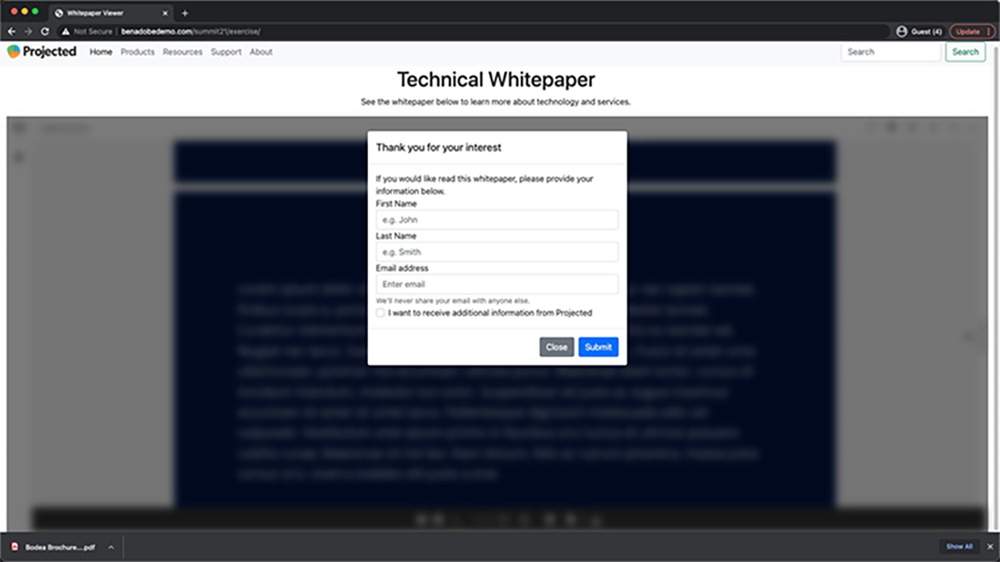

# Adobe PDF Embed API tutorials

The PDF Embed API is a free JavaScript API to embed high-fidelity PDFs, enable collaboration, and see analytics.

<table style="table-layout:fixed">
<tr>
 <td>
   
    

   <a href="controlpdfexperience.md"><strong>Control your PDF online experience and gather analytics</strong></a>
    

    <em>Learn how to use the Adobe PDF Embed API to control appearance, enable collaboration, and gather analytics about how user’s interact with PDFs, including time spent on a page and searches</em>
     
  </td>
  <td>
   
    

   <a href="https://experienceleague.adobe.com/docs/adobe-developers-live-events/events/2021/oct2021/pdf-embed-api.html"><strong>Wrangle PDFs on the web like a pro</strong></a>
    

    <em>Look at how to use the free Adobe PDF Embed API to make it easier to use PDFs in your web site</em>
     
  </td>
  <td>
    
    

     
  </td>
</tr>
</table>
