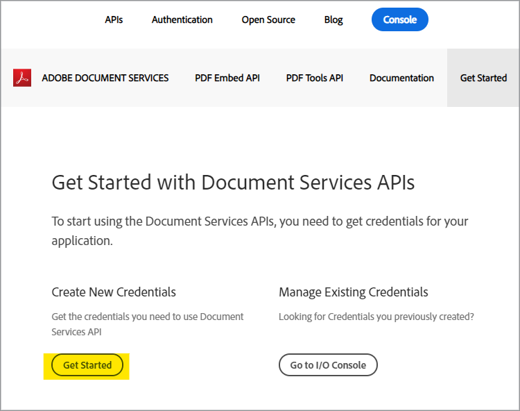
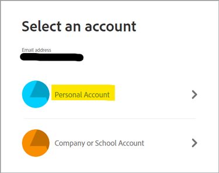
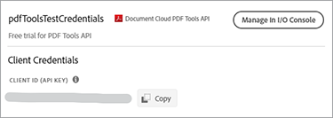
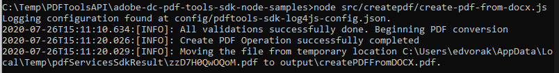

# Create a PDF from HTML or MS Office in a few minutes with PDF Services API and Node.js


Digitizing document workflows has never been easier with the new Adobe PDF Services API which provides developers free range to pick and choose between several powerful PDF manipulation services to meet the needs of complicated business workflows. Complicated architectures, implementation strategies, and technology ramp up can be streamlined with these readily available cloud-based web services.

Within the PDF Services API, there are several available services to create and manipulate PDFs, or export from PDF to MS Office and other formats.

* Create a PDF file from static or dynamic HTML, MS Word, PowerPoint, Excel, and more
* Export PDF to MS Word, PowerPoint, Excel, and more
* OCR to recognize text in PDF files and enable document searching
* Protect PDFs with a password when opening documents
* Combine PDF pages or PDF documents into a single PDF
* Compress PDFs to reduce the size for sharing through email or online
* Linearize to optimize a PDF for quick viewing on the web
* Organize PDF pages with insert, replace, reorder, delete, and rotate services

Developers can get started in just a few minutes with the ready to run sample files provided for accessing all the available web services. Here’s how to start.

## Obtaining credentials and downloading sample files

The first step is to obtain a credential (API Key) to unlock use. [Sign up for the free trial here](https://www.adobe.com/go/dcsdks_credentials) and click on ‘Get Started’ to create your new credentials.



It’s important to choose a ‘Personal Account’ to sign up for the free trial:



In the next step you’ll choose the PDF Services API Service, then add a name and description for your credentials.

There is a checkbox to ‘Create personalized code sample’. Choose this option to have your new credentials automatically added to your sample files, skipping the manual step.

Next, choose Node.js as your language to receive the Node.js specific samples and click on the ‘Create Credentials’ button.


You’ll receive a .zip file to download called PDFToolsSDK-Node.jsSamples.zip which can be saved to your local file system. 

## Adding your credentials to the code samples

If you chose the option for ‘Create personalized code sample’ then you do not need to manually add your client ID to the code sample files and can skip the next step and go directly to the Running code samples section below.

If you did not choose the option for ‘Create personalized code sample’, then you will need to copy the client ID (API Key) from the Adobe.io Console:



Unzip the contents of PDFToolsSDK-Node.jsSamples.zip.

Go to the root directory under adobe-dc-pdf-tools-sdk-node-samples folder.

Open pdftools-api-credentials.json with any text editor or IDE.

Paste the credential into the field for client ID in the code:

```javascript
{
 "client_credentials": {
  "client_id": "abcdefghijklmnopqrstuvwxyz",
```

Save the file and continue to the next step to run the code samples.

## Running your first code sample

Using the command prompt, go to the root directory under adobe-dc-pdf-tools-sdk-node-samples folder.

Type npm install:

C:\Temp\PDFToolsAPI\adobe-dc-pdf-tools-sdk-node-samples>npm install 

Now you’re ready to run the sample files!

For your first sample, create a PDF:

While still in the command prompt, run the create PDF sample with the following command:

C:\Temp\PDFToolsAPI\adobe-dc-pdf-tools-sdk-node-samples>node src/createpdf/create-pdf-from-docx.js

Example output:



Your PDF will be created in the location designated in the output, which by default is the pdfServicesSdkResult directory.

## Resources and next steps

* For additional help and support, visit the Adobe [Document Services APIs](https://community.adobe.com/t5/document-cloud-sdk/bd-p/Document-Cloud-SDK?page=1&sort=latest_replies&filter=all) community forum

PDF Services API [Documentation](https://www.adobe.com/go/pdftoolsapi_doc)

* [FAQ](https://community.adobe.com/t5/document-cloud-sdk/faq-for-document-services-pdf-tools-api/m-p/10726197) for PDF Services API questions

* [Contact us](https://www.adobe.com/go/pdftoolsapi_requestform) for questions on licensing and pricing

* Related articles:
  [New PDF Services API offers even more features for document workflows](https://community.adobe.com/t5/document-services-apis/new-pdf-tools-api-brings-more-capabilities-for-document-services/m-p/11294170)

  [July Release of Adobe Document Services: PDF Embed and PDF Services](https://medium.com/adobetech/july-release-of-adobe-document-services-pdf-embed-and-pdf-tools-17211bf7776d)
