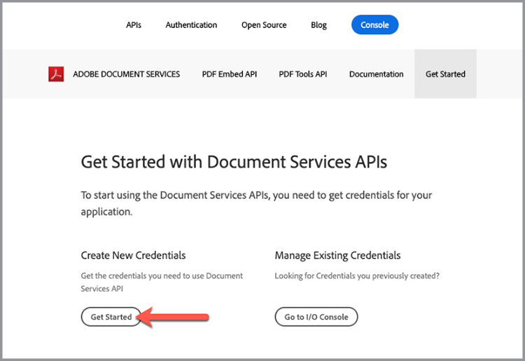

# Getting started with Adobe PDF Tools API and .Net

Developers can get started in just a few minutes with the ready to run sample files provided for accessing all the available web services. This tutorial will walk you through all the steps to start running the samples using the PDF Tools .Net SDK:

## Step 1: Obtaining credentials and downloading sample files

The first step is to obtain a credential (API Key) to unlock use. [Sign up for the free trial here](https://www.adobe.io/apis/documentcloud/dcsdk/gettingstarted.html) and click on ‘Get Started’ to create your new credentials.

It’s important to choose a ‘Personal Account’ to sign up for the free trial:

In the next step you’ll choose the PDF Tools API Service, then add a name and description for your credentials.

There is a checkbox to ‘Create personalized code sample’. Choose this option to have your new credentials automatically added to your sample files which will save you the manual step of adding them to your project. 

Next, choose Node.js as your language to receive the Node.js specific samples and click on the ‘Create Credentials’ button.

You’ll receive a .zip file to download called PDFToolsSDK-.NetSamples.zip which can be saved to your local file system.

## Step 2: Setup your .Net environment and Run the sample code

1. Download and install the [.Net SDK](https://dotnet.microsoft.com/learn/dotnet/hello-world-tutorial/install)
1. Extract the downloaded **PDFToolsSDK-.NetSamples.zip** and unzip the contents
1. cd to the samples root directory **adobe-DC.PDFTools.SDK.NET.Samples**
1. From the samples root directory, run **dotnet build**

    C:\Temp\PDFToolsAPI\ PDFToolsSDK-.NetSamples\adobe-DC.PDFTools.SDK.NET.Samples>dotnet build

    Now you’re ready to run the sample files!

    These final steps show you how to run your first sample with Create PDF from Word operation:

1. From the samples root directory change directory to CreatePDFFromDocx folder, cd CreatePDFFromDocx/

    C:\Temp\PDFToolsAPI\ PDFToolsSDK-.NetSamples\adobe-DC.PDFTools.SDK.NET.Samples>cd CreatePDFFromDocx/

1. run **dotnet run CreatePDFFromDocx.csproj**

    C:\Temp\PDFToolsAPI\ PDFToolsSDK-.NetSamples\adobe-DC.PDFTools.SDK.NET.Samples\CreatePDFFromDocx>dotnet run CreatePDFFromDocx.csproj

Your PDF will be created in the location designated in the output, which by default is the same folder.

## Final thoughts:

The PDF Tools API can help you eliminate manual processes by automating common workflows and shifting the processing burden to the cloud. In a world where every browser treats PDF differently, leveraging the Adobe PDF Embed API along with the PDF Tools API, you can create streamlined, reliable, and predictable processes that run and display correctly **every time** regardless of platform or device.

## Resources and next steps

For additional help and support, visit the Adobe [Document Services APIs](https://community.adobe.com/t5/document-cloud-sdk/bd-p/Document-Cloud-SDK?page=1&sort=latest_replies&filter=all) community forum

PDF Tools API [Documentation](https://www.adobe.com/go/pdftoolsapi_doc)

[FAQ](https://community.adobe.com/t5/document-cloud-sdk/faq-for-document-services-pdf-tools-api/m-p/10726197) for PDF Tools API questions

[Contact us](https://www.adobe.com/go/pdftoolsapi_requestform) for questions on licensing and pricing

## Related articles:

[New PDF Tools API offers even more features for document workflows](https://community.adobe.com/t5/document-services-apis/new-pdf-tools-api-brings-more-capabilities-for-document-services/m-p/11294170)
[July Release of Adobe Document Services: PDF Embed and PDF Tools](https://medium.com/adobetech/july-release-of-adobe-document-services-pdf-embed-and-pdf-tools-17211bf7776d)
