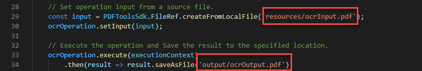

# Using Adobe PDF Tools API to OCR PDF files

With OCR (Optical Character Recognition) you can unlock scanned PDFs to extract text and create searchable files. Using our powerful cloud-based APIs, integrate OCR into any document workflow for the perfect solution to archiving, copying text, and creating searchable document indexes. Create searchable archives from scanned PDF repositories to unlock important information and save time with quick searchability. Or apply OCR to your PDFs from uploaded scans to allow them to be edited for use in onboarding workflows.

Developers can get started in just a few minutes with the ready to run sample files provided for OCR. 

In this tutorial we’ll cover the basics of how to run your first PDF Tools API OCR operation using sample files for Node.js, Java, and .Net languages.  

## Step 1: First, create your credentials and setup your environment:

Use the getting started tutorials below to create your API credentials, download sample files, and setup your environment.

[Getting Started with PDF Tools API and Java](gettingstartedjava.md)
[Getting Started with PDF Tools API and .Net](gettingstartednet.md)
[Getting Started with PDF Tools API and Node.js](createpdffromhtml.md)

## Run the OCR example provided in the sample files

Our OCR operation allows for English locale by default, but also provides support for German, French, Danish, and [other languages](https://opensource.adobe.com/pdftools-java-sdk-samples/apidocs/latest/com/adobe/platform/operation/pdfops/options/ocr/OCRSupportedLocale.html). The default is en-us locale.

When you pass in options with OCR operation including specific locale, the method also accepts the ‘type’ parameter which has two options:

* SEARCHABLE_IMAGE: Modifies the original image during the cleanup process (for example, deskews it) before placing an invisible text layer over it. This type removes unwanted artifacts and may result in a more readable document in some scenarios.

* SEARCHABLE_IMAGE_EXACT: Ensures that text is searchable and selectable. This option keeps the original image and places an invisible text layer over it. Recommended for cases requiring maximum fidelity to the original image.

### Java

1. Open a command prompt

1. Change directories into your sample code directory

    E.g., C:\Temp\PDFToolsAPI\adobe-dc-pdf-tools-sdk-java-samples>

1. Run the following command:

    mvn -f pom.xml exec:java -Dexec.mainClass=com.adobe.platform.operation.samples.ocrpdf.OcrPDF

Your PDF will be created in the src/main/resources directory.

### .Net

1. Open a command prompt

1. Change directories into your sample code directory

    E.g., C:\Temp\PDFToolsAPI\adobe-dc-pdf-tools-sdk-NetSamples>

1. Change directories again into the OcrPDF directory

1. Run the following command:

    dotnet run OcrPDF.csproj

Your PDF will be created in the same directory.

### Node.js

1. Open a command prompt

1. Change directories into your sample code directory. 

    E.g., C:\Temp\PDFToolsAPI\adobe-dc-pdf-tools-sdk-node-samples

1. Run the following command:

    **node src/ocr/ocr-pdf.js**

Your PDF will be created in the location designated in the output, which by default is the output directory.

## Final thoughts:

With these simple steps using the sample files, you should have a working example that you can build on. In addition to the OCR example that we used in this tutorial, there is another example to OCR using the supported type and locale options discussed earlier. 

From here you can simply replace your input and output files located in the sample to use your own PDF to finalize your proof of concept for your own use case.

## Resources and next steps

For additional help and support, visit the Adobe [Document Services APIs](https://community.adobe.com/t5/document-cloud-sdk/bd-p/Document-Cloud-SDK?page=1&sort=latest_replies&filter=all) community forum

PDF Tools API [Documentation](https://www.adobe.com/go/pdftoolsapi_doc)

[FAQ](https://community.adobe.com/t5/document-cloud-sdk/faq-for-document-services-pdf-tools-api/m-p/10726197) for PDF Tools API questions

[Contact us](https://www.adobe.com/go/pdftoolsapi_requestform) for questions on licensing and pricing
