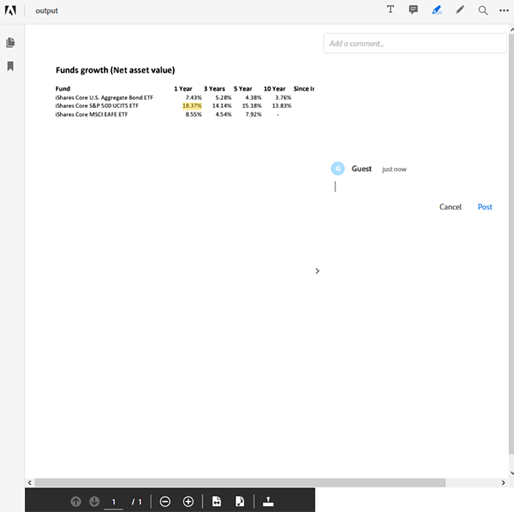

# Managing financial document workflows in Java


The financial industry uses PDF files extensively to exchange data because it helps maintain document format, design, and structure. This robust format allows financial analysts and advisors to help their clients make well-informed decisions.

The PDF format, however, can be challenging to process and automate, especially when combining multiple data sources — a common use case in the financial industry. Building a custom solution to process PDF documents is an option, but there is no need to invest too much time and money in software and infrastructure. Adobe Document Services provides all the necessary tools, services, and features to process and extract data from PDF documents.

## What you can learn

In this hands-on tutorial, learn how to use Adobe Document Services APIs for Java Spring Boot applications. You build a model-view-controller (MVC) app that extracts content from PDF documents, converts it to other data formats such as Excel, combines multiple PDFs, and password protects the resources. This tutorial explains how to process PDF documents and show them on your websites using the Adobe [PDF Embed API](https://www.adobe.io/apis/documentcloud/dcsdk/pdf-embed.html).

## Relevant APIs and resources

* [PDF Services API](https://opensource.adobe.com/pdftools-sdk-docs/release/latest/index.html)

* [PDF Embed API](https://www.adobe.com/devnet-docs/dcsdk_io/viewSDK/index.html) 

* [Project samples](https://github.com/adobe/pdftools-java-sdk-samples)

## Setup

Adobe Document Services uses an authentication system to control resource access. To access the services, you must request an API key from Adobe for your organization or application. If you have an API key, continue to the next section. To create a new API key, visit [Getting Started](https://www.adobe.io/apis/documentcloud/dcsdk/gettingstarted.html) in the Document Services site. You can create a key using their free trial which provides 1,000 document transactions that can be used for up to six months.

To follow along with this tutorial, you need two sets of API keys:

* Adobe PDF Services — used to process the PDF document

* Adobe PDF Embed API

After creating the credentials, copy the PDF Services API credentials and the private key to the Spring Boot application inside the resources section. Learn more about the [Maven and Gradle libraries and dependencies](https://www.adobe.io/apis/documentcloud/dcsdk/docs.html?view=services) on the Adobe Document Services website. Make sure you set up all necessary packages and libraries before you proceed.


To configure the logging services, visit [Adobe documentation](https://www.adobe.io/apis/documentcloud/dcsdk/docs.html?view=services) and scroll to the Logging section.

>[!NOTE]
>
> In your production environment, do not save the private keys in version control. Always use a secret vault or a key injection service to prevent unauthorized use of credentials.

Now that your Spring Boot application is configured, you can proceed with processing the PDFs and generating reports for customers.

## Submitting the report data

To use the Adobe PDF Services API, first set up an `ExecutionContext` that consumes the credentials you provide. Since you have the credentials inside your application, you can read them from the file and create the context as follows:

```
Credentials credentials = Credentials.serviceAccountCredentialsBuilder()
    .fromFile(AUTH_FILE_PATH)
    .build();

ExecutionContext executionContext = ExecutionContext.create(credentials);
```

Next, get the context to process the PDF documents. Here are the actions you can perform:

* Convert the PDF documents (to Excel, Word, or graphics type)

* Create the PDF documents (from HTML, Excel, Word, and more)

* Combine multiple PDF documents

* Protect and unprotect the PDF documents (you must have the password)

* Optimize the PDF documents for delivery on networks

All these samples are available in the [GitHub samples](https://github.com/adobe/pdfservices-java-sdk-samples/tree/master/src/main/java/com/adobe/pdfservices/operation/samples) repository.

Next, in Spring Boot, you can get a file using the String path or the Stream where the file is being uploaded. Every operation you perform must be initialized and an input file path must be set. For this tutorial, you use the publicly available PDF reports from [Blackrock](https://www.blackrock.com/us/individual/products/investment-funds). You can use any other source including your own reports.

Start by capturing the [FileRef](https://opensource.adobe.com/pdfservices-java-sdk-samples/apidocs/latest/com/adobe/pdfservices/operation/io/FileRef.html) object from the file. For simplicity, focus on the files by String path. Below, you create an operation to convert a file in your path from PDF to Excel:

```
ExecutionContext executionContext = ExecutionContext.create(credentials);
ExportPDFOperation exportOperation = ExportPDFOperation.createNew(ExportPDFTargetFormat.XLSX);

// Create the input source
FileRef inputPdf = FileRef.createFromLocalFile(INPUT_PDF);
exportOperation.setInput(inputPdf);
```

After this step, your program is ready to run the first operation on the PDF. Next, you execute the operation and get the result in the Excel sheet:

```
try {
    FileRef output = exportOperation.execute(executionContext);
    output.saveAs(OUTPUT_EXCEL);
} catch (ServiceApiException e) {
    e.printStackTrace();
}
```

This scenario handles only one PDF file. You could also start with multiple PDF files and combine them into a single file. Using multiple files is common in financial data reporting because you must process funds from multiple sources to provide a comprehensive report.

## Generating the report

Adobe Document Services does not support processing Excel documents out of the box, but you can still use community frameworks and libraries to process the content.

For example, you can use the [Apache POI](https://poi.apache.org/) to process Excel (or other Microsoft documents) in your Java Spring Boot app, or you might perform other manual or automated tasks on the Excel file.

In this example, starting with your PDF documents, you extract the net asset value for your three funds and show them in a table. You can pull other information as well, such as charts and tables, based on your requirements and the data available. You can even bring in data from other sources.

After your report is generated — in this example, in an Excel format — you can use Adobe PDF Services operations to convert the report back to a PDF document and protect it.

To convert the report from Excel format to a PDF document, use the following operation:

```
ExecutionContext executionContext = ExecutionContext.create(credentials);
CreatePDFOperation exportOperation = CreatePDFOperation.createNew();

// Create the input source
FileRef inputPdf = FileRef.createFromLocalFile(INPUT_EXCEL);
exportOperation.setInput(inputPdf);

try {
    FileRef output = exportOperation.execute(executionContext);
    output.saveAs(OUTPUT_PDF);
} catch (ServiceApiException e) {
    e.printStackTrace();
}
```

>[!TIP]
>
> To prevent having to recreate the object every time a request comes, use Spring’s dependency injection to inject the `ExecutionContext` object.

This code generates a PDF document from the report in Excel format.

Before delivering this PDF to your customers, you can protect it with a password. Create another operation that handles this protection for you, [ProtectPDFOperation](https://opensource.adobe.com/pdfservices-java-sdk-samples/apidocs/latest/com/adobe/pdfservices/operation/pdfops/ProtectPDFOperation.html), then use [ProtectPDFOptions](https://opensource.adobe.com/pdfservices-java-sdk-samples/apidocs/latest/com/adobe/pdfservices/operation/pdfops/options/protectpdf/package-summary.html) to add the password to the document.

```
ProtectPDFOptions options = ProtectPDFOptions.passwordProtectOptionsBuilder()
                    .setUserPassword("p@55w0rd")
                    .setEncryptionAlgorithm(EncryptionAlgorithm.AES_256)
                    .build();
ProtectPDFOperation operation = ProtectPDFOperation.createNew(options);
```

Next, specify the input and execute the operation. The resulting file should have a password on it to prevent unauthorized access.

## Displaying the report

Now that your PDF report is generated, you can display the report on the website using the Adobe PDF Embed API. This JavaScript API enables web developers to load and render the PDF documents natively inside the web browser.

>[!NOTE]
>
> At this point you need the second credential token, the client ID.

In your Spring Boot application, add the following HTML snippet where you want to render the PDF report:

```
<div id="pdf-viewer"></div>
<script src="https://documentcloud.adobe.com/view-sdk/main.js"></script>
<script type="text/javascript">
    document.addEventListener("adobe_dc_view_sdk.ready", function()
    {
        var adobeDCView = new AdobeDC.View({ clientId: "<your-client-id-here>", divId: "pdf-viewer" });
        adobeDCView.previewFile(
        {
            content: {
                location: {
                    url: "<your-document.pdf>"
                }
            },
            metaData: {
                fileName: "<document-name.pdf>"
            }
        });
    });
</script>
```

This script loads the PDF document and enable viewers to annotate and comment on the documents. Here is the view of this Embed API as shown in Firefox:



The PDF Embed API provides all the tools necessary to preview the PDF as well as to annotate the report.

## Next steps

This hands-on tutorial explored the [Adobe Document Services](https://www.adobe.io/apis/documentcloud/dcsdk/) APIs and discussed how to use these services to process PDF data and generate reports for financial decisions. It demonstrated how you can integrate the APIs into your systems, using Java Spring Boot as an example framework, to show how easy it is to quickly process PDF documents.

Explore [Adobe Document Services](https://www.adobe.io/apis/documentcloud/dcsdk/) and see what Adobe PDF Services can do for your business. To learn about more features available in the SDK, consult the [GitHub repository](https://github.com/adobe/pdftools-java-sdk-samples) for the samples, and explore how [PDF Embed API](https://www.adobe.io/apis/documentcloud/dcsdk/pdf-embed.html) can help you quickly show PDFs inside your applications.

To easily combine and manipulate documents, creating helpful PDF reports for your financial clients, start by signing up for your free [Adobe developer account](https://www.adobe.io/apis/documentcloud/dcsdk/) today.
