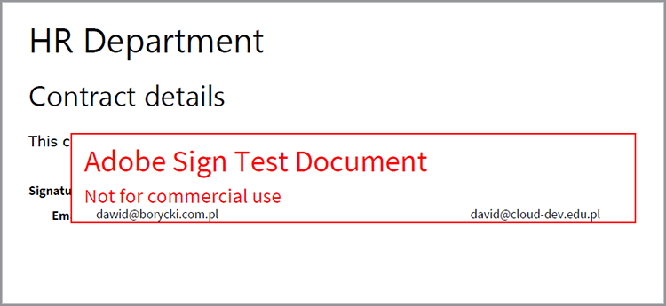

# HR Document Workflows with Adobe Document Services APIs in Java

Many businesses require documentation around a new hire, such as workplace agreements for work-from-home employees. Traditionally, businesses managed these documents physically in forms that were difficult to manage and store. When switching to electronic documents, PDF files are an ideal choice because they are more secure and less modifiable than other file types. Plus, they support digital signatures as well.

In this article, we will implement a web-based HR form that saves a workplace agreement to PDF with sign off in a simple Java Spring MVC application. You can find the companion code [on GitHub](https://github.com/dawidborycki/adobe-sign).

## Generating API Credentials

Start by signing up for the Adobe PDF Tools API free trial. Go to the [Adobe](https://www.adobe.io/apis/documentcloud/dcsdk/gettingstarted.html?ref=getStartedWithServicesSDK) [website](https://www.adobe.io/apis/documentcloud/dcsdk/gettingstarted.html?ref=getStartedWithServicesSDK) and click the *Get Started* button under *Create New Credentials*. The free trial provides 1,000 Document Transactions that can be used over 6 months. This will reveal another page (see below), where you choose the service (PDF Tools API), set the credentials name (for example, HRDocumentWFCredentials), and enter a description.

Select the language (Java for this example) and check *Create personalized code samples*. The last step ensures that code samples will already contain the prepopulated pdftools-api-credentials.json file you use, along with the private key to authenticate your app within the API.

Finally, click the *Create Credentials* button. This will generate the credentials and the samples will automatically begin downloading.


To ensure the credentials are working well, let's open the downloaded samples. Here, we are using IntelliJ IDEA. When we open the source code, the integrated development environment (IDE) asks for the build engine. We are using Maven, but you can also work with Gradle, depending on your preferences.

Next, execute the `mvn clean install` Maven goal to build the jar files.

Finally, run the CombinePDF sample, as shown below. The code will generate the PDF within the output folder.


## Creating the Spring MVC Application

Given the credentials we can then create the application. We use Spring Initializr for this.

First, we configure project settings to use the Java 8 language and Jar packaging (see screenshot below).


Second, we add Spring Web (from Web) and Thymeleaf (from Template Engines):


After creating the project, go to the pom.xml file, and supplement the dependencies section with pdftools-sdk and log4j-slf4j-impl:

```
<dependencies>
    <dependency>
        <groupId>org.springframework.boot</groupId>
        <artifactId>spring-boot-starter-thymeleaf</artifactId>
    </dependency>
    <dependency>
        <groupId>org.springframework.boot</groupId>
        <artifactId>spring-boot-starter-web</artifactId>
    </dependency>

    <dependency>
        <groupId>org.springframework.boot</groupId>
        <artifactId>spring-boot-starter-test</artifactId>
        <scope>test</scope>
    </dependency>

</dependencies>
```

Then, supplement the root folder of your project with two files you downloaded with the sample code:

-   pdftools-api-credentials.json

-   private.key

## Rendering a Web Form

To render the web form, we need to modify the application with the controller that will render the personal data form and handle posting the form. So, let's first modify the application with the PersonForm model class:

```
package com.hr.docsigning;
import javax.validation.constraints.NotNull;
import javax.validation.constraints.Size;

public class PersonForm {
    @NotNull
    @Size(min=2, max=30)
    private String firstName;

    @NotNull
    @Size(min=2, max=30)
    private String lastName;

    public String getFirstName() {
            return this.firstName;
    }


    public void setFirstName(String firstName) {
            this.firstName = firstName;
    }

    public String getLastName() {
           return this.lastName;
    }

    public void setLastName(String lastName) {
            this.lastName = lastName;
    }

    public String GetFullName() {
           return this.firstName + " " + this.lastName;
    }
}
```

This class contains two properties: `firstName` and `lastName`. Additionally, we have a simple validation to check if they are between two and thirty characters.

Given the model class, we can create the controller (see PersonController.java from the companion code):

```
package com.hr.docsigning;
import org.springframework.stereotype.Controller;
import org.springframework.validation.BindingResult;
import org.springframework.web.bind.annotation.GetMapping;
import org.springframework.web.bind.annotation.PostMapping;
import javax.validation.Valid;


@Controller
public class PersonController {
    @GetMapping("/")
    public String showForm(PersonForm personForm) {
        return "form";
    }
}
```

The controller has only one method: showForm. It is responsible for rendering the form using the HTML template, located in resources/templates/form.html:

```
<html>
<head>
    <link rel="stylesheet" href="https://www.w3schools.com/w3css/4/w3.css">
</head>
 
<body>
<div class="w3-container">
    <h1>HR Department</h1>
</div>
 
<form class="w3-panel w3-card-4" action="#" th:action="@{/}"
        th:object="${personForm}" method="post">
    <h2>Personal data</h2>
    <table>
        <tr>
            <td>First Name:</td>
            <td><input type="text" class="w3-input"
                placeholder="First name" th:field="*{firstName}" /></td>
            <td class="w3-text-red" th:if="${#fields.hasErrors('firstName')}"
                th:errors="*{firstName}"></td>
        </tr>
        <tr>
            <td>Last Name:</td>
            <td><input type="text" class="w3-input"
                placeholder="Last name" th:field="*{lastName}" /></td>
            <td class="w3-text-red" th:if="${#fields.hasErrors('lastName')}"
                th:errors="*{lastName}"></td>
        </tr>
        <tr>
            <td><button class="w3-button w3-black" type="submit">Submit</button></td>
        </tr>
    </table>
</form>
</body>
</html>
```

To render dynamic content, we employed the Thymeleaf template rendering engine. So, after running the application, you should see the following:


## Generating the PDF with Dynamic Content

We can now generate the PDF document containing the virtual contract by dynamically populating selected fields after rendering the personal data form. Specifically, we will need to populate the person data into the pre-created contract.

Here, for simplicity, we have only a header, a subheader, and a string constant reading: "This contract was prepared for \<full name of the person\>".

To achieve this goal, we can start with Adobe’s [Create a PDF from Dynamic HTML](https://opensource.adobe.com/pdftools-sdk-docs/release/latest/howtos.html#create-a-pdf-from-dynamic-html) example. By analyzing that sample code, we see that the process of dynamic HTML field population works as follows.

First, you need to prepare the HTML page, which will have static and dynamic content. The dynamic part will be updated using JavaScript. Namely, the PDF Tools API will inject the JSON object into your HTML.

You then get the JSON properties using the JavaScript function that is invoked when the HTML document loads. This JavaScript function updates the selected DOM elements. Here is the example that populates the span element, holding the person’s data (see src\\main\\resources\\contract\\index.html of the companion code):

```
<html>
<head>
    <link rel="stylesheet" href="https://www.w3schools.com/w3css/4/w3.css">
</head>
 
<body onload="updateFullName()">
    <script src="./json.js"></script>
    <script type="text/javascript">
        function updateFullName()
        {
            var document = window.document;
            document.getElementById("personFullName").innerHTML = String(
                window.json.personFullName);
        }
    </script>
 
    <div class="w3-container ">
        <h1>HR Department</h1>
 
        <h2>Contract details</h2>
 
        <p>This contract was prepared for:
            <strong><span id="personFullName"></span></strong>
        </p>
    </div>
</body>
</html>
```

Then, you need to zip the HTML with all dependent JavaScript and CSS files. The PDF Tools API does not accept HTML files. Instead, it requires a zip file as the input. In our case, we store the zipped file in src\\main\\resources\\contract\\index.zip.

Afterward, you can supplement the `PersonController` with another method that handles POST requests:

```
@PostMapping("/")
public String checkPersonInfo(@Valid PersonForm personForm,
    BindingResult bindingResult) {
    if (bindingResult.hasErrors()) {
        return "form";
    }
 
    CreateContract(personForm);
 
    return "contract-actions";
}
```

The above method will create a PDF contract using the provided personal data and render the contract-actions view. The latter will provide links to the generated PDF and for signing the PDF. We will talk more about this later.

Now, let's see how the `CreateContract` method works (the full listing is below). The method relies on two fields:

-   `LOGGER`, from log4j, to debug information about any exceptions

-   `contractFilePath`, containing the file path to the generated PDF

The `CreateContract` method sets up the credentials and creates the PDF from HTML. To pass and populate the person’s data in the contract, we use the `setCustomOptionsAndPersonData` helper. This method retrieves the person's data from the form, then sends it to the generated PDF through the JSON object we explained above.

Additionally, `setCustomOptionsAndPersonData` shows how you can control PDF appearance by disabling the header and footer. Once this is done, we save the PDF file to output/contract.pdf and eventually delete the previously generated file.

```
private static final Logger LOGGER = LoggerFactory.getLogger(PersonController.class);
private String contractFilePath = "output/contract.pdf"; 
private void CreateContract(PersonForm personForm) {
    try {
        // Initial setup, create credentials instance.
        Credentials credentials = Credentials.serviceAccountCredentialsBuilder()
                .fromFile("pdftools-api-credentials.json")
                .build();

        //Create an ExecutionContext using credentials 
       //and create a new operation instance.
        ExecutionContext executionContext = ExecutionContext.create(credentials);
        CreatePDFOperation htmlToPDFOperation = CreatePDFOperation.createNew();

        // Set operation input from a source file.
        FileRef source = FileRef.createFromLocalFile(
           "src/main/resources/contract/index.zip");
       htmlToPDFOperation.setInput(source);

        // Provide any custom configuration options for the operation
        // We pass person data here to dynamically fill out the HTML
        setCustomOptionsAndPersonData(htmlToPDFOperation, personForm);

        // Execute the operation.
        FileRef result = htmlToPDFOperation.execute(executionContext);

        // Save the result to the specified location. Delete previous file if exists
        File file = new File(contractFilePath);
        Files.deleteIfExists(file.toPath());

        result.saveAs(file.getPath());

    } catch (ServiceApiException | IOException | 
             SdkException | ServiceUsageException ex) {
        LOGGER.error("Exception encountered while executing operation", ex);
    }
}
 
private static void setCustomOptionsAndPersonData(
    CreatePDFOperation htmlToPDFOperation, PersonForm personForm) {
    //Set the dataToMerge field that needs to be populated 
    //in the HTML before its conversion
    JSONObject dataToMerge = new JSONObject();
    dataToMerge.put("personFullName", personForm.GetFullName());
 
    // Set the desired HTML-to-PDF conversion options.
    CreatePDFOptions htmlToPdfOptions = CreatePDFOptions.htmlOptionsBuilder()
        .includeHeaderFooter(false)
        .withDataToMerge(dataToMerge)
        .build();
    htmlToPDFOperation.setOptions(htmlToPdfOptions);
}
```

When generating the contract, you can also merge the dynamic, person-specific data with fixed contract terms. To do so, follow the [Create a PDF from static HTML](https://opensource.adobe.com/pdftools-sdk-docs/release/latest/howtos.html#create-a-pdf-from-dynamic-html) example. Alternatively, you can [merge two PDFs](https://opensource.adobe.com/pdftools-sdk-docs/release/latest/howtos.html#create-a-pdf-from-static-html).

## Presenting the PDF File for Download

We can now present the link to the generated PDF for the user to download. To do so, we first create the contract-actions.html file (see resources/templates contract-actions.html of the companion code):

```
<html>
<head>
    <link rel="stylesheet" href="https://www.w3schools.com/w3css/4/w3.css">
</head>
 
<div class="w3-container ">
    <h1>HR Department</h1>
 
    <h2>Contract file</h2>
 
    <p>Click <a href="/pdf">here</a> to download your contract</p>
</div>
</body>
</html>
```

Then, we implement the `downloadContract` method within the `PersonController` class as follows:

```
@RequestMapping("/pdf")
public void downloadContract(HttpServletResponse response)
{
    Path file = Paths.get(contractFilePath);
 
    response.setContentType("application/pdf");
    response.addHeader(
        "Content-Disposition", "attachment; filename=contract.pdf");

    try
    {
        Files.copy(file, response.getOutputStream());
        response.getOutputStream().flush();
    }
    catch (IOException ex) 
    {
        ex.printStackTrace();
    }
}
```

After running the app, we get the following flow. The first screen shows the personal data form. To test, fill it with any values between two and thirty characters:


After clicking the *Submit* button, the form validates and the PDF generates based on the HTML (resources/contract/index.html). The application will display another view (contract-details), where you can download the PDF:


The PDF, after rendering in the web browser, will look as follows. Namely, the personal data you entered are propagated to the PDF:


## Enabling Signatures and Security

When the agreement is ready, Adobe Sign can add digital signatures representing approval. Adobe Sign authentication works a little differently than OAuth. Let's now see how to integrate the application with Adobe Sign. To do so, you need to prepare the access token for your application. Then, you write the client code using Adobe Sign Java SDK.

To obtain an authorization token, you need to perform several steps:

First, register a [developer account](https://acrobat.adobe.com/us/en/sign/developer-form.html).

Create the CLIENT application in the [Adobe Sign portal](https://www.adobe.io/apis/documentcloud/sign/docs.html#!adobedocs/adobe-sign/master/gstarted/create_app.md).

Configure OAuth for the application as described [here](https://www.adobe.io/apis/documentcloud/sign/docs.html#!adobedocs/adobe-sign/master/gstarted/configure_oauth.md)
and [here](https://secure.eu1.adobesign.com/public/static/oauthDoc.jsp). Note your client identifier and client secret. Then, you can use https://www.google.com as the Redirect URI and the following scopes:

-   user_login: self

-   agreement_read: account

-   agreement_write: account

-   agreement_send: account

Prepare a URL as follows using your client ID in place of \<CLIENT_ID\>:

```
https://secure.eu1.adobesign.com/public/oauth?redirect_uri=https://www.google.com
&response_type=code
&client_id=<CLIENT_ID>
&scope=user_login:self+agreement_read:account+agreement_write:account+agreement_send:account
```

Type the above URL in your web browser. You will be redirected to google.com and the code will be displayed in the address bar as code=\<YOUR_CODE\>, for
example:

```
https://www.google.com/?code=<YOUR_CODE>&api_access_point=https://api.eu1.adobesign.com/&web_access_point=https://secure.eu1.adobesign.com%2F
```

Note the values given for \<YOUR_CODE\> and api_access_point.

Use the client ID, \<YOUR_CODE\>, and api_access_point values to send an HTTP POST request that will provide you with the access token. You can use [Postman](https://helpx.adobe.com/sign/kb/how-to-create-access-token-using-postman-adobe-sign.html)
or cURL:

curl --location --request POST "https://**api.eu1.adobesign.com**/oauth/token"
\\

\--data-urlencode "client_secret=**\<CLIENT_SECRET\>**" \\

\--data-urlencode "client_id=**\<CLIENT_ID\>**" \\

\--data-urlencode "code=**\<YOUR_CODE\>**" \\

\--data-urlencode "redirect_uri=**https://www.google.com**" \\

\--data-urlencode "grant_type=authorization_code"

The sample response will look as follows:

```
{
    "access_token":"3AAABLblqZhByhLuqlb-…",
    "refresh_token":"3AAABLblqZhC_nJCT7n…",
    "token_type":"Bearer",
    "expires_in":3600
}
```

Note your access_token. You will need it to authorize your client code.

## Using the Adobe Sign Java SDK

Once you have the access token, you can send REST API calls to Adobe Sign. To simplify this process, use Adobe Sign Java SDK. The source code is available at the [Adobe GitHub repository](https://github.com/adobe-sign/AdobeSignJavaSdk).

To integrate this package with our application, we first need to clone the code. Then, create the Maven package (mvn package) and install the following files into the project (you can find them in the companion code in the adobe-sign-sdk folder):

-   target/swagger-java-client-1.0.0.jar

-   target/lib/gson-2.8.1.jar

-   target/lib/gson-fire-1.8.0.jar

-   target/lib/hamcrest-core-1.3.jar

-   target/lib/junit-4.12.jar

-   target/lib/logging-interceptor-2.7.5.jar

-   target/lib/okhttp-2.7.5.jar

-   target/lib/okio-1.6.0.jar

-   target/lib/swagger-annotations-1.5.15.jar

In IntelliJ IDEA, you can add those files as dependencies using *Project Structure* (File/Project Structure).

## Sending the PDF for Signature

We are now ready to send the agreement for signing. To do so, we first supplement the contract-details.html with another hyperlink to the send request:

```
<html>
<head>
    <link rel="stylesheet" href="https://www.w3schools.com/w3css/4/w3.css">
</head>
 
<div class="w3-container ">
    <h1>HR Department</h1>
 
    <h2>Contract file</h2>
 
    <p>Click <a href="/pdf"> here</a> to download your contract</p>
 
    
</div>
</body>
</html>
```

Then, we add another controller, `AdobeSignController`, in which we implement `sendContractMethod` (see companion code). The method works as follows.

First, it uses `ApiClient` to obtain the API endpoint.

```
ApiClient apiClient = new ApiClient();

//Default baseUrl to make GET /baseUris API call.
String baseUrl = "https://api.echosign.com/";
String endpointUrl = "/api/rest/v6";
apiClient.setBasePath(baseUrl + endpointUrl);

// Provide an OAuth Access Token as "Bearer access token" in authorization
String authorization = "Bearer ";

// Get the baseUris for the user and set it in apiClient.
BaseUrisApi baseUrisApi = new BaseUrisApi(apiClient);
BaseUriInfo baseUriInfo = baseUrisApi.getBaseUris(authorization);
apiClient.setBasePath(baseUriInfo.getApiAccessPoint() + endpointUrl);
```

Then, the method uses the contract.pdf file to create the transient document:

```
// Get PDF file
String filePath = "output/";
String fileName = "contract.pdf";
File file = new File(filePath + fileName);
String mimeType = "application/pdf";
 
//Get the id of the transient document.
TransientDocumentsApi transientDocumentsApi =
    new TransientDocumentsApi(apiClient);
TransientDocumentResponse response = transientDocumentsApi.createTransientDocument(authorization,
    file, null, null, fileName, mimeType);
String transientDocumentId = response.getTransientDocumentId();
```

Next, we need to create an agreement. To do so, we use the contract.pdf file and set the agreement state to IN_PROCESS to send the file immediately. Additionally, we choose the electronic signature:

```
// Create AgreementCreationInfo
AgreementCreationInfo agreementCreationInfo = new AgreementCreationInfo();
 
// Add file
FileInfo fileInfo = new FileInfo();
fileInfo.setTransientDocumentId(transientDocumentId);
agreementCreationInfo.addFileInfosItem(fileInfo);
 
// Set state to IN_PROCESS, so the agreement will be sent immediately
agreementCreationInfo.setState(AgreementCreationInfo.StateEnum.IN_PROCESS);
agreementCreationInfo.setName("Contract");
agreementCreationInfo.setSignatureType(AgreementCreationInfo.SignatureTypeEnum.ESIGN);
```

When this is done, you add agreement recipients as follows. Here I am adding two recipients (see Employee and Manager sections):

```
// Provide emails of recipients to whom agreement will be sent
// Employee
ParticipantSetInfo participantSetInfo = new ParticipantSetInfo();
ParticipantSetMemberInfo participantSetMemberInfo = new ParticipantSetMemberInfo();
participantSetMemberInfo.setEmail("");
participantSetInfo.addMemberInfosItem(participantSetMemberInfo);
participantSetInfo.setOrder(1);
participantSetInfo.setRole(ParticipantSetInfo.RoleEnum.SIGNER);
agreementCreationInfo.addParticipantSetsInfoItem(participantSetInfo);
 
// Manager
participantSetInfo = new ParticipantSetInfo();
participantSetMemberInfo = new ParticipantSetMemberInfo();
participantSetMemberInfo.setEmail("");
participantSetInfo.addMemberInfosItem(participantSetMemberInfo);
participantSetInfo.setOrder(2);
participantSetInfo.setRole(ParticipantSetInfo.RoleEnum.SIGNER);
agreementCreationInfo.addParticipantSetsInfoItem(participantSetInfo);
```

Finally, we send out the agreement using the `createAgreement` method from the Adobe Sign Java SDK:

```
// Create agreement using the transient document.
AgreementsApi agreementsApi = new AgreementsApi(apiClient);
AgreementCreationResponse agreementCreationResponse = agreementsApi.createAgreement(
    authorization, agreementCreationInfo, null, null);
 
System.out.println("Agreement sent, ID: " + agreementCreationResponse.getId());
```

After running this code, you will receive an email (to the address specified in the code as `<email_address>)` with the agreement signature request. The email contains the hyperlink, which directs recipients to the Adobe Sign portal to perform signing. You will see the document in your Adobe Sign Developer Portal (see figure below) and you can also track the signature process programmatically using the [getAgreementInfo](https://github.com/adobe-sign/AdobeSignJavaSdk/blob/master/docs/AgreementsApi.md#getAgreementInfo) method.

Finally, you could also password-protect your PDF using PDF Tools API as shown in these [examples](https://github.com/adobe/pdftools-java-sdk-samples/tree/master/src/main/java/com/adobe/platform/operation/samples/protectpdf).



## Next Steps

As you can see, by leveraging the quickstarts provided, you can implement a simple web form to create an approved PDF in Java with Adobe PDF Tools API. Adobe PDF APIs integrate into your existing client applications seamlessly.

Taking the example further, you can create forms recipients can sign remotely and securely. When you require multiple signatures, you can even automatically route forms to a series of people in a workflow. This improves your employee onboarding, and your HR department will love you.

Check out [Adobe Document Services](https://www.adobe.io/apis/documentcloud/dcsdk/) to add a multitude of PDF capabilities to your applications today.
