# Accelerate your sales process


From whitepapers to contracts and agreements, numerous documents are necessary throughout a purchasing journey. In this tutorial, learn how [Adobe Document Services](https://developer.adobe.com/document-services/) can integrate document experiences throughout this journey to help accelerate sales.

## Generate agreements and sales orders from data

Sales agreements, contracts, and other documents can vary greatly based on specific criteria. For example, a sales agreement might only include certain terms based on unique criterion--such as being in a specific country or state, or including certain products as part of the agreement. Manually creating these documents or maintaining many different template variations can significantly increase legals costs associated with manually reviewing changes.

[Adobe Document Generation API](https://developer.adobe.com/document-services/apis/doc-generation/) allows you to take data from your CRM or other data system to dynamically generate sales documents based on that data. 

## Get credentials

Start by registering for free Adobe PDF Services credentials:

1.  Navigate [here](https://documentcloud.adobe.com/dc-integration-creation-app-cdn/main.html) to register your credentials.
1.  Login using your Adobe ID.
1.  Set your credential name (e.g., Sales Agreements Demo).

    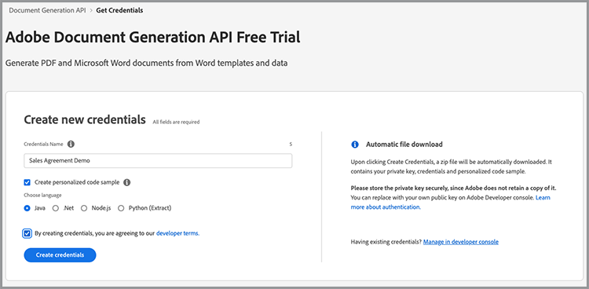

1.  Choose a language to download your sample code (e.g., Node.js).
1.  Check to agree to **developer terms**.
1.  Select **Create credentials**.
    A file is downloaded to your computer with a ZIP file containing the sample files, pdfservices-api-credentials.json, and private.key for authentication.

    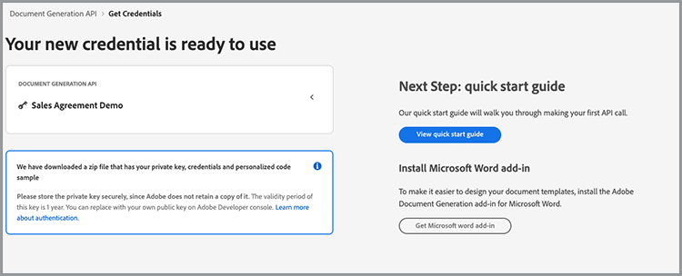

1. Select **Get Microsoft Word add-in** or go to [AppSource](https://appsource.microsoft.com/en-cy/product/office/WA200002654) to install.

    >[!NOTE]
    >
    >Installing the Word add-in requires you to have permission to install Add-ins within Microsoft 365. If you don’t have permission, contact your Microsoft 365 administrator.

## Your data

If you are pulling data from a specific data system, you must output that data as JSON data or generate your own schema. This scenario uses the following pre-created sample data set:

```
{
    "salesOrder": {
        "comment": "Make sure to call 555-555-1234 when you arrive. The front door is broken."
    },
    "company": {
        "name":"Home Services Co.",
        "address": {
            "city": "Homestead",
            "state": "NY",
            "zip": "14623",
            "streetAddress": "123 Demohome Street"
        }
    },
    "customer": {
        "address": {
            "city": "Seattle",
            "state": "WA",
            "zip": "98052",
            "streetAddress": "20341 Whitworth Institute 405 N. Whitworth"
        },
        "email": "mailto:jane-doe@xyz.edu",
        "jobTitle": "Professor",
        "name": "Jane Doe",
        "telephone": "(425) 123-4567",
        "url": "http://www.janedoe.com"
    },
    "tax": {
        "state":"WA",
        "rate": 0.08
    },
    "referencesOrder": [
        {
            "description": "Carpet Cleaning Service - 3BR 2BA",
            "totalPaymentDue": {
                "price": 359.54
            },
            "orderedItem": {
                "description": "Carpet Cleaning Service"
            }
        },
        {
            "description": "Home Cleaning Service - 3BR 2BA",
            "totalPaymentDue": {
                "price": 299.99
            },
            "orderedItem": {
                "description": "House Cleaning Service"
            }
        }
    ]
}
```

## Add basic tags to your document

This scenario uses a Sales Order document, which can be downloaded [here](https://github.com/benvanderberg/adobe-document-generation-samples/blob/main/SalesOrder/Exercise/SalesOrder_Base.docx?raw=true).

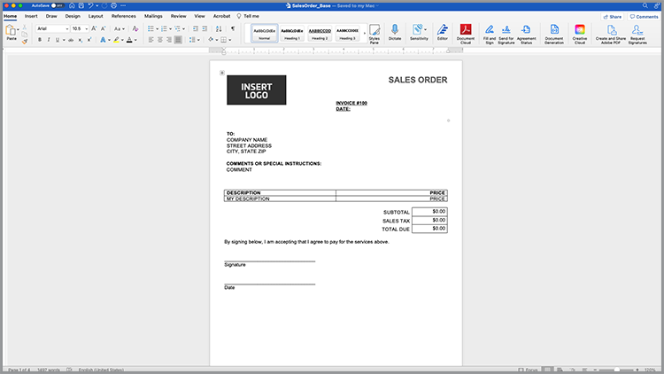

1.  Open the *SalesOrder.docx* sample document in Microsoft Word.
1.  If your Document Generation plugin is installed, select **Document Generation** in the Ribbon. If you do not see Document Generation in your ribbon, follow these instructions.
1.  Select **Get Started**.
1.  Copy the JSON sample data written above into the *JSON Data* field.

    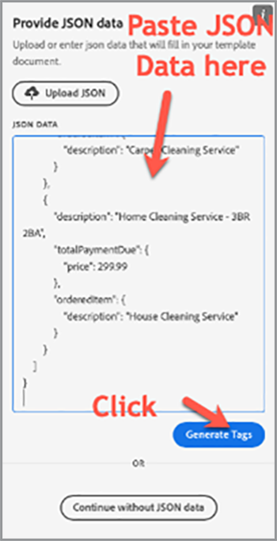

Next, navigate to the Document Generation Tagger panel to place tags into the document.

1.  Select the text that you want to replace (e.g., *COMPANY NAME*).
1.  In the *Document Generation Tagger* panel, search for “name”.
1.  In the list of tags, select name under company.
1.  Select **Insert Text**. 

    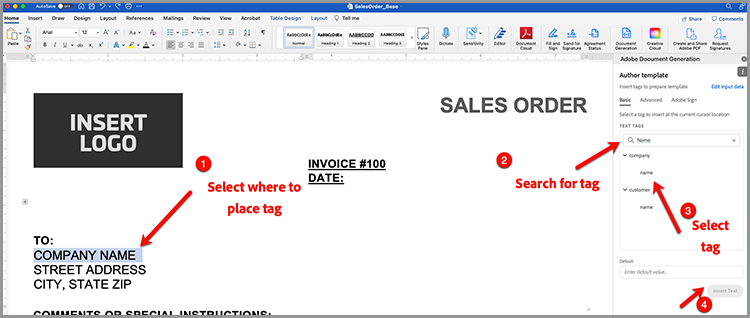

    This process places a tag called {{company.name}} because the tag is under the path in the JSON.

    ```
    {
    …
    "company": {
        "name":"Home Services Co.",
        …
    },
    …
    }
    ```

Repeat these actions for some of the additional tags in the document, such as STREET ADDRESS, CITY, STATE, ZIP, and so forth.

## Preview your generated document

Directly within Microsoft Word, you can preview your generated document based on the sample JSON data.

1.  In the *Document Generation Tagger* panel, select **Generate document**. The first time you may be prompted to sign in with your Adobe ID. Select **Sign In** and complete the prompts to login with your credentials.

    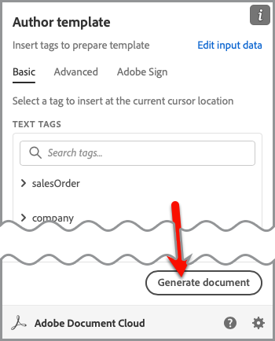

1.  Select **View document**.

    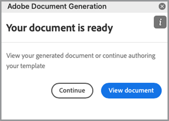

1.  A browser window opens allowing you to preview the document results.

    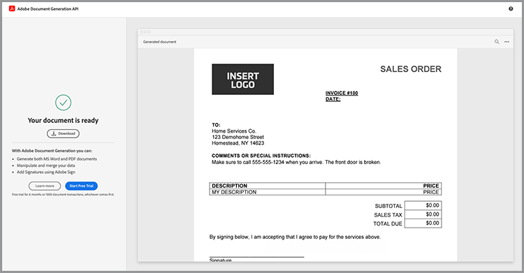

You can see the tags in the document that were replaced with the data from the original sample data.

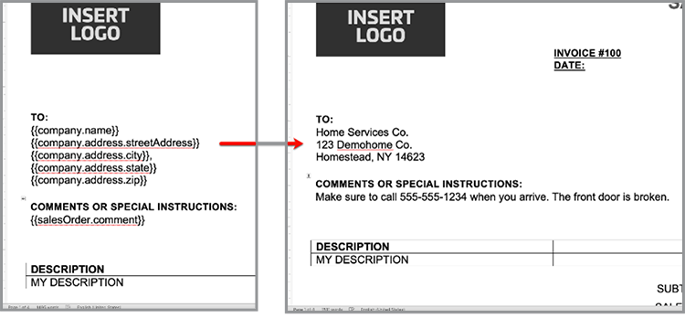

## Add a table to template

In this next scenario, add a list of products to a table in the document.

1.  Insert your cursor where the table must be placed.
1.  In the *Document Generation Tagger* panel, select **Advanced**.
1.  Expand **Tables and Lists**.
1.  In the *Table records* field, select *referencesOrder*, which is an array that lists all the product items.
1.  In the Select column records field, type to include *description* and *totalPaymentDue.price* field.
1.  Select **Insert table**.

    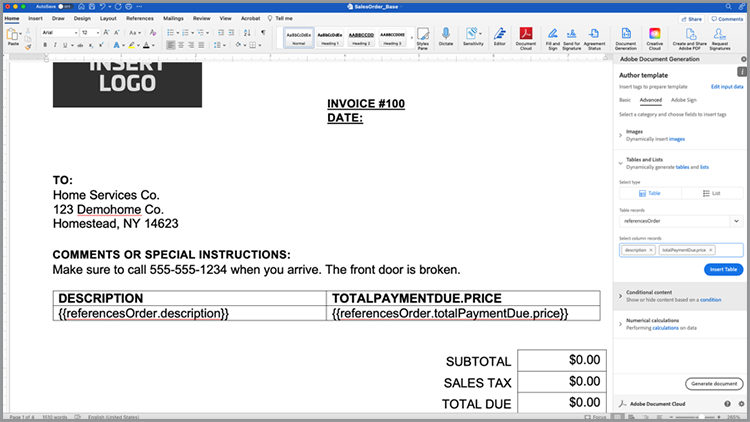

Edit the table to adjust for styles, sizes, and other parameters as you would any other table in Microsoft Word.

## Add numerical calculation

Numerical calculations allow you to calculate sums and other calculations based on a collection of data, such as an array. In this scenario, add a field to calculate the subtotal.

1.  Select the *$0.00* next to the subtotal title.
1.  In the *Document Generation Tagger* panel, expand **Numerical calculations**.
1.  Under *Select calculation type*, choose **Aggregation**.
1.  Under *Select type*, choose **Sum**.
1.  Under *Select records*, choose **ReferencesOrder**.
1.  Under *Select item to perform aggregation**, choose **totalPaymentsDue.price**.
1.  Select **Insert Calculation**.

This process inserts a calculation tag which provides the sum of values. More advanced calculations can be made using JSONata calculations. For example:

*   Subtotal: `${{expr($sum(referencesOrder.totalPaymentDue.price))}}`
    Calculates the sum of referencesOrder.totalPaymentDue.price.

*   Sales Tax: `${{expr($sum(referencesOrder.totalPaymentDue.price)*0.08)}}`
    Calculates the price and multiplies by 8% to calculate tax.

*   Total Due: `${{expr($sum(referencesOrder.totalPaymentDue.price)*1.08)}}`
    Calculates the price and multiples by 1.08 to calculate the subtotal + tax.

## Add conditional terms

Conditional sections allow you to only include a sentence or paragraph when a certain condition is met. In this scenario, only a section is included if it matches a certain state.

1.  In the document, find the section called *CALIFORNIA PRIVACY STATEMENTS*.
1.  Select the section with your cursor.

    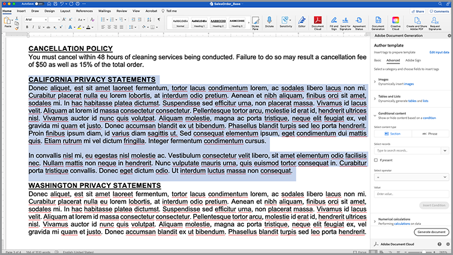

1.  In the *Document Generation Tagger*, select **Advanced**.
1.  Expand **Conditional content**.
1.  In the *Select records* field, search and select **customer.address.state**.
1.  In the *Select operator* field, select **=**.
1.  In the *Value field*, type *CA*.
1.  Select **Insert Condition**.

The California section only appears in the generated document if customer.address.state = CA.

Next, select the section for WASHINGTON PRIVACY STATEMENTS and repeat the steps above, replacing the value CA with WA.

## Add a dynamic image

Document Generation API allows you to insert images dynamically from data. This is useful when you have different subbrands and you want to change logos, portrait images, or images to make them more relevant for a given industry.

Images can be passed by a URL in the data or base64 content. This example uses a URL.

1.  Place your cursor where you want to include an image.
1.  In the *Document Generation Tagger* panel, select **Advanced**.
1.  Expand **Images**.
1.  In the *Select tags* field, choose **logo**.
1.  In the *Optional alternate text* field, provide a description (i.e., logo). This process inserts an image placeholder that looks like this:

    

However, you want to set the image dynamically on an image that already is in the layout, which you can do by the following:

1.  Right-click on the inserted placeholder image.

    

1.  Select **Edit Alt Text**.
1.  In the panel, copy the text that looks like this:
    `{ "location-path": "logo", "image-props": { "alt-text": "Logo" }}`
1.  Select a different image in your document you want to be dynamic.

    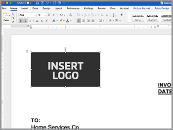
 
1.  Right-click on the image and select **Edit Alt Text**.
1.  Paste the value into the panel.

This process replaces the image with an image that is in the logo variable in the data.

## Add tags for Acrobat Sign

Adobe Acrobat Sign allows you to capture electronic signatures on your documents. Acrobat Sign provides an easy way to drag and drop fields within the web interface, but you can also control signature and other fields placement by using a Text Tag. With Adobe Document Generation Tagger, you can easily place these Text Tag fields.

1.  Navigate to where a signature is required in the sample document.
1.  Insert your cursor where the signature is needed.
1.  In the *Adobe Document Generation Tagger* panel, select **Adobe Sign**.
1.  In the *Specify number of recipient* field, set the number of recipients (in this example it is one).
1.  In the *Recipients* field, select **Signer-1**.
1.  In the *Field* type, select **Signature**.
1.  Select **Insert Adobe Sign Text Tag**. 

A tag is inserted into the document.

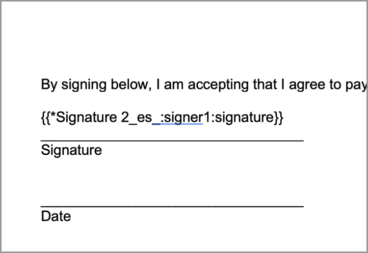

Acrobat Sign provides several other types of fields that you can place, such as date fields.
1.  In the *Field* type, select **Date**.
1.  Move the cursor above the Date location in the document.
1.  Select **Insert Adobe Sign Text Tag**.

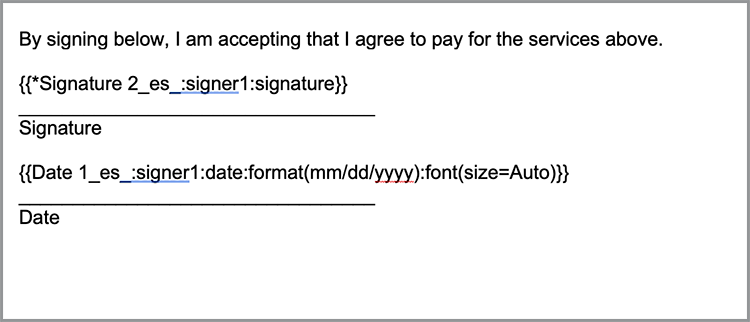

## Generate your agreement

You have now tagged your document and are ready to go. This next section walks through how to generate a document using the Document Generation API samples for Node.js, however these will work in any languages.

Open the pdfservices-node-sdk-samples-master that was downloaded when you registered your credentials. The pdfservices-api-credentials.json and private.key files should be included in these files.

1.  Open a Terminal to install dependencies using npm install.
1.  Copy the sample data.json into the resources folder.
1.  Copy the Word template into the resources folder.
1.  Create a new file in the root directory of the samples folder called generate-salesOrder.js.

```
const PDFServicesSdk = require('@adobe/pdfservices-node-sdk');
const fs = require('fs');
const path = require('path');

var dataFileName = path.join('resources', '<INSERT JSON FILE');
var outputFileName = path.join('output', 'salesOrder_'+Date.now()+".pdf");
var inputFileName = path.join('resources', '<INSERT DOCX>');

//Loads credentials from the file that you created.
const credentials =  PDFServicesSdk.Credentials
    .serviceAccountCredentialsBuilder()
    .fromFile("pdfservices-api-credentials.json")
    .build();

// Setup input data for the document merge process
const jsonString = fs.readFileSync(dataFileName),
jsonDataForMerge = JSON.parse(jsonString);

// Create an ExecutionContext using credentials
const executionContext = PDFServicesSdk.ExecutionContext.create(credentials);

// Create a new DocumentMerge options instance
const documentMerge = PDFServicesSdk.DocumentMerge,
documentMergeOptions = documentMerge.options,
options = new documentMergeOptions.DocumentMergeOptions(jsonDataForMerge, documentMergeOptions.OutputFormat.PDF);

// Create a new operation instance using the options instance
const documentMergeOperation = documentMerge.Operation.createNew(options)

// Set operation input document template from a source file.
const input = PDFServicesSdk.FileRef.createFromLocalFile(inputFileName);
documentMergeOperation.setInput(input);

// Execute the operation and Save the result to the specified location.
documentMergeOperation.execute(executionContext)
.then(result => result.saveAsFile(outputFileName))
.catch(err => {
    if(err instanceof PDFServicesSdk.Error.ServiceApiError
        || err instanceof PDFServicesSdk.Error.ServiceUsageError) {
        console.log('Exception encountered while executing operation', err);
    } else {
        console.log('Exception encountered while executing operation', err);
    }
});
```

1.  Replace `<INSERT JSON FILE>` with the name of the JSON file in /resources.
1.  Replace `<INSERT DOCX>` with the name of the DOCX file.
1.  To run, use Terminal to execute node generate-salesOrder.js.

The output file should be in the /output folder with the document generated correctly.

## More options

Once your document is generated, you can take additional actions such as:

* Secure document with a password
* Compress PDF if there are large images
* Capture electronic signatures on the document

To learn more about some of the other actions that are available, look at the scripts in the /src folder in the sample files. You can also learn more by reviewing documentation of the different actions.

## Additional use cases

Adobe Document Services can help streamline many parts of a sales cycle with digital document workflows:

* Use Adobe PDF Embed API to embed whitepapers and other content on websites while also measure and gather analytics on viewership
* Use Acrobat Sign to capture e-signatures on your generated agreements 
* Extract agreement data from your PDF documents using Adobe PDF Extract API

## Further learning

Interested in learning more? Have a look at some additional ways to use Adobe Document Services:

* Learn more from [documentation](https://developer.adobe.com/document-services/docs/overview/)
* See more tutorials on Adobe Experience League
* Use the sample scripts in the /src folder to see how you can leverage PDF 
* Follow [Adobe Tech Blog](https://medium.com/adobetech/tagged/adobe-document-cloud) for latest tips and tricks
* Subscribe to [Paper Clips (the monthly live stream)](https://www.youtube.com/playlist?list=PLcVEYUqU7VRe4sT-Bf8flvRz1XXUyGmtF) to learn about automating using Adobe Document Services.