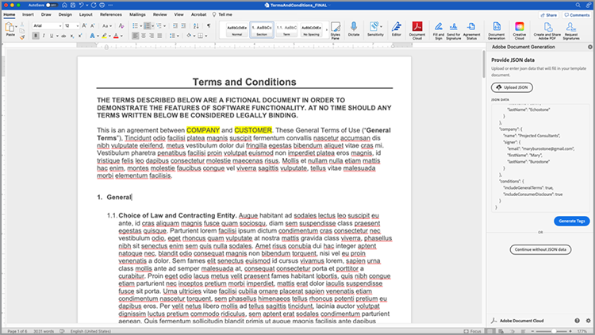
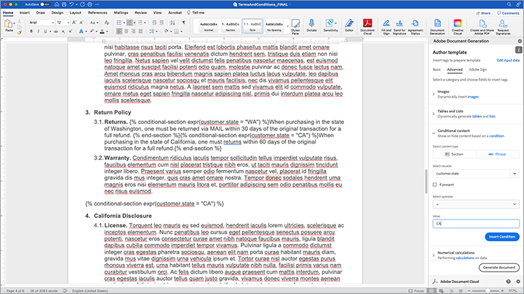
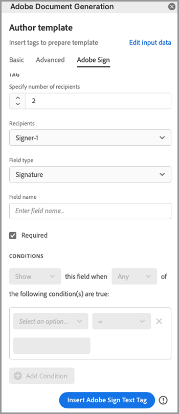
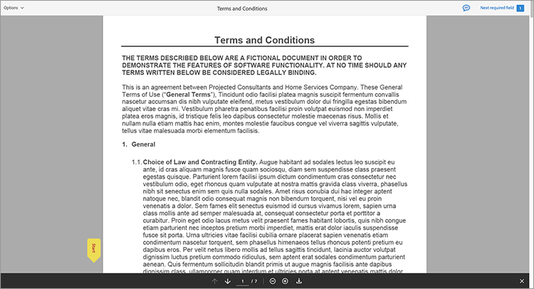

# Automate legal workflows


In an ideal scenario, agreement terms are accepted without any modifications. Often times, however, agreements need customization, which then requires legal review. Legal reviews create significant costs and slow down the process of delivering agreement terms. Using pre-defined templates that change based on approved language, helps legal teams manage and more securely excute agreement terms.

This tutorial uses a legal agreement that varies from state to state. To address these variations, an agreement template with conditional sections is created, which are only included when certain criteria is met. The generated document can either be a Word or PDF document. You can also learn some of the ways to secure your document using Adobe PDF Services API or Acrobat Sign. 

## Get credentials

Start by registering for free Adobe PDF Services credentials:

1.  Navigate [here](https://documentcloud.adobe.com/dc-integration-creation-app-cdn/main.html) to register your credentials.
1.  Login using your Adobe ID.
1.  Set your credential name.

    

1. Choose a language to download your sample code (for example Node.js).
1. Check to agree to **developer terms**.
1. Select **Create credentials**.
   A file is downloaded to your computer with a ZIP file containing the sample files, pdfservices-api-credentials.json, and private.key for authentication.

   

1. Select **Get Microsoft Word add-in** or go to [AppSource](https://appsource.microsoft.com/en-cy/product/office/WA200002654) to install.

    >[!NOTE]
    >
    >Installing the Word add-in requires you to have permission to install Add-ins within Microsoft 365. If you don’t have permission, contact your Microsoft 365 administrator.

## Your data

In this scenario, information is passed to help generate the document and inform if certain sections should be included or not:

```
{
    "customer": {
        "name": "Home Services Company",
        "street": "123 Any Street",
        "city": "Anywhere",
        "state": "CA",
        "zip": "12345",
        "country":"USA",
        "signer": {
            "email": "johnnyechostone@gmail.com",
            "firstName": "John",
            "lastName": "Echostone"
        }
    },
    "company": {
        "name": "Projected Consultants",
        "signer": {
            "email": "maryburostone@gmail.com",
            "firstName": "Mary",
            "lastName": "Burostone"
        }
    },
    "conditions": {
        "includeGeneralTerms": true,
        "includeConsumerDiscloure": true
    }
}
```

In the data, there is information about the customer, their name, who is signing, the state they are in, and so on. In addition, there are sections for information about the company that is generating the agreement and condition flags that are used to include certain sections of the agreement.

## Add basic tags to your document

This scenario uses a Terms and Conditions document, which can be downloaded [here](https://github.com/benvanderberg/adobe-document-generation-samples/blob/main/Agreement/exercise/TermsAndConditions_Sample.docx?raw=true).


1. Open the *TermsAndConditions.docx* sample document in Microsoft Word.
1. If the [Document Generation](https://appsource.microsoft.com/en-cy/product/office/WA200002654) plugin is installed, select **Document Generation** in the Ribbon. If you do not see Document Generation in your ribbon, follow these instructions.
1. Select **Get Started**.
1. Copy the JSON sample data written above into the JSON Data field.



Navigate to the *Document Generation Tagger* panel to place tags in the document.

## Insert the company name

1. Select the text that you want to replace. In this scenario, you are replacing the COMPANY in the opening section of the document.
1. In *Document Generation Tagger*, search for “name”.
1. Under company, choose *name*.

   

1. Select **Insert Text**.

This places a tag called `{{company.name}}` because the tag is under that path in the JSON.

```
{
    "company": {
        "name": "Projected Consultants",
        ...
    }
    ...
}
```

Next, repeat this step in the opening section for the CUSTOMER text. Repeat **steps 1-4**, replacing CUSTOMER with “name” under customer. The output should be `{{customer.name}}`, reflecting that the text is coming from underneath the customer object.

Adobe Document Generation API also allows you to include tags within your headers and footers and at the very end where the titles for the signatures need to go. 

Repeat this process again with **steps 1-4** for the COMPANY and CUSTOMER text in the footer.


Finally, you need to **repeat steps 1-4** to replace FIRST NAME and LAST NAME under the Customer section of the signature page with the tags for `{{customer.signer.firstName}}` and `{{customer.signer.lastName}}` respectively. Do not worry if the tag is long and reflows to the next line because the tag is replaced when the document is generated.

The beginning of your document and the footer should look something like this:

* Beginning section:


* Footer:


* Signature page:


Now that your tags are placed in the document, you are ready to preview your generated agreement.

## Preview your generated document

Directly within Microsoft Word, you can preview your generated document based on the sample JSON data.

1. In *Document Generation Tagger*, select **Generate document**.
1. The first time you may be prompted to sign in with your Adobe ID. Select **Sign In** and complete the prompts to login with your credentials.

   

1. Select **View document**.

   

1. A browser window opens, allowing you to preview the document results.
   
   

## Add conditional terms for each state

In this next section, you set only certain sections to be included based on certain input data criteria. In the sample document, sections 4 and 5 only pertain to a specific state. For this scenario, only the state-specific terms should be included when a customer resides in that state. Also, the numbering in Microsoft Word should not include that section if it is removed. Use Document Generation API’s Conditional content feature to tag this.


1. In the document, select the California Disclosure section and all the subbullets.
  
   

1. In *Document Generation Tagger*, select **Advanced**.
1. Expand **Conditional content**.
1. In *Select records* field, search, and select **customer.state**.
1. In *Select operator* field, select **=**.
1. In *Value* field, type *CA*.
1. Select **Insert Condition**.

The section is now wrapped with some tags called conditional-section tags. When you added the tags, it may have added the conditional-section tag as a numbered line. You can remove this by backspacing before the tag, otherwise it will number items as if the tag wasn’t there when the document is generated. The section that is conditional ends with the `` tag.


**Repeat steps 1-7** for the *Washington Disclosure* section, replacing the *CA* value with *WA* to represent that the section is only shown if the customer’s state is Washington.


## Testing with conditional sections

Once your conditional sections are in place, you can preview your document by selecting **Generate document**.

When you generate your document, notice that the section that is included is only the one that meets the data criteria. In the example below, because the state was equal to CA, only the California section is included.


One other notable change is that the numbering for the subsequent section, Use of Services and Software, has the number 5. This means that when the Washington section is omitted, the numbering continues.


To test whether the template behaves correctly when the customer is in the state of Washington rather than California, change the sample data for the template:

1. In *Document Generation Tagger*, select **Edit input data**.

   

1. Select **Edit**.

1. In the JSON data, change *CA* to *WA*.

   

1. Select **Generate Tags**.
1. Select **Generate document** to regenerate the document.

Notice that the document only includes the Washington state section.


## Adding a conditional sentence

Like conditional sections, you can also have specific sentences that are included when certain conditions are met. For this example, the return policy is different between California and Washington. 

1. In section 3.1, select the first sentence “When purchasing in the state of Washington, one must be returned via MAIL within 30 days of the original transaction for a full refund.”.
1. In *Document Generation Tagger*, select **Advanced**.
1. Expand **Conditional content**.
1. Under *Content type*, select **Phrase**.
1. In *Select records* field, search, and select **customer.state**.
1. In *Select operator* field, select **=**.
1. In *Value* field, type *CA*.
1. Select **Insert Condition**.

While the name of the tag is the same, the main difference between Phrase and Section is that a phrase has the section not include new lines. The condition-section tag and the -end-section tag must be in the same paragraph.



## Add tags for Acrobat Sign

Acrobat Sign allows you to send agreements for signature or embed into web experience for someone to easily view and sign. Adobe Document Generation Tagger in Microsoft Word allows you to easily pre-tag documents before they are sent with Acrobat Sign, so signatures are always placed in the right location. In this scenario, there are two signers that need a place to sign and date the document.

1. Navigate to where the customer must sign.
1. Place your cursor where the signature needs to go.

   

1. In *Document Generation Tagger*, select **Adobe Sign**.
1. In *Specify number of recipient* field, set the number of recipients (this example uses 2).
1. In *Recipients* field, select **Signer-1**.
1. In *Field* type, select **Signature**.
1. Select **Insert Adobe Sign Text Tag**.

   

>[!NOTE]
>
>If the **Insert Adobe Sign Text Tag** button appears to be missing, scroll down.

This places a signature field where the first signer needs to sign.


Next, place a data field for the signer who that auto-populates when they sign.

1. Move your cursor where the date should be placed.

   

1. Set Field type to Date.
1. Select **Insert Adobe Sign Text Tag**.

The Date tag that is placed is rather long: `{{Date 3_es_:signer1:date:format(mm/dd/yyyy):font(size=Auto)}}`. The Acrobat Sign text tag must remain on the same line, which is different from the Document Generation tags. The `:format()` and `font()` parameters are optional, so for this scenario we can shorten the tag to `{{Date 3_es_:signer1:date}}`.

Repeat the steps above the *Company signature* section. When you do this, you must change the Recipients field to **Signer-2**, otherwise all the signature fields are assigned to the same person.

## Generate your agreement

You have now tagged your document and are ready to go. In this next section, learn how to generate a document using the Document Generation API samples for Node.js. These samples work in any languages.

Open the pdfservices-node-sdk-samples-master file that you downloaded when registering your credentials. These files include the pdfservices-api-credentials.json and private.key files.

1. Open your **Terminal** to install dependencies using `npm install`.
1. Copy your sample *data.json* into the *resources* folder.
1. Copy the Word template that you created into the *resources* folder.
1. Create a new file in the root directory of the samples folder called *generate-salesOrder.js*.

```
const PDFServicesSdk = require('@adobe/pdfservices-node-sdk').
const fs = require('fs');
const path = require('path');

var dataFileName = path.join('resources', '<INSERT JSON FILE');
var outputFileName = path.join('output', 'salesOrder_'+Date.now()+".pdf");
var inputFileName = path.join('resources', '<INSERT DOCX>');

//Loads credentials from the file that you created.
const credentials =  PDFServicesSdk.Credentials
    .serviceAccountCredentialsBuilder()
    .fromFile("pdfservices-api-credentials.json")
    .build();

// Setup input data for the document merge process
const jsonString = fs.readFileSync(dataFileName),
jsonDataForMerge = JSON.parse(jsonString);

// Create an ExecutionContext using credentials
const executionContext = PDFServicesSdk.ExecutionContext.create(credentials);

// Create a new DocumentMerge options instance
const documentMerge = PDFServicesSdk.DocumentMerge,
documentMergeOptions = documentMerge.options,
options = new documentMergeOptions.DocumentMergeOptions(jsonDataForMerge, documentMergeOptions.OutputFormat.PDF);

// Create a new operation instance using the options instance
const documentMergeOperation = documentMerge.Operation.createNew(options)

// Set operation input document template from a source file.
const input = PDFServicesSdk.FileRef.createFromLocalFile(inputFileName);
documentMergeOperation.setInput(input);

// Execute the operation and Save the result to the specified location.
documentMergeOperation.execute(executionContext)
.then(result => result.saveAsFile(outputFileName))
.catch(err => {
    if(err instanceof PDFServicesSdk.Error.ServiceApiError
        || err instanceof PDFServicesSdk.Error.ServiceUsageError) {
        console.log('Exception encountered while executing operation', err);
    } else {
        console.log('Exception encountered while executing operation', err);
    }
});
```

1. Replace `<JSON FILE>` with the name of the JSON file in /resources.
1. Replace `<INSERT DOCX>` with the name of the DOCX file.
1. To run, use **Terminal** to execute node `generate-salesOrder.js`.

The output file is in the /output folder with the document generated correctly. 

You can change the format by changing the line below. DOCX format is helpful if this document is going to be sent for someone to edit in Word or for contract review.

PDF:

```
options = new documentMergeOptions.DocumentMergeOptions(jsonDataForMerge,
documentMergeOptions.OutputFormat.PDF);
```

Word:

```
options = new documentMergeOptions.DocumentMergeOptions(jsonDataForMerge, documentMergeOptions.OutputFormat.DOCX);
```

You must also change the name of the output file to .pdf or .docx for PDF or DOCX output format respectively:

```
var outputFileName = path.join('output', 'salesOrder_'+Date.now()+".docx");
```

## Send agreement for signature

[Adobe Acrobat Sign](https://www.adobe.com/sign.html) allows you to send agreements to one or many recipients for them to view and sign documents. Along with an easy-to-use user experience to send a document for signature, REST APIs are available that allow you to take Word, PDF, HTML, and other formats and send them for signature.

The example below walks through how to use REST API documentation page to take the previously generated document and send it for signature. First, learn how you can do it through the Acrobat Sign web interface and then how to do it with the REST API.

## Get an Acrobat Sign account

If you do not have an Acrobat Sign account, sign up for a developer account and review the documentation [here](https://developer.adobe.com/adobesign-api/), and select **Developer Account Sign Up**. You are prompted to fill out a form and receive a verification email. Once you do that, you are directed to a website to set your password and account where you can then login to Acrobat Sign.

## Send an agreement from web interface

1. Select **Send** from the navigation bar.

   

1. In *Recipients* field, specify two email addresses. It is best practice to use an email address that is not associated with your Acrobat Sign account.

   

1. Set an **Agreement Name** and **Message**.
1. Select **Add Files** and upload the generated file from your computer.
1. Select **Preview & Add Signature Fields**.
1. Select **Next**.
1. When scrolling down to the signature page, you can see the placed signature fields based on the tags.

   

1. Select **Send**.
1. In your email, a message with a link to view and sign appears.

   

1. Select **Review and sign**.
1. Select **Continue** to accept terms of use.
1. Select **Start** to jump to where you need to sign.

   

1. Select **Click here to sign**.

   

1. Type your signature.

   

1. Select **Apply**.
1. Select **Click to Sign**.

An email is sent to the next signer. Repeat steps 9-16 to view and sign for the second signer.

Once the agreement is completed, a signed copy of the agreement is sent via email to each of the parties. In addition, a signed agreement can be retrieved from the Acrobat Sign web interface in the **Manage** page.


Next, learn how to do the same scenario via REST API documentation.

## Get credentials

1. Navigate to [Acrobat Sign REST Documentation](https://secure.na1.adobesign.com/public/docs/restapi/v6).
1. Expand *transientDocuments* and the [POST /transientDocuments](https://benprojecteddemo.na1.adobesign.com/public/docs/restapi/v6#!/transientDocuments/createTransientDocument).
1. Select **OAUTH ACCESS-TOKEN**.
   
   

1. Check the OAUTH permissions for *agreement_write*, *agreement_sign*, *widget_write*, and *library_write*. 
1. Select **Authorize**.
1. You are prompted via a pop-up to login with your Acrobat Sign account. Login user your administrator’s username and password.
1. You are prompted to allow access to the REST Documentation. Select **Allow Access**.

A bearer token is then added to the **Authorization** field.

To learn more how to create an authorization token for Acrobat Sign, you can follow the step outlined [here](https://opensource.adobe.com/acrobat-sign/developer_guide/helloworld.html).

## Upload a transient document

Since the Authorization token is added from the previous steps, you need to upload a document to make the API call:

1. In *File* field, upload the PDF document that was generated in previous steps.

   

1. Select **Try it out!**.
1. In **Response Body**, copy the *transientDocumentId* value.

The *transientDocumentId* is used to reference a document that is temporarily stored in Acrobat Sign so that it can be referenced in subsequent API calls.

## Send for signature

Once a document is uploaded, you need to send the agreement for signature.

1. Expand out the agreement section and POST agreement sections.
1. In the *AgreementInfo* field, populate it with the following JSON:

```
{
  "fileInfos": [
    {
      "transientDocumentId": "3AAABLblqZhAJeoswpyslef8_toTGT1WgBLk3TlhfJXy_uSLlKyre2hjF0-J1meBDn0PlShk0uQy6JghlqEoqXNnskq7YawteF6QWtHefP9wN2CW_Xbt0O9kq1tkpznG0a5-mEm4bYAV1FGOnD1mt_ooYdzKxm7KzTB11DLX2-81Zbe2Z1suy7oXiWNR3VSb-zMfIb5D4oIxF8BiNfN0q08RwT108FcB1bx4lekkATGld3nRbf8ApVPhB72VNrAIF0F1rAFBWTtfgvBKZaxrYSyZq73R_neMdvZEtxWTk5fii_bLVe7VdNZMcO55sofH61eQC_QIIsoYswZP4rw6dsTa68ZRgKUNs"
    }
  ],
  "name": "Terms and Conditions",
  "participantSetsInfo": [
    {
      "memberInfos": [
        {
          "email": "adobesigndemo+customer@outlook.com"
        }
      ],
      "order": 1,
      "role": "SIGNER"
    },
    {
        "memberInfos": [
          {
            "email": "adobesigndemo+company@outlook.com"
          }
        ],
        "order": 1,
        "role": "SIGNER"
      }
  ],
  "signatureType": "ESIGN",
  "state": "IN_PROCESS"
}
```

1. Select **Try it out!**.

**POST agreements API** returns an ID for the agreement. To get a template for the JSON model schema, select **Minimal Model Schema**. A full list of parameters is available in the **Complete Model Schema** section.

## Check status of agreement

Once you have an agreement ID, you can send an agreement status.

1. Expand **GET /agreements/{agreementId}**.
1. Because you may need additional OAUTH scope, select **OAUTH-ACCESS-TOKEN** again.
1. Copy the agreementId from the previous API call response into the agreementId field.
1. Select **Try it Out!**.

Now you have information about that agreement.

```
{
    "id": "CBJCHBCAABAAc6LyP4SVuKXP_pNstzIzyripanRdz4IB",
    "name": "Terms and Conditions",
    "groupId": "CBJCHBCAABAAoyMb1yIgczAGhBuJeHf99mglPtM7ElEu",
    "type": "AGREEMENT",
    "participantSetsInfo": [
      {
        "id": "CBJCHBCAABAAzZE-IcHHkt05-AVbxas4Jz7DUl3oEBO6",
        "memberInfos": [
          {
            "email": "adobesigndemo+customer@outlook.com",
            "id": "CBJCHBCAABAAyWgMMReqbxUFM7ctI5xz16c2kOmEy-IQ",
            "securityOption": {
              "authenticationMethod": "NONE"
            }
          }
        ],
        "role": "SIGNER",
        "order": 1
      },
      {
        "id": "CBJCHBCAABAAaRHz3gY2W0w5n_6pj1GMMuZAfhBihc1j",
        "memberInfos": [
          {
            "email": "adobesigndemo+company@outlook.com",
            "id": "CBJCHBCAABAAOZQwjPwJXFiX8YDKPYtzMpftsmxYrIo9",
            "securityOption": {
              "authenticationMethod": "NONE"
            }
          }
        ],
        "role": "SIGNER",
        "order": 1
      }
    ],
    "senderEmail": "adobesigndemo+new@outlook.com",
    "createdDate": "2022-03-22T02:59:36Z",
    "lastEventDate": "2022-03-22T02:59:41Z",
    "signatureType": "ESIGN",
    "locale": "en_US",
    "status": "OUT_FOR_SIGNATURE",
    "documentVisibilityEnabled": true,
    "hasFormFieldData": false,
    "hasSignerIdentityReport": false,
    "documentRetentionApplied": false
  }
```

The more efficient method for getting notifications when updates are changed is via Webhooks, which you can learn more about [here](https://opensource.adobe.com/acrobat-sign/developer_guide/webhookapis.html) and a full list of available webhook events are available [here](https://opensource.adobe.com/acrobat-sign/developer_guide/webhookevents.html).

## Store a signed document

Once the document is signed, it can be retrieved using the GET /agreements/combinedDocument file.

1. Expand **GET /agreements/{agreementId}/combinedDocument**.
1. Set **agreementId** to the *agreementId* provided from the previous API call.
1. Select **Try it Out!**.

Additional parameters to attach an audit report or supporting documents can be set using the attachSupportingDocuments and attachAuditReport parameters.

In the **Response Body**, it can then be downloaded to your computer and stored where you like.

## More options

In addition to generating a document and sending it for signature, additional actions are available.

For example, if the document does not have a signature, Adobe PDF Services API offers many ways you can transform documents after the agreement is generated such as: 

* Secure document with a password
* Compress PDF if there are large images
* To learn more about other actions that are available, look at the scripts in the /src folder in the sample files for Adobe PDF Services API. You can also learn more by reviewing documentation of the different actions that can be used.

In addition, Acrobat Sign offers several additional functions such as:

* Embed signing experience into an application
* Add identity verification methods for signers
* Configure email notification settings
* Download individual separate documents as part of an agreement

## Further learning

Interested in learning more? Have a look at some additional ways to use Adobe Document Services:

* Learn more from [documentation](https://developer.adobe.com/document-services/docs/overview/)
* See more tutorials on Adobe Experience League
* Use the sample scripts in the /src folder to see how you can use PDF 
* Follow [Adobe Tech Blog](https://medium.com/adobetech/tagged/adobe-document-cloud) for latest tips and tricks
* Subscribe to [Paper Clips (the monthly live stream)](https://www.youtube.com/playlist?list=PLcVEYUqU7VRe4sT-Bf8flvRz1XXUyGmtF) to learn about automating using Adobe Document Services.

