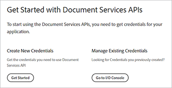
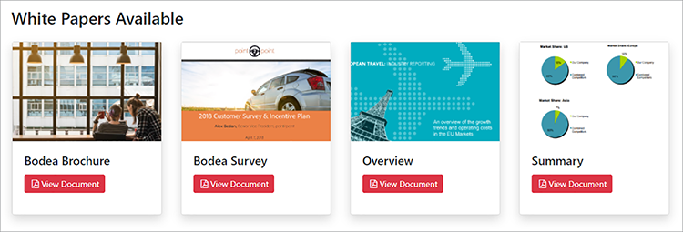

# Digital document publishing with Adobe PDF Embed API

Electronic documents are everywhere — in fact, there are probably [trillions of PDFs](https://itextpdf.com/en/blog/technical-notes/do-you-know-how-many-pdf-documents-exist-world) globally, and that number rises every day. By embedding a PDF viewer in your web pages, you enable users to view documents without redesigning your HTML and CSS or obstructing access to your website.

Let’s explore a popular scenario. A company posts [whitepapers on their website](https://www.adobe.io/apis/documentcloud/dcsdk/digital-content-publishing.html)
to provide context for their apps and services. The website’s marketer wants to understand better how users interact with their PDF-based content and incorporate it with their webpage and brand. They have decided to publish the whitepapers as [gated content](https://whatis.techtarget.com/definition/gated-content-ungated-content#:~:text=Gated%20content%20is%20online%20materials,about%20their%20jobs%20and%20organizations.), controlling who can download them.

Learn how to display embedded PDF documents inside web pages using [Adobe PDF Embed API](https://www.adobe.io/apis/documentcloud/dcsdk/pdf-embed.html), which is free and easy to use. These examples use some JavaScript, Node.js, Express.js, HTML, and CSS. You can view the complete project code on [GitHub](https://www.google.com/url?q=https://github.com/marcelooliveira/EmbedPDF/tree/main/pdf-app&sa=D&source=editors&ust=1617129543031000&usg=AOvVaw2rzSwYuJ_JI7biVIgbNMw1).

## Creating a Node Web App

Let’s start by creating a site using Node.js and Express that uses a nice-looking template and offers several PDFs for download.

First, [download and install Node.js](https://nodejs.org/en/download/).

To create a Node.js project easily with a minimal web application structure, install the application generator tool `` `express-generator` ``.

```
npm install express-generator -g
```

Next, create the new Express app named pdf-app, choosing as the view engine.

```
express pdf-app --view=ejs
``` 

Now, move to the \\pdf-app directory and install all the project dependencies.

``` 
cd pdf-app
npm install
```
 
Then, start the local web server and run the application.

```
npm start
```

Finally, open the website at <http://localhost:3000>.


You now have a basic website.

## Rendering whitepaper data

To post whitepapers to the website, the whitepaper data is defined and prepared our website to display these documents. First, create a new \\data folder at the project root. The information on available whitepapers comes from a new file named [data.json](https://github.com/marcelooliveira/EmbedPDF/blob/main/pdf-app/data/data.json), which is put in the data folder.

To give the web app a nice, polished look, install the [Bootstrap](https://getbootstrap.com/) and [Font Awesome](https://fontawesome.com/) front-end libraries.

```
npm install bootstrap
npm install font-awesome
```

Open the app.js file and include these directories as sources for static files, placing them after the existing `` `express.static` `` line.

```
app.use(express.static(path.join(__dirname, '/node_modules/bootstrap/dist')));
app.use(express.static(path.join(__dirname, '/node_modules/font-awesome')));
```
 
To include the PDF documents, create a folder named \\pdfs under the project’s \\public folder. Instead of creating the PDFs and the thumbnails by yourself, you can copy them from this [GitHub repository folder](https://github.com/marcelooliveira/EmbedPDF/tree/main/pdf-app/public) to the \\pdfs and \\image folders.

The \\public\\pdfs folder now contains the PDF documents:


While the \\public\\images folder should contain the thumbnails for each of the PDF documents:


Now, open the \\routes\\index.js file, which contains the logic for routing the home page. To use the whitepaper data from the data.json file, you must load the Node.js module responsible for accessing and interacting with the file system and declare the `fs` constant in the first line of the \\routes\\index.js file, as follows:

```
const fs = require('fs');
```

Then, read and parse the data.json file and store them in the papers variable:

```
let rawdata = fs.readFileSync('data/data.json');
let papers = JSON.parse(rawdata);
```

Now modify the line to invoke the render method for the index view, passing the papers collection as the model for the index view.

```
res.render('index', { title: 'Embedding PDF', papers: papers });
```
 
To render the collection of whitepapers on the homepage, open the \\views\\index.ejs file and replace the existing code with the code from our project’s [index file](https://github.com/marcelooliveira/EmbedPDF/blob/main/pdf-app/views/index.ejs).

Now, rerun npm start and open <http://localhost:3000> to view your collection of available whitepapers.


In the next sections onvolve enhancing the website and using [PDF Embed API](https://www.adobe.io/apis/documentcloud/dcsdk/pdf-embed.html) to display the PDF documents on our web page. PDF Embed API is free to use — you just need to obtain an API credential.

## Getting a PDF Embed API credential

To get a free PDF Embed API credential, visit the [Get Started](https://www.adobe.io/apis/documentcloud/dcsdk/gettingstarted.html) page after signing up for a new account or logging in to your existing account.

Click **Create New Credentials** and then **Get Started:**



<br>&nbsp;

At this point, you are asked to register for a free account if you don’t have one.

Select **PDF Embed API**, then type your credentials name and application domain. Use the **localhost** domain because of testing the web app locally.


<br>&nbsp;

Click the **Create Credentials** button to access your PDF credentials and get the Client ID (API KEY).


<br>&nbsp;

In your Node.js project, create a file named .ENV in the application’s root folder and declare the environment variable for your PDF Embed Client ID with the value of the API KEY credential from the previous step.
 
```
PDF_EMBED_CLIENT_ID=**********************************************
```
 
Later you use this client ID to access PDF Embed API. Install the dotenv package to access this environment variable using Node.js code.
 
```
npm install dotenv
```

Now, open the app.js file and add the following line at the top of the file so Node.js can load the dotenv module:
 
```
require('dotenv').config();
```
 
## Displaying PDFs in the Web App

Now use PDF Embed API to display PDFs on the site. Open the live [PDF Embed API Demo](https://documentcloud.adobe.com/view-sdk-demo/index.html#/view/FULL_WINDOW/Bodea%20Brochure.pdf).


On the left panel, you can choose the embed mode that best fits your website needs:

*   **Full Window**: the PDF covers all the web page space

*   **Sized Container**: the PDF displays inside the webpage, one page at a time, in a div with limited size

*   **In-Line**: the entire PDF displays in a div inside the webpage

*  **Lightbox**: the PDF displays as a layer on top of your webpage

It is recommended to use the in-line embed mode for whitepapers and the code generator later to embed a PDF in our application.

## Creating an in-line embed mode page

To embed a PDF viewer in your webpage and display all the pages simultaneously, you create a new page using the in-line embed mode.

Create a new view in the file \\views\\in-line.ejs using the EJS view engine.

```
<! html DOCTYPE >
<html>
<head>
<title>
<%= title %>
</title>
<link rel='stylesheet' href='/stylesheets/style.css' />
<link rel='stylesheet' href='/css/bootstrap.min.css'/>
<link rel='stylesheet' href='/css/font-awesome.min.css' />
<style type="text/css">
p {
font-family: 'Gill Sans', 'Gill Sans MT', Calibri, 'Trebuchet MS', sans-serif
}
</style>
</head>
<body class="m-0">
<div>
<main>
<div class="row">
<div class="col-sm-3"></div>
<div class="col-sm-6">
<h3>
<p class="text-center">Grow your business, establish your brand,<br
/>
```
 
and put your customers first.
 
```
</p>
</h3>
<div>
<p class="text-center">Lorem ipsum dolor sit amet, consectetur adipiscing elit, sed do<br />
eiusmod tempor incididunt ut labore et dolore</p>
</div>
</div>
</main>
<footer>
<div class="row">
<div class="col-sm-3"></div>
<div class="col-sm-6">
<p class="text-center">Bodea Inc. Your trusted partner since 2008</p>
</div>
</div>
</footer>
</div>
</div>
</body>
</html>
```
 
Then, modify \\views\\index.ejs to create a button to open the in-line view.

```
<div class="card-body">
<h5 class="card-title">
<span>
<%= paper.title %>
</span>
</h5>
<p>
<a class="btn btn-sm btn btn-danger" href="/in-line/<%=
paper.id %>">
<span type="button"></span>
<span class="fa fa-file-pdf-o"></span>&nbsp;View Document</button>
</a>
</p>
</div>
```
 
Open the app.js file and declare a new router after the indexRouter declaration:
 
```
var indexRouter = require('./routes/index');
var inLineRouter = require('./routes/in-line');
```
 
Then add this code after app.use('/', indexRouter); to associate the in-line embed mode view with its router:
 
```
app.use('/', indexRouter);
app.use('/in-line', inLineRouter);
```
 
Now, create a new in-line.js file under \\routes to create new router logic. Include Express, a Node module that enables a web application backend.

```
var express = require('express');
const fs = require('fs');
var router = express.Router();
```

Next, create an endpoint that handles GET requests for a specific whitepaper ID and renders the in-line.ejs view.
 
```
router.all('/:id', function(req, res, next) {
let rawdata = fs.readFileSync('data/data.json');
let papers = JSON.parse(rawdata);
let paper = papers.filter(p => p.id == parseInt(req.params.id))[0];
res.render('in-line', { title: paper.title, paper: paper });
});
module.exports = router;
```

Look again at the [live demo](https://documentcloud.adobe.com/view-sdk-demo/index.html#/view/FULL_WINDOW/Bodea%20Brochure.pdf) to generate PDF Embed API code automatically. Click **In-Line** from the left panel:


Click **Generate Code** to see the HTML code required to display a Sized Container PDF viewer.


Click **Copy Code** and paste the code into the in-line.ejs file.

```
<div>
<p class="text-center">Lorem ipsum dolor sit amet, consectetur adipiscing elit, sed do<br />
eiusmod tempor incididunt ut labore et dolore</p>
</div>
<div class="row align-items-center border border-primary">
<div id="adobe-dc-view" style="width: 800px;"></div>
<script src="https://documentcloud.adobe.com/view-sdk/main.js"></script>
<script type="text/javascript">
document.addEventListener("adobe_dc_view_sdk.ready", function(){
var adobeDCView = new AdobeDC.View({clientId: "<YOUR_CLIENT_ID>", divId: "adobe-dc-view"});
adobeDCView.previewFile({
content:{location: {url: "https://documentcloud.adobe.com/view-sdk-demo/PDFs/Bodea Brochure.pdf"}},
metaData:{fileName: "Bodea Brochure.pdf"}
}, {embedMode: "IN_LINE"});
});
</script>
</div>
```

However, our document parameters are still hardcoded. Let’s replace them with the EJS bracket syntax (\<%= someValue %\>) to render the page according to the whitepaper model data.
 
```
<div id="adobe-dc-view" style="width: 800px;"></div>
<script src="https://documentcloud.adobe.com/view-sdk/main.js"></script>
<script type="text/javascript">
document.addEventListener("adobe_dc_view_sdk.ready", function () {
var adobeDCView = new AdobeDC.View({ clientId: "<%=process.env.PDF_EMBED_CLIENT_ID %>", divId: "adobe-dc-view" });
adobeDCView.previewFile({
content: { location: { url: "<%= paper.pdf %>" } },
metaData: { fileName: "<%= paper.fileName %>" }
}, {
embedMode: "IN_LINE"
});
});
</script>
```

Now run the application with the npm start command and open the website at <http://localhost:3000>.



Finally, choose one white paper and click **View Document** to open a new page with the in-line embedded PDF:


Note how the Download PDF and Print PDF options are now present.


You will want to control these flags on the back end. Later you can implement authorization controls based on user identity and restrict access according to your business rules. That complexity isn't needed here, so let’s just modify \\routes\\in-line.js to include the authenticated and permissions properties in the model object.
 
```
let authenticated = false;
res.render('in-line', {
title: paper.title,
paper: paper,
authenticated: authenticated,
permissions: {
showDownloadPDF: true,
showPrintPDF: true,
showFullScreen: true
}
});
```

Then, modify \\views\\in-line.ejs so your webpage can render the flag values coming from the backend.

```
embedMode: "IN_LINE",
showDownloadPDF: <%= permissions.showDownloadPDF %>,
showPrintPDF: <%= permissions.showPrintPDF %>,
showFullScreen: <%= permissions.showFullScreen %>
Now, open the in-line.js route file and modify it to disallow the printing, downloading, and full-screen controls.
permissions: {
showDownloadPDF: false,
showPrintPDF: false,
showFullScreen: false
}
```
 
Then, rerun the application to see how this change reflects in the PDF Viewer.


## Creating gated content

According to the end-user scenario, the marketer for the company’s website wants to understand better how users interact with their PDF-based content and incorporate the content with the rest of their webpage and brand.

Our focus is on PDF embedding, so you won’t create a user authentication feature. Instead, you'll just implement a simple, fake paywall using a web form that accepts some user information then displays the PDF document once the user submits the form.

Replace the \\routes\\in-line.js file with the contents below to provide the view model with user information:
 
```
var express = require('express');
const fs = require('fs');
var router = express.Router();
router.all('/:id', function(req, res, next) {
let rawdata = fs.readFileSync('data/data.json');
let papers = JSON.parse(rawdata);
let paper = papers.filter(p => p.id == parseInt(req.params.id))[0];
let authenticated = false;
let user = {};
if (req.body.firstName) {
user = {
firstName: req.body.firstName,
lastName: req.body.lastName,
jobTitle: req.body.jobTitle,
email: req.body.email,
};
authenticated = true;
}
res.render('in-line', {
title: paper.title,
paper: paper,
user: user,
authenticated: authenticated,
permissions: {
showDownloadPDF: false,
showPrintPDF: false,
showFullScreen: false
}
});
});
module.exports = router;
```
 
Then replace the \\views\\in-line.ejs contents with the code below. It displays the user data form or the PDF viewer, depending on whether it is an authenticated user.

```
<!DOCTYPE html>
<html>
<head>
<title>
<%= title %>
</title>
<link rel='stylesheet' href='/css/bootstrap.min.css'/>
<link rel='stylesheet' href='/css/font-awesome.min.css' />
<style type="text/css">
p {
font-family: 'Gill Sans', 'Gill Sans MT', Calibri, 'Trebuchet MS', sans-serif
}
</style>
</head>
<body class="m-0">
<% if (authenticated) { %>
<header class="bg-dark text-white">
<div class="text-right mr-4">Hello, <%= user.firstName %> <%= user.lastName%></div>
</header>
<% } %>
<div>
<main>
<div class="row">
<div class="col-sm-3"></div>
<div class="col-sm-6">
<h3>
<p class="text-center">Grow your business, establish your brand,<br
/>
```

and put your customers first.
 
```
</p>
</h3>
<div>
<p class="text-center">Lorem ipsum dolor sit amet, consectetur adipiscing elit, sed do<br />
eiusmod tempor incididunt ut labore et dolore</p>
</div>
<% if (!authenticated) { %>
<div class="row">
<form method="POST" class="center-panel text offset-md-3 col-md-6 border">
<fieldset class="offset-md-1">
<legend>Submit your info to<br/>access the whitepaper</legend>
<p><input name="firstName" placeholder="first name"/></p>
<p><input name="lastName" placeholder="last name"/></p>
<p><input name="jobTitle" placeholder="job title"/></p>
<p><input name="email" placeholder="email"/></p>
<p><button type="submit" class="btn btn-sm btn btn-primary">Submit</button></p>
</fieldset>
</form>
</div>
<% } %>
<% if (authenticated) { %>
<div class="row align-items-center border border-primary">
<div id="adobe-dc-view" style="width: 800px;"></div>
<script src="https://documentcloud.adobe.com/view-sdk/main.js"></script>
<script type="text/javascript">
document.addEventListener("adobe_dc_view_sdk.ready", function () {
var adobeDCView = new AdobeDC.View({ clientId: "<%=process.env.PDF_EMBED_CLIENT_ID %>", divId: "adobe-dc-view" });
adobeDCView.previewFile({
content: { location: { url: "<%= paper.pdf %>" } },
metaData: { fileName: "<%= paper.fileName %>" }
}, {
embedMode: "IN_LINE",
showDownloadPDF: <%= permissions.showDownloadPDF %>,
showPrintPDF: <%= permissions.showPrintPDF %>,
showFullScreen: <%= permissions.showFullScreen %>
});
});
</script>
<% } %>
</div>
</div>
</main>
<footer>
<div class="row">
<div class="col-sm-3"></div>
<div class="col-sm-6">
<p class="text-center">Bodea Inc. Your trusted partner since 2008</p>
</div>
</div>
</footer>
</div>
</div>
</body>
</html>
```
 


Site visitors can now only access PDFs after submitting their information:


## Enabling events

Let’s see how to easily integrate PDF viewer events with your application to gather analytics data for the marketer. To extend your viewer using PDF EmbedAPI, add the following lines of code after declaring the adobeDCView variable and before calling the previewFile method:

```
var adobeDCView = new AdobeDC.View({ clientId: "<%=process.env.PDF_EMBED_CLIENT_ID %>", divId: "adobe-dc-view" });
adobeDCView.registerCallback(
AdobeDC.View.Enum.CallbackType.EVENT_LISTENER,
function(event) {
console.log(event);
},
{ enablePDFAnalytics: true }
);
```

Now, rerun the application and open your web browser’s developer tools to see the event data.


You can send this data to [Adobe Analytics](https://www.adobe.io/apis/documentcloud/dcsdk/docs.html?view=view) or other analytics tools.

## Next steps

Document Services APIs help developers easily solve digital publishing challenges using a PDF-centric workflow. You've seen how to create a sample Node web app to display a collection of whitepapers. Then, acquire a [free API credential](https://www.adobe.io/apis/documentcloud/dcsdk/gettingstarted.html) and built restricted access to the whitepapers, which can be displayed in one of four [embed modes](https://documentcloud.adobe.com/view-sdk-demo/index.html#/view/FULL_WINDOW/Bodea%20Brochure.pdf).

Putting all this together helps our [hypothetical marketer](https://www.adobe.io/apis/documentcloud/dcsdk/digital-content-publishing.html) gather lead contact information in exchange for whitepaper downloads and view statistics on who is interacting with the PDFs. You can incorporate these features into your website to drive and monitor user engagement.

If you’re an Angular or React developer, you’ll enjoy trying [additional samples](https://github.com/adobe/pdf-embed-api-samples) featuring how to integrate PDF Embed API with React and Angular projects.

Adobe enables you to build your end-to-end customer experience with innovative solutions. Check out [Adobe PDF Embed API](https://www.adobe.io/apis/documentcloud/viesdk) for free. To explore what else you can do, try Adobe PDF Services API with [pay-as-you-gopr](https://www.adobe.io/apis/documentcloud/dcsdk/pdf-pricing.html)[icing](https://www.adobe.io/apis/documentcloud/dcsdk/pdf-pricing.html).

[Get started](https://www.adobe.io/apis/documentcloud/dcsdk/gettingstarted.html) with Adobe Document Services APIs today.