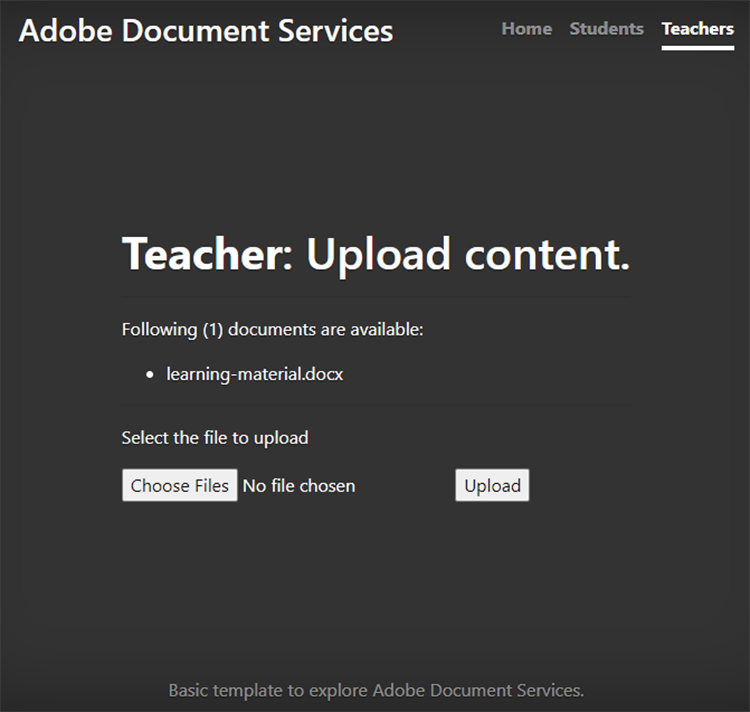
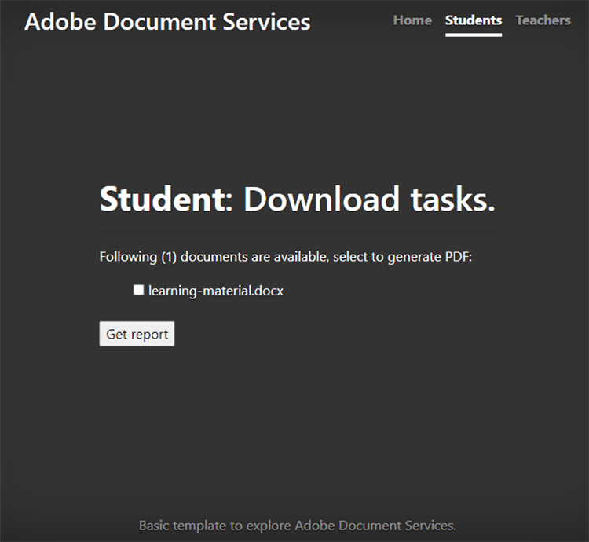
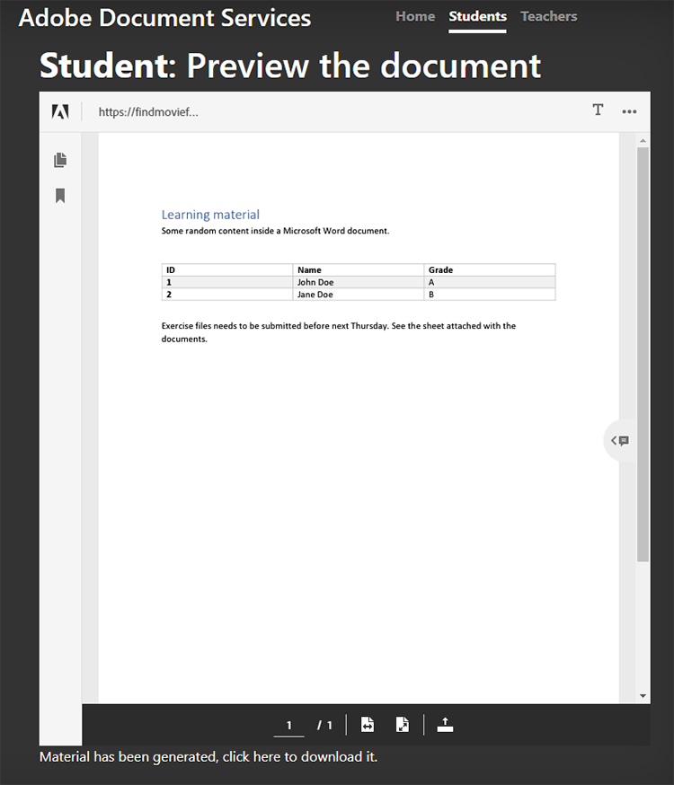
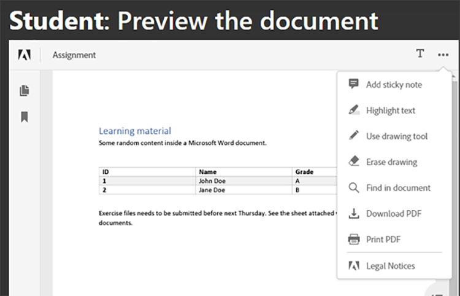
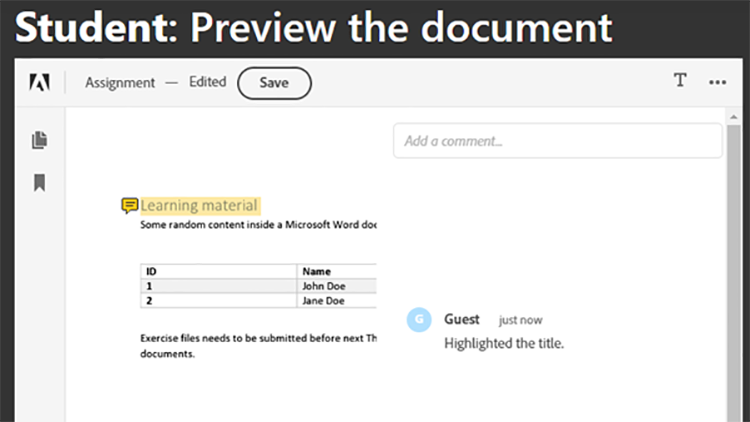
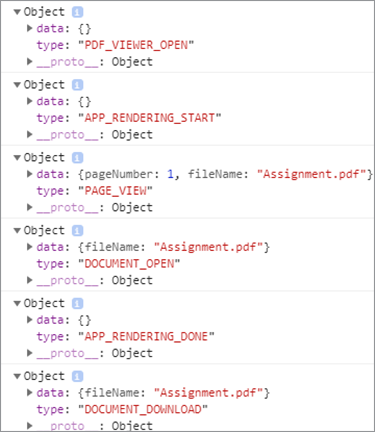

# Student-Teacher collaboration


Educational institutes use PDF documents to share learning material with students. PDFs provide an interchangeable document format for teachers.

Integrating [Adobe PDF Services API](https://www.adobe.io/apis/documentcloud/dcsdk/pdf-tools.html) and [Adobe PDF Embed API](https://www.adobe.io/apis/documentcloud/dcsdk/pdf-embed.html) into an app provides teachers and students a single platform on which to teach and learn. For example, your app can enable students to ask questions on their assignments and report cards, and to collaborate on group assignments.

There is an official SDK for Node.js applications to access PDF Services API. This enables you to convert documents like Microsoft Word or Microsoft Excel to
PDF. Also, you can perform more advanced operations like combining multiple reports, rearranging pages, and protecting PDFs. For more details, review [product documentation](https://www.adobe.io/apis/documentcloud/dcsdk/).

## What you can learn

In this hands-on tutorial, learn to create an online learning platform that [enables teachers and students to easily share resources](https://www.adobe.io/apis/documentcloud/dcsdk/student-teacher-collaboration.html) in PDF. This tutorial uses a [learning portal](https://github.com/afzaal-ahmad-zeeshan/adobe-pdf-tools-for-teachers) created using the Node.js JavaScript runtime (Node.js) and PDF Services.

The learning portal has the following features:

* Enables teachers to upload resources

* Enables students to select multiple documents to convert to PDF

* Enables conversion of documents to PDF

* Provides a PDF preview for students in a web browser and enables them to annotate the documents without additional software

* Enables students to leave comments and download them to their computers

Learn how Adobe Document Services provide a rich experience for your students with PDFs. Document Services APIs seamlessly integrate into your existing applications, so students can upload, convert, and view files, then make and save comments — all within your current setup.

## Relevant APIs and resources

* [PDF Embed API](https://www.adobe.com/devnet-docs/dcsdk_io/viewSDK/index.html)

* [PDF Services API](https://opensource.adobe.com/pdftools-sdk-docs/release/latest/index.html)

* [Project code](https://github.com/afzaal-ahmad-zeeshan/adobe-pdf-tools-for-teachers)

## Uploading resources to the learning portal

In the teachers’ section of the learning portal, teachers can upload documents such as assignments and tests. The documents can be in any format, such as Microsoft Word, Microsoft Excel, HTML, various image formats, and so on.



Uploaded documents are stored and presented to the students when they open their webpage.

To learn how the application uploads the files, please see the [project code](https://github.com/afzaal-ahmad-zeeshan/adobe-pdf-tools-for-teachers).

## Converting documents to PDF

Students can convert single or multiple documents of any type to PDF, such as Microsoft Word, Excel, and PowerPoint, as well as other popular text and image file types. The learning portal uses PDF Services to perform the conversion of files to PDF.

To create your own learning portal, you must first create your own credentials. [Sign up](https://www.adobe.io/apis/documentcloud/dcsdk/gettingstarted.html) to
use PDF Services API free for six months and up to 1,000 document transactions. After that, [pay-as-you-go](https://www.adobe.io/apis/documentcloud/dcsdk/pdf-pricing.html) at just \$0.05 per document transaction as the class ramps up their assignments.

When a student selects a document from the dashboard, they see the following:



The student simply selects the documents for conversion and clicks **Get report**.

The learning portal converts the documents to PDF and displays a report page, along with a preview of the PDF file.

Here is the sample code for this step:

```
async function createPdf(rawFile, outputPdf) {
	try {
    	    // configurations
    	    const credentials =  adobe.Credentials
        	.serviceAccountCredentialsBuilder()
            .fromFile("./src/pdftools-api-credentials.json")
        	.build();
 
    	    // Capture the credential from app and show create the context
    	    const executionContext = adobe.ExecutionContext.create(credentials),
        	operation = adobe.CreatePDF.Operation.createNew();
 
    	    // Pass the content as input (stream)
    	    const input = adobe.FileRef.createFromLocalFile(rawFile);
    	    operation.setInput(input);
 
    	    // Async create the PDF
    	    let result = await operation.execute(executionContext);
    	    await result.saveAsFile(outputPdf);
	} catch (err) {
    	    console.log('Exception encountered while executing operation', err);
	}
}
```

The sample code calls the `createPdf` method inside the Express route handler to generate the PDF.

To learn how this method is called, see [the project code](https://github.com/afzaal-ahmad-zeeshan/adobe-pdf-tools-for-teachers/blob/master/src/helpers/pdf.js).

## Previewing the learning resources

The user interface uses PDF Embed API to render PDFs in a web browser. This API is available to use for free.

PDF Embed API uses a different credential than PDF Services API, so you must [create a credential](https://www.adobe.io/apis/documentcloud/dcsdk/gettingstarted.html)
before you can use it. Then, you can use PDF Embed completely free.

Make sure to input the correct website URL in the token. Otherwise, you might not be able to render the PDFs with the token.

The user interface uses the [Handlebars](https://handlebarsjs.com/) templates language. It displays the PDF in a web browser.

Here is the code for this step:

```
<div id="adobe-dc-view" style="height: 750px; width: 700px;"></div>
<script src="https://documentcloud.adobe.com/view-sdk/main.js"></script>
<script type="text/javascript">
    document.addEventListener("adobe_dc_view_sdk.ready", function () {
    	var adobeDCView = new AdobeDC.View({ clientId: "<your-credentials-here>", divId: "adobe-dc-view" });
    	adobeDCView.previewFile(
        	{
            	content: {
                	location: { url: "<file-url>" }
            	},
            	    metaData: { fileName: "<file-name>" }
        	},
    	   );
	});
</script>
 
<p>Material has been generated, <a href="/students/download/{{filename}}" target="_blank">click here</a> to download it.
</p>
```

This code displays the PDF output and the link to download the PDF report, as shown in the screen capture below:



Students should be able to download the report or work on the material here.

## Annotating PDF documents

A learning platform should support basic annotation, comments, and discussions in PDFs. PDF Embed API provides all these features. It activates annotations support using `showAnnotationTools`, enabling teachers and students to comment on the documents and archive comments as a part of the PDF.

To enable annotations in PDF documents, you only have to pass the argument `showAnnotationTools` : true to the `previewFile` method. This displays the annotations tool in the PDF previewer. Access this tool from the three-dot menu in the top right corner of the preview.



In the documents uploaded by teachers, students can highlight text, add comments, and so on.



In the screen capture above, the user is labeled “Guest”, but you can configure profiles for users, such as students and teachers.

When a student applies an annotation, PDF Embed API displays a **Save** button along the top banner. Saving adds the annotations to the file. Try clicking **Save** to see how the file saves with the annotation embedded in the report.

Students can use annotations to ask questions or share their comments about the learning material.

## Tracking document use

It is important for teachers and schools to see how students are using online platforms. This helps teachers support their students with resources that help them perform better on their assignments. PDF Embed API integrates with analytics that you can use to measure all the events taking place, such as when users are opening, reading, and closing documents. With PDF Services API, teachers can also disable print, download, and file modification to help maintain academic integrity.

If you have an [Adobe Analytics](https://www.adobe.io/apis/experiencecloud/analytics.html) license, you can use its [out-of-the-box integration](https://experienceleague.adobe.com/docs/document-services/tutorials/pdfembed/controlpdfexperience.html?lang=en#adobe-analytics). Otherwise, use callbacks to integrate your PDF Services with other analytics providers, such as [Google](https://experienceleague.adobe.com/docs/document-services/tutorials/pdfembed/controlpdfexperience.html?lang=en#google-analytics).

To enable the measurement of document events, you attach the event handlers using the `registerCallback` method with Adobe DC View instance. You can display basic metrics, such as opening a document or reading a page, on the console. You can also save the metrics in a log, or publish them in other analytics stores.

Here is the sample code for attaching the event handlers:

```
adobeDCView.registerCallback(
    AdobeDC.View.Enum.CallbackType.EVENT_LISTENER,
	function(event) {
    	   console.log(event);
	},
	{
    	   enablePDFAnalytics: true
	}
);
```

Teachers can see how many students have seen the assignment, how many went through all the pages of their notes, and other valuable details.

Here is a screen capture of web browser console:



This screen capture shows that the student opened the assignment file, they read the first page — they either did not scroll to additional pages or the document only had one page — then they downloaded the file. You can collect these metrics to perform analyses and study the behavior of your students.

Also, [Adobe Analytics](https://business.adobe.com/products/analytics/adobe-analytics.html) is integrated with PDF Embed API, so if you have a subscription to the Adobe Analytics suite, you can publish your metrics in your subscription. To publish the metrics in Adobe Analytics, you only need to pass your suite ID to PDF Embed API constructor. (Note that you must use your PDF Embed API credentials, not your PDF Services API credentials).

Here is sample code that shows how to pass the suite ID to PDF Embed API constructor:

```
var adobeDCView = new AdobeDC.View({
	clientId: "<your-adobe-dc-credential>",
	divId: "<#element>"
	reportSuiteId: <your-id-here>,
}); 
```

## Next steps

This hands-on tutorial reviewed how to use PDF Services API and PDF Embed API to create a learning portal, facilitating effective [collaboration between students and teachers](https://www.adobe.io/apis/documentcloud/dcsdk/student-teacher-collaboration.html). Using this portal, teachers can upload learning material in any format and convert it to PDF using PDF Services API. Students can then preview these PDFs using PDF Embed API.

Now that you know how to annotate PDF reports, archive the annotations, and track the use of PDF reports, you can start implementing these solutions in your own projects.

You can use Adobe Document Services APIs to create user-friendly, interactive PDF experiences on your website. Enjoy using Adobe PDF Services API free for six months then just [pay-as-you-go](https://www.adobe.io/apis/documentcloud/dcsdk/pdf-pricing.html) (through AWS or a direct agreement) for only \$0.05 per document transaction. Use Adobe PDF Embed free with no time limit. Create a free account to [get started](https://www.adobe.com/go/dcsdks_credentials) today.
