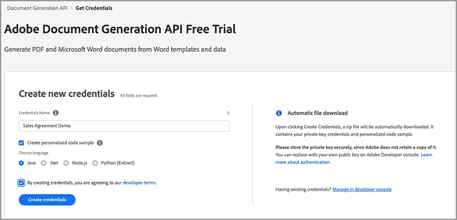
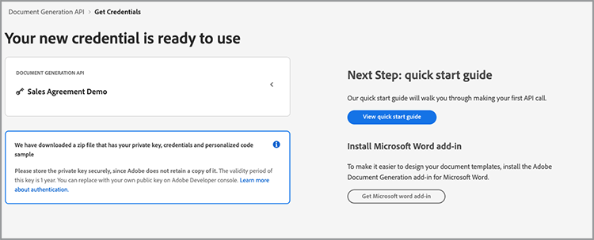
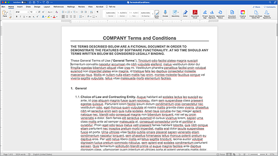
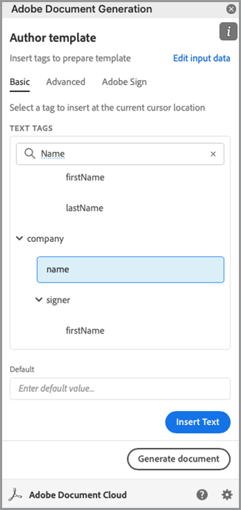
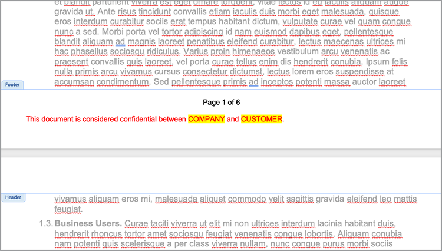
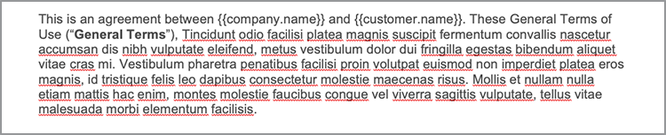
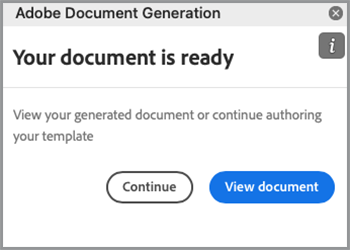

# Modernizing employee onboarding


In a large organization, employee onboarding can be a large, and slow, process. Typically there is a mix of customized documentation along with boilerplate material that must be presented and signed by a new employee. This mix of customized and boilerplate material requires multiple steps--taking valuable time away from people involved in the process. Adobe Document Services and Acrobat Sign can modernize and automate this approach, freeing up your HR personal for more important tasks. Let's look at how this is achieved.

## What are Adobe Document Services?

[Adobe Document Services](https://developer.adobe.com/document-services/homepage) are a set of APIs related to working with documents (and not just PDFs). Broadly speaking, this suite of services falls into three main categories:

* First are the [PDF Services](https://developer.adobe.com/document-services/apis/pdf-services/) set of tools. These are "utility" methods for working with PDFs and other documents. The services include things like converting to and from PDF, performing OCR and optimization, merging and splitting PDFs, and so forth. It's the toolbox of document processing features.
* [PDF Extract API](https://developer.adobe.com/document-services/apis/pdf-extract/) uses powerful AI/ML techniques to analyze a PDF and return an incredible amount of detail about the contents. This includes the text, styling and positional information, and can also return tabular data in CSV/XLS format as well as retrieve images. 
* Lastly, [Document Generation API](https://developer.adobe.com/document-services/apis/doc-generation/) lets developers use Microsoft Word as a "template", mix with their data (from any source), and generate dynamic personalized documents (PDF and Word). 

Developers can [sign up](https://documentcloud.adobe.com/dc-integration-creation-app-cdn/main.html) and try all of these services with a free trial. The Document Services platform uses a REST-based API but also supports SDKs for Node, Java, .NET, and Python (Extract only at this time).

While not an API, developers can also use the free [PDF Embed API](https://developer.adobe.com/document-services/apis/pdf-embed/), which provides a consistent and flexible viewing experience of documents with your web pages.

## What is Acrobat Sign?

[Acrobat Sign](https://www.adobe.com/sign.html) is the world leader in electronic signature services. You can send documents for signature  using various different workflows--including multiple signatures. Acrobat Sign also supports workflows that require signatures and additional information. All of these capabilities are supported by a powerful dashboard with a flexible authoring system. 

As with Document Services, Acrobat Sign has a [free trial](https://www.adobe.com/sign.html#sign_free_trial) that lets developers test the signing process both via the dashboard and with an easy-to-use REST-based API. 

## An onboarding scenario

Let's consider a real-world scenario that demonstrates how Adobe's services can help. When a new employee joins a company, they need customized information tailored to their role. In addition, they also need company-wide material. Finally, they must demonstrate acceptance of corporate policies by signing the documents. Let's break this down into concrete steps:

* First, a customized cover letter that greets the new employee by name is needed. The letter should contain information about the employee's name, role, salary, and location. 
* The customized letter must be combined with a PDF that contains basic, company-wide information (think various HR policies, benefits, etc.)
* A final document must be included that asks for the employee's signature and date.
* All of the above should be presented as one document that is sent to the employee for signing.

Let's go into details on how to do this.

## Generating dynamic documents

Adobe's [Document Generation](https://developer.adobe.com/document-services/apis/doc-generation/) API lets developers create dynamic documents by using Microsoft Word and a simple templating language, as a basis for generating PDFs and Word documents. Here's an example of how this works. 

Let's begin with a Word document that has hard-coded values. The document can be styled any way you want, include graphics, tables, and so forth. Here's the initial document.



Document Generation works by adding "tokens" to a Word document that are replaced with your data. While these tokens can be entered manually, there is a [Microsoft Word add-in](https://developer.adobe.com/document-services/docs/overview/document-generation-api/wordaddin/) that makes this easier to do. Opening it up provides a tool for authors to define tags, or sets of data, that can be used in your document. 



You can either upload JSON information from a local file, copy in JSON text, or select to continue with initial data. Doing so lets you define your tags in an ad hoc manner based on your particular needs. In this example, only a tag for name, role, salary, and location is needed. This is done by using the **Create Tag** button:



After defining the first tag, you can continue to define as many as you need:


With the tags defined, you select the text in your document and replace it with the tags where appropriate. In this example, tags are added for name, role, and salary.



Document Generation doesn't just support simple tags but logical expressions as well. The second paragraph of the document has text that only applies to people in Louisiana. You can add a conditional expression by going into the Advanced tab of the Document Tagger and defining a condition. Here is how you define a simple equality condition, but note that numerical comparisons and other comparison types are supported as well.



This can then be inserted and wrapped around the paragraph:



To test how this works, select **Generate document**. The first time you do this, you must sign in with an Adobe ID. After signing in, default JSON is presented that can be manually edited. 


A PDF is generated that can then be viewed or downloaded.


While the Document Tagger lets you quickly design and test, once done and in production, you can use one of the SDKs to automate this process. While actual code differs based on specific needs, here's an example of how this code looks in Node.js:

```js
 const PDFServicesSdk = require('@adobe/pdfservices-node-sdk');

const credentials =  PDFServicesSdk.Credentials
	.serviceAccountCredentialsBuilder()
	.fromFile("pdfservices-api-credentials.json")
	.build();

// Data would be dynamic...
let data = {
	"name":"Raymond Camden",
	"role":"Lead Developer",
	"salary":9000,
	"location":"Louisiana"
}

// Create an ExecutionContext using credentials.
const executionContext = PDFServicesSdk.ExecutionContext.create(credentials);

// Create a new DocumentMerge options instance.
const documentMerge = PDFServicesSdk.DocumentMerge,
	documentMergeOptions = documentMerge.options,
	options = new documentMergeOptions.DocumentMergeOptions(jsonDataForMerge, documentMergeOptions.OutputFormat.PDF);

// Create a new operation instance using the options instance.
const documentMergeOperation = documentMerge.Operation.createNew(options);

// Set operation input document template from a source file.
const input = PDFServicesSdk.FileRef.createFromLocalFile('documentMergeTemplate.docx');
documentMergeOperation.setInput(input);

// Execute the operation and Save the result to the specified location.
documentMergeOperation.execute(executionContext)
	.then(result => result.saveAsFile('documentOutput.pdf'))
	.catch(err => {
		if(err instanceof PDFServicesSdk.Error.ServiceApiError
			|| err instanceof PDFServicesSdk.Error.ServiceUsageError) {
			console.log('Exception encountered while executing operation', err);
		} else {
			console.log('Exception encountered while executing operation', err);
		}
	});
```

In brief, the code sets up credentials, creates an operation object and sets the input and options, and then calls the operation. Finally, it saves out the result as a PDF. (Results can be output as Word as well.) 

Document Generation supports much more complex use cases including the ability to have fully dynamic tables and images. See the [documentation](https://developer.adobe.com/document-services/docs/overview/document-generation-api/) for more details.

## Performing PDF operations

The [PDF Services API](https://developer.adobe.com/document-services/apis/pdf-services/) provides a large set of "utility" operations for working with PDFs. These operations include:

* Creating PDFs from Office docs
* Exporting PDFs to Office docs
* Combining and splitting PDFs
* Applying OCR to PDFs
* Setting, removing, and modifying protection to PDFs
* Deleting, inserting, reordering, and rotating pages
* Optimizing PDFs via compression or linearization
* Getting PDF properties

For this scenario, the result of the Document Generation call must be merged with a standard PDF. This operation is fairly simple with the SDKs. Here's an example of in Node.js:

```js
const PDFServicesSdk = require('@adobe/pdfservices-node-sdk');
 
// Initial setup, create credentials instance.
const credentials = PDFServicesSdk.Credentials
	.serviceAccountCredentialsBuilder()
	.fromFile("pdfservices-api-credentials.json")
	.build();
 
// Create an ExecutionContext using credentials and create a new operation instance.
const executionContext = PDFServicesSdk.ExecutionContext.create(credentials),
	combineFilesOperation = PDFServicesSdk.CombineFiles.Operation.createNew();
 
// Set operation input from a source file.
const combineSource1 = PDFServicesSdk.FileRef.createFromLocalFile('documentOutput.pdf'),
	  combineSource2 = PDFServicesSdk.FileRef.createFromLocalFile('standardCorporate.pdf');

combineFilesOperation.addInput(combineSource1);
combineFilesOperation.addInput(combineSource2);
 
// Execute the operation and Save the result to the specified location.
combineFilesOperation.execute(executionContext)
	.then(result => result.saveAsFile('combineFilesOutput.pdf'))
	.catch(err => {
		if (err instanceof PDFServicesSdk.Error.ServiceApiError
			|| err instanceof PDFServicesSdk.Error.ServiceUsageError) {
			console.log('Exception encountered while executing operation', err);
		} else {
			console.log('Exception encountered while executing operation', err);
		}
	});
```

This code takes the two PDFs, merges them, and saves the result in a new PDF. Simple and easy! See the [docs](https://developer.adobe.com/document-services/docs/overview/pdf-services-api/) for examples of what can be done.

## The signing process

In the final stop of the onboarding process, the employee must sign an agreement stating that they've read and agree to all policies defined within. [Acrobat Sign](https://www.adobe.com/sign.html) supports many different workflows and integrations, including a automated one via an [API](https://opensource.adobe.com/acrobat-sign/developer_guide/index.html). Broadly speaking, the final portion of the scenario can be completed as follows:

First, design the document that includes the form that needs signing. There are multiple ways of doing this, including a visual designed in the Adobe Sign user dashboard. Another option is to use the Document Generation Word add-in to insert the tags for you. This example requests a signature and date.


This document can be saved as a PDF, and using the same method described above, joined with all the documents together. This process creates one cohesive package that contains a personalized greeting, standard corporate documentation, and a final page fit for signing.

The template can be uploaded to the Acrobat Sign dashboard and then used for new agreements. By using the REST API, this document can then be sent to the prospective employee to request their signature.



## Experience it yourself

Everything described in this article can be tested right now. The Adobe Document Services API [free trial](https://documentcloud.adobe.com/dc-integration-creation-app-cdn/main.html) currently gives you 1,000 free requests over a six-month period. Acrobat Sign's [free trial](https://www.adobe.com/sign.html#sign_free_trial) lets you send watermarked agreements for testing purposes. 

Have questions? The [support forum](https://community.adobe.com/t5/document-services-apis/ct-p/ct-Document-Cloud-SDK) is monitored by Adobe developers and support folks every day. FInally, for more inspiration, be sure to catch the next [Paper Clips](https://www.youtube.com/playlist?list=PLcVEYUqU7VRe4sT-Bf8flvRz1XXUyGmtF) episode. There are regular live meetings with news, demos, and talks with customers.