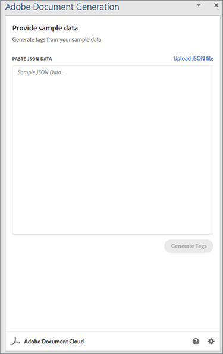
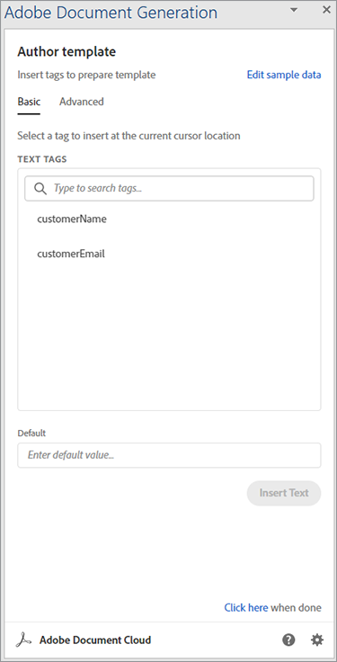
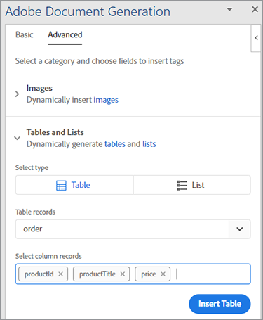
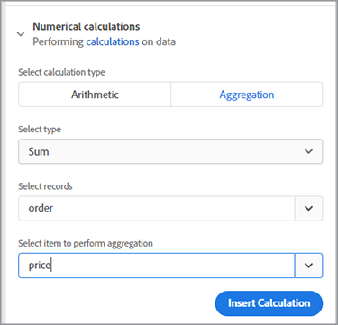
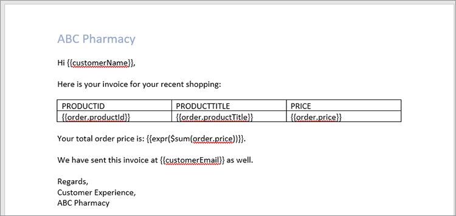
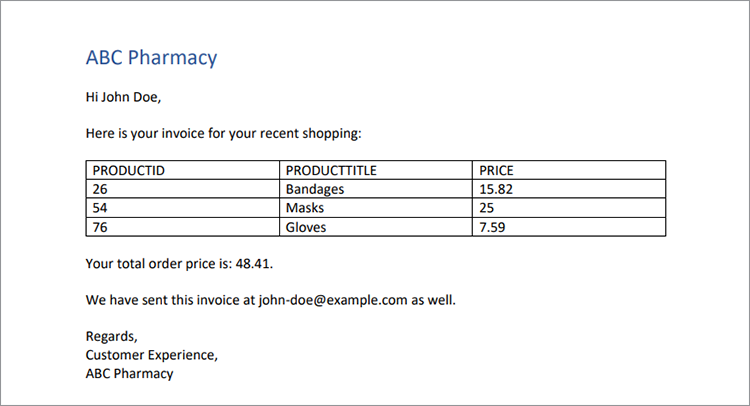

# Handling invoices with Adobe Document Generation API

It’s great when business is booming but productivity suffers when it comes time to prepare all those invoices. Manually generating invoices is time consuming, plus you run the risk of making an error, potentially losing money or angering a customer with an incorrect amount.

Think of Danielle, for example, working in the [accounting department](https://www.adobe.io/apis/documentcloud/dcsdk/invoices.html) [of a medical supply company](https://www.adobe.io/apis/documentcloud/dcsdk/invoices.html). It’s the end of the month, so she’s pulling information from several different systems, double-checking its accuracy, and formatting the invoices. After all that work, she’s finally ready to convert the documents to PDFs (so anyone can view them without purchasing specific software) and send each customer their personalized invoice.

Even when the monthly invoicing is complete, Danielle just can’t escape those invoices. Some customers have non-monthly billing cycles, so she’s always creating an invoice for someone. Occassionally, a customer edits their invoice and underpays. Danielle then spends time troubleshooting this invoice mismatch. At this rate, she needs to hire an assistant to keep up with all the work!

What Danielle needs is a way to generate invoices quickly and accurately, both in batch at the end of the month and ad hoc at other times. Ideally, if she could protect these invoices from edits, she wouldn’t have to worry about troubleshooting mismatched amounts.

In this tutorial, learn how to use Adobe Document Generation API to automatically generate invoices, password-protect the PDFs, and deliver an invoice to each customer. All it takes is a little knowledge of Node.js, JavaScript, Express.js, HTML, and CSS.

The complete code for this project is [available on GitHub](https://github.com/afzaal-ahmad-zeeshan/adobe-pdf-invoice-generation). You must set up the public directory with your template and the raw data folders. In production, you must fetch the data from an external API. You can also explore this archived version of the application that contains the template resources.

## Preparing the data

This tutorial doesn't look at how the data imports from your data warehouses. Your customer orders might exist in a database, external API, or custom software. Adobe Document Generation API expects a JSON document containing the invoicing data — such as information from your customer relationship management (CRM) or eCommerce platform. This tutorial assumes that the data is already in JSON format.

For simplicity, use the following JSON structure for invoicing:

```
{ 
    "customerName": "John Doe", 
    "customerEmail": "john-doe@example.com", 
    "order": [ 
        { 
            "productId": 26, 
            "productTitle": "Bandages", 
            "price": 15.82 
        }, 
        { 
            "productId": 54, 
            "productTitle": "Masks", 
            "price": 25 
        }, 
        { 
            "productId": 76, 
            "productTitle": "Gloves", 
            "price": 7.59 
        } 
    ] 
} 
```

The JSON document contains the customer details as well as order information. Use this structured document to build up your invoice and display the elements in PDF format.

## Building an invoice template

Adobe Document Generation API expects a Microsoft Word-based template and a JSON document to create a dynamic PDF or Word document. Create a Microsoft Word template for your invoicing application and use the [free Document Generation Tagger add-in](https://opensource.adobe.com/pdftools-sdk-docs/docgen/latest/wordaddin.html#add-in-demo) to generate the template tags. Install the add-in and open the tab in Microsoft Word.



Once you have pasted the JSON content into the add-in, as shown above, click Generate Tags. Now, this plugin shows your object’s format. Your basic template can use the customer’s name and email but doesn’t show the order information. The order information is discussed later in this tutorial.



Inside your Microsoft Word document, start writing the invoice template. Leave the cursor where you must insert dynamic data, then select the tag from the Adobe add-in window. Click **Insert Text** so Adobe Document Generation Tagger add-in can generate and insert the tags. For personalization, let’s insert the customer’s name and email.

Now, move on to the data that changes with each new invoice. Select the **Advanced** tab of the add-in. To see the available options to generate a dynamic table based on the products a customer ordered, click **Tables and Lists** .

Select **Order** from the first dropdown. In the second dropdown, select the columns for this table. In this tutorial, select all three columns for the object to render the table.



Document Generation API can also perform complex operations such as aggregating elements inside an array. In the **Advanced** tab, select **Numerical Calculations**, and in the **Aggregation** tab, select the field where you want to apply the calculation.



Click the **Insert Calculation** button to insert this tag where needed inside the document. The following text now appears in your Microsoft Word file:



This invoice sample contains customer information, the ordered products, and the total amount due.

## Generating an invoice using Adobe Document Generation API

Use Adobe PDF Services Node.js software development kit (SDK) to combine the Microsoft Word and JSON documents. Build a Node.js application to create the invoice using Document Generation API.

PDF Services API includes Document Generation Service, so you can use the same credentials for both. Enjoy a [six-month free trial](https://www.adobe.io/apis/documentcloud/dcsdk/pdf-pricing.html), then pay just $0.05 per document transaction.

Here is the code to merge the PDF:

```
async function compileDocFile(json, inputFile, outputPdf) { 
    try { 
    	// configurations 
    	const credentials =  adobe.Credentials 
        	.serviceAccountCredentialsBuilder() 
            .fromFile("./src/pdftools-api-credentials.json") 
        	.build(); 

    	// Capture the credential from app and show create the context 
    	const executionContext = adobe.ExecutionContext.create(credentials); 
  
    	// create the operation 
    	const documentMerge = adobe.DocumentMerge, 
        	documentMergeOptions = documentMerge.options, 
        	options = new documentMergeOptions.DocumentMergeOptions(json, documentMergeOptions.OutputFormat.PDF);

    	const operation = documentMerge.Operation.createNew(options); 
  
    	// Pass the content as input (stream) 
        const input = adobe.FileRef.createFromLocalFile(inputFile); 
    	operation.setInput(input); 
  
    	// Async create the PDF 
    	let result = await operation.execute(executionContext); 
    	await result.saveAsFile(outputPdf); 
    } catch (err) { 
    	console.log('Exception encountered while executing operation', err); 
    } 
} 
```

This code takes information from the input JSON document and the input template file. Then, it creates a document merge operation to combine the files into a single PDF report. Finally, it executes the operation with your API credentials. If you do not already have them, [create credentials](https://opensource.adobe.com/pdftools-sdk-docs/release/latest/index.html#getting-credentials) (Document Generation and PDF Services API use the same credentials).

Use this code inside the Express router to handle the document request:

```
// Create one report and send it back
try {
    console.log(\`[INFO] generating the report...\`);
    const fileContent = fs.readFileSync(\`./public/documents/raw/\${vendor}\`,
    'utf-8');
    const parsedObject = JSON.parse(fileContent);

    await pdf.compileDocFile(parsedObject,
    \`./public/documents/template/Adobe-Invoice-Sample.docx\`,
    \`./public/documents/processed/output.pdf\`);

    await pdf.applyPassword("p@55w0rd", './public/documents/processed/output.pdf',
    './public/documents/processed/output-secured.pdf');

    console.log(\`[INFO] sending the report...\`);
    res.status(200).render("preview", { page: 'invoice', filename: 'output.pdf' });
} catch(error) {
    console.log(\`[ERROR] \${JSON.stringify(error)}\`);
    res.status(500).render("crash", { error: error });
}
```

Once this code executes, it provides a PDF document containing the dynamically generated invoice based on the data provided. With the sample JSON data (provided above), the output of this code is:



This invoice includes your dynamic data from the JSON document.

## Password protecting invoices

Since Danielle the accountant is worried about customers altering the invoice, apply a password to restrict editing. [PDF Services API](https://opensource.adobe.com/pdftools-sdk-docs/release/latest/index.html) can automatically apply a password to documents. Here, you use Adobe PDF Services SDK to protect the documents with a password. The code is:

```
async function applyPassword(password, inputFile, outputFile) {
    try {
        // Initial setup, create credentials instance.
        const credentials = adobe.Credentials
        .serviceAccountCredentialsBuilder()
        .fromFile("./src/pdftools-api-credentials.json")
        .build();

        // Create an ExecutionContext using credentials
        const executionContext = adobe.ExecutionContext.create(credentials);
        // Create new permissions instance and add the required permissions
        const protectPDF = adobe.ProtectPDF,
        protectPDFOptions = protectPDF.options;
        // Build ProtectPDF options by setting an Owner/Permissions Password, Permissions,
        // Encryption Algorithm (used for encrypting the PDF file) and specifying the type of content to encrypt.
        const options = new protectPDFOptions.PasswordProtectOptions.Builder()
        .setOwnerPassword(password)
        .setEncryptionAlgorithm(protectPDFOptions.EncryptionAlgorithm.AES_256)
        .build();

        // Create a new operation instance.
        const protectPDFOperation = protectPDF.Operation.createNew(options);

        // Set operation input from a source file.
        const input = adobe.FileRef.createFromLocalFile(inputFile);
        protectPDFOperation.setInput(input);

        // Execute the operation and Save the result to the specified location.
        let result = await protectPDFOperation.execute(executionContext);

        result.saveAsFile(outputFile);
    } catch (err) {
        console.log('Exception encountered while executing operation', err);
    }
}
```

When you use this code, it protects your document with a password and uploads a new invoice to the system. For more on how this code is used, or to try it out, see the [code sample](https://github.com/afzaal-ahmad-zeeshan/adobe-pdf-invoice-generation).

Once you're done with the invoice, you might want to automatically email it to the client. There are a few ways to accomplish automatically emailing your clients. The quickest way is to use a third-party email API along with a helper library like [sendgrid-nodejs](https://github.com/sendgrid/sendgrid-nodejs). Alternatively, if you already have access to an SMTP server you can use [nodemailer](https://www.npmjs.com/package/nodemailer) to send emails via SMTP.

## Next steps

In this tutorial, you created a simple app to help Danielle in accounting with [invoicing](https://www.adobe.io/apis/documentcloud/dcsdk/invoices.html). Using PDF Services API and Document Generation SDK, you populated a Microsoft Word template with customer order information from a JSON document, creating a PDF invoice. Then, password-protected each document using password protection services by [PDF Services API](https://opensource.adobe.com/pdftools-sdk-docs/release/latest/index.html).

Since Danielle can generate invoices automatically and doesn’t have to worry about customers editing their invoices, she won’t need to hire an assistant to help with all the manual work. She can use her extra time to find cost savings in the accounts payable files.

Now that you’ve see how easy it is, you can expand this simple app using other Adobe tools to embed invoices on your website. For example, so customers can view their invoices or balance at any time. [Adobe PDF Embed API](https://www.adobe.io/apis/documentcloud/dcsdk/pdf-embed.html) is free to use. You can even move on to the human resources or sales department, helping automate their agreements and collect electronic signatures.

To explore all the possibilities, and start building your own handy application, create a free [Adobe Document Services](https://www.adobe.io/apis/documentcloud/dcsdk/gettingstarted.html) account to get started today. Enjoy a six-month free trial then [pay-as-you-go](https://www.adobe.io/apis/documentcloud/dcsdk/pdf-pricing.html)
at just $0.05 per document transaction as your business scales.
