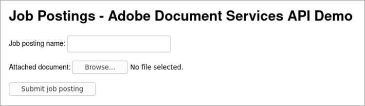
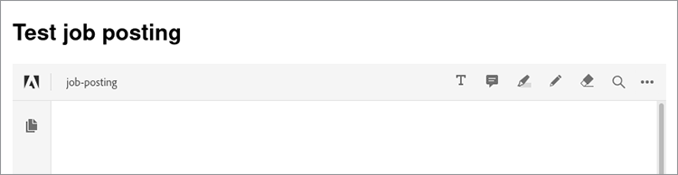

# Job posting


When operating a website with multiple users, it’s crucial to design an experience that ensures a smooth experience for everyone.

Imagine the following scenario: you have a website that allows employers to [upload job postings](https://www.adobe.io/apis/documentcloud/dcsdk/job-posting.html). For job seekers, it’s convenient to easily view all documents related to a posting in a consistent format. However, it’s convenient for employers to attach information in whatever file format they happen to have. To offer convenience to both types of users, you can automatically convert all uploaded documents to PDFs and embed them in-line in the posting.

## What you can learn

This hands-on tutorial walks through a Node.js example that uses Adobe Document Services and its [Node.js SDK](https://www.npmjs.com/package/@adobe/documentservices-pdftools-node-sdk) to add these capabilities to a job posting site. This creates a website that is easier to use and more attractive to employers and job seekers alike. Here is the [complete](https://github.com/contentlab-io/adobe_job_posting) [project code](https://github.com/contentlab-io/adobe_job_posting), in case you want to follow along as you read.

To start, set up a simple Express-based Node.js web application. [Express](https://expressjs.com/) is a minimalist web application framework offering features such as routing and templating. The code for the application is available on [GitHub](https://github.com/contentlab-io/adobe_job_posting). Also, install the [PostgreSQL database](https://www.postgresql.org/) and set it up to store the PDF.

## Relevant Document Services APIs

* [PDF Embed API](https://www.adobe.com/devnet-docs/dcsdk_io/viewSDK/index.html)

* [PDF Services API](https://opensource.adobe.com/pdftools-sdk-docs/release/latest/index.html)

## Creating Adobe API credentials

First, you must [create credentials](https://www.adobe.com/go/dcsdks_credentials) for Adobe PDF Embed API (free to use) and Adobe PDF Services API (free for six months then [pay-as-you-go](https://www.adobe.io/apis/documentcloud/dcsdk/pdf-pricing.html) for just \$0.05 per document transaction). When creating credentials for PDF Services API, select the “Create personalized code sample” option. Save the ZIP file and extract pdftools-api-credentials.json and private.key to the root directory of your Node.js Express project.

You also need an API key for the freely available Embed API. From [Projects](https://console.adobe.io/projects), go to the project you created. Then, click **Add to Project** and select **API**. Finally, click **PDF Embed API**.

Specify the domain for the PDF Embed API. The API key must be public (find it in the code executed by the browser). By specifying a domain, you ensure that someone else in a different domain can’t use the API key.

You cannot use “localhost” as a domain. Specify a domain, such as “testing.local”, and edit the hosts file on your computer to redirect that domain to 127.0.0.1, which is your computer. Then, instead of testing your application on localhost:3000, you can test it on testing.local:3000. When finished, find the API key for PDF Embed API on the project page.

## Adding an upload form and handler

With a working Express application and API credentials, you also need a form enabling users to upload their documents to the website. Edit the index.jade template for this purpose.

Create an input field for the name of the uploaded job posting and for a document containing more information.

Inside the content block of the template, add the following form:

```
extends layout

block content
  h1= title

  form(action="/upload", enctype="multipart/form-data", method="POST")
    label Job posting name:&nbsp;
    input(type="text", name="name", required="required")
    br
    br
    label Describing document:&nbsp;
    input(type="file", name="attachment", required="required")
    br
    br
    input(type="submit", value="Submit job posting")
```

Next, add a handler for the POST request to the /upload action. Then, add a route for /upload to the routes/index.js file. You can create a new file for this route, but you’ll have to update the app.js file to reflect the new file. Inside this route handler, you can access the given name and the uploaded file.

```  
router.post('/upload', async function (req, res, next) {
    const name = req.body.name;
    const fileContents = req.files.attachment.data;

    // code to work with the uploaded document
  });
```

The function is asynchronous so you can use the await keyword in the function, which is convenient when calling the methods that perform API calls.



## Using PDF Services API

Before using the PDF Services API, you must add the following imports to the top of the routes file:

```  
const PDFToolsSdk = require('@adobe/documentservices-pdftools-node-sdk');
  const { Readable } = require('stream');
```

Right under the imports, you can load API credentials and create an [execution content](https://www.javascripttutorial.net/javascript-execution-context/). Since you can reuse an execution context for different operations, it makes sense to do it once only.

```
  const credentials = PDFToolsSdk.Credentials
  .serviceAccountCredentialsBuilder()
  .fromFile("pdftools-api-credentials.json")
  .build();

  const executionContext = PDFToolsSdk.ExecutionContext.create(credentials);
```

Now, go back to writing code in the request handler at the comment in the `router.post` block. Start by converting the document to PDF.

```
  const createPdfOperation = PDFToolsSdk.CreatePDF.Operation.createNew();

  const input = PDFToolsSdk.FileRef.createFromStream(Readable.from(fileContents),
  req.files.attachment.mimetype);

  createPdfOperation.setInput(input);

  let result = await createPdfOperation.execute(executionContext);

  result.saveAsFile('output-pdf' + new Date().getTime() + '.pdf');
  return res.send('success!');
```

Most operations take the same four steps. First, initialize the type of operation, using the createNew method of the appropriate class. Then, create the input for the operation, which is FileRef. Subsequent operations can skip this step because the result of an operation is also a FileRef. For this initial operation, create a FileRef from the bytes of the uploaded file. Third, you must assign the input to the operation. Finally, the operation executes, with the execution context as a parameter in the execute method. This method returns a Promise so you can await the result.

The code saves the returned PDF to a file and sends a simple “success” response to the browser. The “Date” part of the filename guarantees a unique filename. The saveAsFile returns an error if the destination file exists.

## Converting images to text and compressing the PDF

Now, use optical character recognition (OCR) to convert images to text and then compress the result. You do this using the OCR and CompressPDF operations similar to the CreatePDF operation. Add the following to the routes file, in `router.post`:

```
  const name = req.body.name;
  const fileContents = req.files.attachment.data;

  const createPdfOperation = PDFToolsSdk.CreatePDF.Operation.createNew();
  const input = PDFToolsSdk.FileRef.createFromStream(Readable.from(fileContents),
  req.files.attachment.mimetype);
  createPdfOperation.setInput(input);

  let result = await createPdfOperation.execute(executionContext);

  const ocrOperation = PDFToolsSdk.OCR.Operation.createNew();
  ocrOperation.setInput(result);
  result = await ocrOperation.execute(executionContext);

  const compressPdfOperation = PDFToolsSdk.CompressPDF.Operation.createNew();
  compressPdfOperation.setInput(result);
  result = await compressPdfOperation.execute(executionContext);

  result.saveAsFile('output-pdf' + new Date().getTime() + '.pdf');
  return res.send('success!');
```

It's only necessary to do this operation once because the result is a FileRef, which the code can pass to setInput.

There is a better alternative than saving the file on a hard disk and returning an oversimplified HTTP response. Instead, store the PDF in a database and display a webpage that embeds the PDF using Adobe’s free PDF Embed API. This way, the employer’s job posting or brochure is visible on the website for job seekers to find and view, complete with company logos and other design elements.

## Storing the PDF in a database

Store the PDFs in a PostgreSQL database. Get the node-postgres package to connect to Postgres in Node.js. Install the stream-buffers package because, at some point, you must store the contents of the PDF in a buffer, and FileRef works only with streams. So, use the stream-buffers package to write the contents to a buffer.

```
npm install pg stream-buffers
```

Now create a database table for job postings. It needs a column for a unique identifier, a column for a name, and a column for the attached PDF. You can create a database table from the Postgres command-line interface (CLI):

```
CREATE TABLE job_postings (id TEXT PRIMARY KEY, name TEXT NOT NULL, attachment
BYTEA NOT NULL);
```

Go back to the Node.js files. Add some imports at the top of the file:

```
  const { Client } = require('pg');
  const streamBuffers = require('stream-buffers');
```

To store the PDF in the database table, modify the upload function. Replace the last two lines (saveAsFile and send) with this code snippet:

```
  const pgClient = new Client();
  pgClient.connect();

  const id = Math.random().toString(36).substr(2, 6); // not securely random at all,
  but serves the purpose for this demo

  const writableStream = new streamBuffers.WritableStreamBuffer();
  writableStream.on("finish", async () => {    
    await pgClient.query("INSERT INTO job_postings VALUES ($1, $2, $3)", [
	  id,
	  name,
	  writableStream.getContents()
    ]);
    res.redirect(`/job/${id}`);
  })
  result.writeToStream(writableStream);
```

To write the contents, create a WritableStreamBuffer. With the finish event, it's time to execute the SQL query. The node-postgres package automatically converts the Buffer parameter to the BYTEA format. The query redirects the user to /job/{id}, an endpoint created later.

For PDF Embed API, you also need an endpoint that returns just the PDF contents:

```
  router.get('/pdf/:id', async function (req, res, next) {
    const id = req.params.id;
 
    const pgClient = new Client();
    pgClient.connect();

  const pgResult = await pgClient.query("SELECT attachment FROM job_postings WHERE id
  = $1", [id]);
  const buffer = pgResult.rows[0].attachment;
  res.type('pdf');
    return res.send(buffer);
  });
```

## Embedding the PDF

Now, create the /job/{id} endpoint, which renders a template containing the name of the requested job posting and an embedded PDF.

```
router.get('/job/:id', async function(req, res, next) {
    const id = req.params.id;

    const pgClient = new Client();
    pgClient.connect();

    const pgResult = await pgClient.query("SELECT name FROM job_postings WHERE id =
  $1", [id]);
    const name = pgResult.rows[0].name;

    res.render('job', { pdf_url: `/pdf/${id}`, name });
  });
```

In the views/ directory, create a job.jade file with this content:

```
  extends layout

  block content
    h1= name
    div(id='adobe-dc-view')
    script(src='https://documentcloud.adobe.com/view-sdk/main.js')
    script.
	  window.embedUrl = "!{pdf_url}";
    script(src='/javascripts/embed-pdf.js')
```

The first script is Adobe’s View SDK, which makes it easy to embed the PDF. The second script is an in-line one-liner that sets the value of window.embedUrl to the URL of the PDF provided by the Express route handler. Create the third script yourself as follows:

```
  document.addEventListener("adobe_dc_view_sdk.ready", function () {
    var adobeDCView = new AdobeDC.View({ clientId: "YOUR API KEY HERE", divId:
   "adobe-dc-view" });
    adobeDCView.previewFile({
	  content: { location: { url: '//' + window.location.host + window.embedUrl }
         },
	  metaData: { fileName: "Job posting" }
    });
  });
```

Now, you can test the whole process of uploading a document, being redirected to the /job/id page, and viewing the embedded PDF. Your users go through the same steps to add a job posting or other document to your website.



To see an in-line embed in action, check out this [live demo](https://documentcloud.adobe.com/view-sdk-demo/index.html#/view/IN_LINE/Bodea%20Brochure.pdf).

## Next steps

This hands-on tutorial walked through how to use Node.js with Document Services to convert an uploaded [job posting](https://www.adobe.io/apis/documentcloud/dcsdk/job-posting.html) in various formats to a PDF. The resulting PDF was then embedded in a webpage. Now you can add the same function to your website, making it easier for employers to upload job descriptions, brochures, and more for job seekers to find. These capabilities help everyone get the information necessary to find their dream job.

Document Services help you add key document-handling functions to your website or app. If you want to dive deeper into what these APIs can do, refer to the following quickstart documentation:

* [PDF Embed API](https://www.adobe.com/devnet-docs/dcsdk_io/viewSDK/index.html)

* [PDF Services API](https://opensource.adobe.com/pdftools-sdk-docs/release/latest/index.html)

To start adding user-friendly document-handling features to your website, [sign up for your free trial](https://www.adobe.io/apis/documentcloud/dcsdk/gettingstarted.html). Adobe PDF Embed API is always free to use and Adobe PDF Services API is free for six months, then it’s just \$0.05 per document transaction so you can [pay-as-you-go](https://www.adobe.io/apis/documentcloud/dcsdk/pdf-pricing.html) as your business grows.
