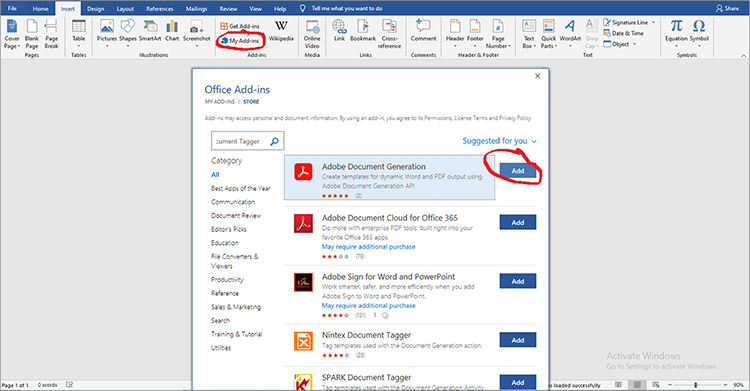

# Managing legal contracts with Adobe Document Services APIs


With digitization comes challenges. Today, most organizations have many types of [legal contracts](https://www.adobe.io/apis/documentcloud/dcsdk/legal-contracts.html) that they must create, edit, approve, and have signed by different parties. These legal contracts often require unique customization and branding. Organizations may also need to save them in a protected format once signed to keep them secure. To do all these things, they need a robust document generation and management solution.

Many solutions offer some document generation, but cannot customize data inputs and conditional logic, such as clauses that apply only to specific scenarios. Manually updating a company’s legal templates is challenging and error-prone as these documents grow more extensive. The need to automate these processes is considerable.

## What you can learn

In this hands-on tutorial, explore the features of [Adobe Document Services APIs](https://www.adobe.io/apis/documentcloud/dcsdk/doc-generation.html) in the generation of custom input fields in documents. Also, explore how to easily convert these generated documents to a protected portable document format (PDF) to prevent data manipulation.

This tutorial involves a bit of programming when exploring the conversion of contracts to PDFs. To follow along effectively, [Microsoft Word](https://www.microsoft.com/en-us/download/office.aspx) and [Node.js](https://nodejs.org/) should be installed on your PC. A basic understanding of Node.js and [ES6 syntax](https://www.w3schools.com/js/js_es6.asp) is also recommended.

## Relevant APIs and resources

* [Adobe Document Generation API](https://www.adobe.io/apis/documentcloud/dcsdk/doc-generation.html)

* [PDF Embed API](https://www.adobe.com/devnet-docs/dcsdk_io/viewSDK/index.html) 

* [Adobe Sign API](https://www.adobe.io/apis/documentcloud/sign.html)

* [Project code](https://github.com/agavitalis/adobe_legal_contracts.git)

## Creating a template document

You can create legal documents using the Microsoft Word application or by downloading Adobe’s [sample Word templates](https://www.adobe.io/apis/documentcloud/dcsdk/doc-generation.html#sample-blade). Still, it is not easy to customize inputs and digitally sign these documents without using some helper tools like [Adobe Document Generation Tagger add-in](https://www.adobe.io/apis/documentcloud/dcsdk/docs.html?view=docgen-addin) for Microsoft Word.

Document Generation Tagger is a Microsoft Word add-in, made to make document customization seamless using tags. It enables the creation of dynamic fields in document templates that fill dynamically using JSON data.



To illustrate the use of Document Generation Tagger, install this add-in and then create a JSON data model, which is used in the tagging of a simple legal contract document.

Install Document Generation Tagger in Word by clicking the **Insert** tab, then in the Add-ins group, click **My Add-ins**. On the Office Add-ins menu, search for “Adobe Document Generation” and then click **Add** and follow the process. You can see these steps in the screen capture above.

After installing the Document Generation Tagger for Word add-in, create a simple JSON data model to tag the legal document.

To proceed, open any editor of your choice, create a file called Agreement.json, then paste the code snippet below in the JSON file you created.
 
```
{
"Agreement": {
"Date": "1/24/2021",
"Prime Contractor Name": "Ogbonna Vitalis Corp",
"Prime State": "Lagos",
"Address": "Maryland Ave, Lagos State, Ng",
"Sub Contractor Name": "Vivvaa Soln",
"Sub Contractor State": "California",
"Sub Contractor Address": "Molusi Avenue, Dallas Texas, CA",
"Agreement Date": "1/24/2021",
"Length": 5
}
}
```
 
After saving this JSON document, import it to the Document Generation Tagger add-in. Import the document by clicking **Document Generation** in the Adobe group on the upper right side of your Word screen, as shown in the screen capture below.


This displays a video to guide you. You can watch it or go straight to the tagging field by clicking **Get Started**. After clicking **Get Started**, an upload form appears. Click **Upload JSON file** and select the JSON file you just created. When the import is complete, click **Generate Tag** to generate the tags.

After importing and generating tags, you can add these tags to your document. To add them, place your cursor at the exact spot where you would like the tag to appear. Then select a tag from Document Generation API and click **Insert Text**. The screen capture below outlines this procedure.


Aside from the basic tags created using the imported JSON data model, you can also use advanced features for more options such as images, conditional logic, calculations, repeating elements, and conditional phrases. You can access these features by clicking **Advanced** in the Document Generation Tagger panel. You can see this in the screen capture below.


These advanced features are not different from the basic tags. To include conditional logic, select the part of the document to fill. Then, configure the rule that determines the tag’s insertion.

To further illustrate, say in the agreement, there is a section you want to include, only conditionally. In the Select content type field, select **Section.** In the Select records field, pick the option that determines whether the conditional section shows. Select your desired conditional operator and set the value you are testing for in the Value field. Then click **Insert Condition.** The screen capture below illustrates this process.


For calculations, select either Arithmetic or Aggregation, then include the relevant first record, operator, and the second record to use based on the template tags available. Then click **Insert Calculation**.

Also, legal contracts often require signatures of the involved parties. You can insert an e-signature using Adobe Sign Text tags found right below the “Numerical calculations” section. To include the e-signature, you must specify the number of recipients, select **Signer**, and the field type from the drop-down lists, accordingly. Once done, click **Insert Adobe Sign Text Tag** to finalize the process.

To ensure data integrity, save legal documents in a protected format. With Document Services APIs, you can quickly transform documents into PDF format. You can build a simple express Node.js application, integrate Document Generation API into it, and using this simple application to convert your tagged document from Word to PDF format.

## Project setup

First, you set up the folder structure for the Node.js application. In this example, call this simple application AdobeLegalContractAPI. You can retrieve the source code [here](https://github.com/agavitalis/adobe_legal_contracts.git).

### Directory structure

Create a folder called AdobeLegalContractAPI and open it in an editor of your choice. Create a basic Node.js application with the ```npm init``` command using the folder structure below:
 
```
###Directory Structure
AdobeLegalContractAPI
-----config
----------default.json
-----controllers
----------createPDFController.js
----------previewController.js
-----models
----------document.js
-----routes
----------web.js
-----services
-----------upload.js
-----uploads
-----views
-----index.js
```
 
Above is a simple Node.js application structure for your application. Now proceed with the installation of the necessary npm packages.

### Package installation

Install the required packages using the npm install command as shown in the code snippet below:

```
npm install express body-parser morgan multer hbs path config mongoose
```

After installing the packages, ensure that the content of your package.json file is like the code snippet below:

```
###package.json
{
"name": "adobelegalcontractapi",
"version": "1.0.0",
"description": "",
"main": "index.js",
"directories": {
"test": "test"
},
"dependencies": {
"body-parser": "^1.19.0",
"config": "^3.3.6",
"express": "^4.17.1",
"hbs": "^4.1.1",
"mongoose": "^5.12.1",
"morgan": "^1.10.0",
"multer": "^1.4.2",
"path": "^0.12.7"
},
"devDependencies": {},
"scripts": {
"start": "node index.js"
},
"repository": {
"type": "git",
"url": "https://github.com/agavitalis/adobe_legal_contracts.git"
},
"author": "Ogbonna Vitalis",
"license": "ISC",
"bugs": {
"url": "https://github.com/agavitalis/adobe_legal_contracts/issues"
},
"homepage": "https://github.com/agavitalis/adobe_legal_contracts#readme"
}
```

In these code snippets, you installed the application dependencies, including the Handlebars templating engine for the view.

THe primary focus in this tutorial is on using [Document Services APIs](https://www.adobe.io/apis/documentcloud/dcsdk/) to convert documents to PDF. Hence, there is not a step-by-step process of how to build this Node.js application. However, you can retrieve the complete working Node.js application code on [GitHub](https://github.com/agavitalis/adobe_legal_contracts.git).

## Integrating Adobe Document Services APIs into a Node.js application

Adobe Document Services APIs are cloud-based reliable services designed for the seamless manipulation of documents. It offers three APIs:

* Adobe PDF Services API

* Adobe PDF Embed API

* Adobe Document Generation API

You require credentials to use Document Services APIs (different from your PDF Embed API credentials). If you don’t have valid credentials, [register](https://www.adobe.com/go/dcsdks_credentials?ref=getStartedWithServicesSDK) and complete the workflow as illustrated in the screen capture below. Enjoy a [free six-month trial then pay-as-you-go](https://www.adobe.io/apis/documentcloud/dcsdk/pdf-pricing.html), just $0.05 per document transaction.


Once the signup process is completed, a code sample automatically downloads to your PC to help you start. You can extract this code sample and follow along. Don’t forget to copy the pdftools-api-credentials.json and private.key files from the extracted code sample to the Node.js project’s root directory. The credentials are required before you can access Document Services API endpoints. You can also download SDK samples with your personalized credentials so you don’t have to update the key in the sample code.

Now, install Adobe PDF Services Node SDK by running the ```npm install \--save @adobe/documentservices-pdftools-node-sdk``` command using the terminal in the root directory of your application. When successfully installed, you can use Document Services APIs to manipulate documents in your application.

## Creating a PDF document

Document Services APIs support the creation of PDFs from Microsoft Office documents (Word, Excel, and PowerPoint) and other [supported file formats](https:/opensource.adobe.com/pdftools-java-sdk-samples/apidocs/latest/com/adobe/platform/operation/pdfops/CreatePDFOperation.SupportedSourceFormat.html) like .txt, .rtf, .bmp, .jpeg,  gif, .tiff, and .png. You can easily convert legal contracts from any other file format to PDF using Document Service APIs.

Adobe Document Generation API enables conversion to a Word file or PDF. For example, you can use a Word template to generate a contract, including redlining to mark edited text. Then, convert it to a PDF and use PDF Services API to protect the document with a password, send it for signature, and more.

To implement the creation of PDF documents from the available supported file formats, there is a form to upload a document for transformation using Document Services.

The designed upload form appears in the screen capture below, and you can access the HTML and CSS files on [GitHub](https://github.com/agavitalis/adobe_legal_contracts.git).


Now, add the following code snippets to the controllers /createPDFController.js file. This code retrieves the uploaded document and transforms it into PDF. Document Services saves the original uploaded file and the transformed file in different folders.

```
###controllers/createPDFController.js
const PDFToolsSdk = require('@adobe/documentservices-pdftools-node-sdk');
const Document = require('../models/document');
/*
* GET / route to show the createPDF form.
*/
function createPDF(req, res) {
//catch any response on the url
let response = req.query.response
res.render('index', { response })
}
/*
* POST /createPDF to create a new PDF File.
*/
function createPDFPost(req, res) {
let filePath = req.file.path;
let fileName = req.file.filename;
try {
// Initial setup, create credentials instance.
const credentials = PDFToolsSdk.Credentials
.serviceAccountCredentialsBuilder()
.fromFile("pdftools-api-credentials.json")
.build();
// Create an ExecutionContext using credentials and create a new operation instance.
const executionContext = PDFToolsSdk.ExecutionContext.create(credentials),
createPdfOperation = PDFToolsSdk.CreatePDF.Operation.createNew();
// Set operation input from a source file.
const input = PDFToolsSdk.FileRef.createFromLocalFile(filePath);
createPdfOperation.setInput(input);
// Execute the operation and Save the result to the specified location.
createPdfOperation.execute(executionContext)
.then(async(result) => {
let newFileName = `createPDFFromDOCX-${Math.random() * 171}.pdf`
let newFilePath = require('path').resolve('./') + `\\output\\${newFileName}`
await result.saveAsFile(`views/output/${newFileName}`)
//Creates a new document
let newDocument = new Document({
documentName: newFileName,
url: newFilePath
});
//Save it into the DB.
newDocument.save((err, docs) => {
if (err) {
res.send(err);
}
else {
res.redirect('/?response=PDF Successfully created')
}
});
})
.catch(err => {
if (err instanceof PDFToolsSdk.Error.ServiceApiError
|| err instanceof PDFToolsSdk.Error.ServiceUsageError) {
console.log('Exception encountered while executing operation', err);
} else {
console.log('Exception encountered while executing operation', err);
}
});
} catch (err) {
console.log('Exception encountered while executing operation', err);
}
}
//export all the functions
module.exports = { createPDF, createPDFPost };
```
 
The above code snippet required the document model and Document Services Node SDK that you earlier installed. There are two functions:

* createPDF displays the upload document form.

* createPDFPost transforms the uploaded document into a PDF.

The functions save the transformed PDF documents in the views/output directory, where you can download them to your PC.

You can also preview the transformed PDF file using the free PDF Embed API. Using PDF Embed API, you can generate Adobe credentials [here](https://www.adobe.com/go/dcsdks_credentials) (different from your Document Services credentials) and register allowed domains to access the API. Follow the process and generate PDF Embed API credentials for your application. You can also check out the demonstration [here](https://documentcloud.adobe.com/view-sdk-demo/index.html#/view/FULL_WINDOW/Bodea%20Brochure.pdf), from which you can easily generate codes to get you started quickly.

Back to the application, create list.hbs and preview.hbs files in the view folder of your application and paste the code snippet below into the list.hbs and preview.hbs files, respectively.
 
```
###views/list.hbs
<!DOCTYPE html>
<html lang="en">
<head>
<title>Adobe Legal Contract</title>
<!-- Meta tags -->
<meta charset="UTF-8">
<meta name="viewport" content="width=device-width,
initial-scale=1.0">
<meta http-equiv="X-UA-Compatible" content="ie=edge">
<!-- //Meta tags -->
<link
href=".min.css" rel="stylesheet" integrity="sha384-eOJMYsd53ii+scO/
bJGFsiCZc+5NDVN2yr8+0RDqr0Ql0h+rP48ckxlpbzKgwra6" crossorigin="anonymous">
<link rel="stylesheet" href="css/style.css" type="text/css"
media="all" /><!-- Style-CSS -->
<link href="css/font-awesome.css" rel="stylesheet" /><!--
font-awesome-icons -->
</head>
<body>
<section>
<div class="form-36-mian section-gap">
<div class="wrapper">
<div class="container">
<div class="row">
{{#each documents}}
<div class="col-md-4 mb-2">
<div class="card" style="width:
18rem;">

<div class="card-body">
<h5
class="card-title">{{documentName}}</h5>
<a
href="/downloadPDF/{{_id}}" class="btn btn-primary"><i class="fa
fa-download" aria-hidden="true"></i> Download</a>
<a
href="/previewPDF/{{_id}}" class="btn btn-info"><i class="fa fa-eye"
aria-hidden="true"></i> Preview</a>
</div>
</div>
</div>
{{/each}}
</div>
</div>
<!-- copyright -->
<div class="copy-right">
<p>(c) 2021 Vitalis</p>
</div>
<!-- //copyright -->
</div>
</div>
</section>
</body>
</html>
###views/preview.hbs
<!DOCTYPE html>
<html lang="en">
<head>
<title>Adobe Document Services PDF Embed API</title>
<meta charset="utf-8" />
<meta http-equiv="X-UA-Compatible" content="IE=edge,chrome=1" />
<meta id="viewport" name="viewport" content="width=device-width,
initial-scale=1" />
</head>
<body style="margin: 0px">
<input type="hidden" id="pdfDocumentName"
value={{document.documentName}} />
<input type="hidden" id="pdfDocumentUrl" value={{document.url}} />
<div id="adobe-dc-view"></div>
<script
src="https://documentcloud.adobe.com/view-sdk/main.js"></script>
<script type="text/javascript">
let pdfDocumentName =
document.getElementById("pdfDocumentName").value;
let pdfDocumentUrl =
document.getElementById("pdfDocumentUrl").value;
document.addEventListener("adobe_dc_view_sdk.ready", function
() {
var adobeDCView = new AdobeDC.View({ clientId:
"XXXXXXXXXXXXXXXX", divId: "adobe-dc-view" });
adobeDCView.previewFile({
content: { location: { url:
`http://localhost:5000/output/${pdfDocumentName}` } },
metaData: { fileName: pdfDocumentName }
}, {});
});
</script>
</body>
</html>
```
 
Also, create a controller/previewController.js file and paste the code snippets below into it.
 
```
const Document = require('../models/document');
/*
* GET /listFiles route to show PDF file lists.
*/
async function listFiles(req, res) {
let documents = await Document.find({});
res.render('lists', { documents })
}
/*
* GET /previewPDF route to show PDF file in AdobeEmbedAPI.
*/
async function previewPDF(req, res) {
//catch any response on the url
let documentId = req.params.documentId
let document = await Document.findOne({_id:documentId});
res.render('preview', { document })
}
/*
* GET /downloadPDF To Download PDF Documents.
*/
async function downloadPDF(req, res) {
let documentId = req.params.documentId
let document = await Document.findOne({_id:documentId});
res.download(document.url);
}
//export all the functions
module.exports = {listFiles, previewPDF, downloadPDF };
```
 
In the controller file above, there are three functions, listFiles, previewPDF, and downloadPDF. The listFiles function lists all the PDF files generated so far using Document Services APIs. The previewPDF function allows you to preview PDF files using PDF Embed API, while the downloadPDF function enables you to download the generated PDF file to your PC. The screen capture below shows a sample of the PDF preview using PDF Embed API.


## Summary

In this hands-on tutorial, you tagged a document using Document Generation Tagger Microsoft Word add-in. Then, integrated Document Services APIs into a Node.js application and
converted a tagged document to a downloadable PDF format, although you could have also created the legal contract directly to PDF. Finally, you used Adobe PDF Embed API to preview the generated PDF for verification and signing.

The completed application makes it much easier to tag [legal contract templates](https://www.adobe.io/apis/documentcloud/dcsdk/legal-contracts.html) with dynamic fields, convert them to PDF, preview them, and sign them using Document Services APIs. Instead of spending time creating a unique contract, your team can automatically send the correct contract to each client then spend more time growing your business.

Organizations use Adobe Document Services APIs for their completeness and ease of use. Best of all, you can enjoy a [six-month free trial then pay-as-you-go](https://www.adobe.io/apis/documentcloud/dcsdk/pdf-pricing.html). You only pay for what you use. Plus, PDF Embed API is always free.

Ready to boost productivity by improving your document flow? [Get started](https://www.adobe.io/apis/documentcloud/dcsdk/gettingstarted.html) today.
