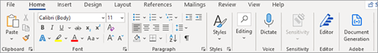
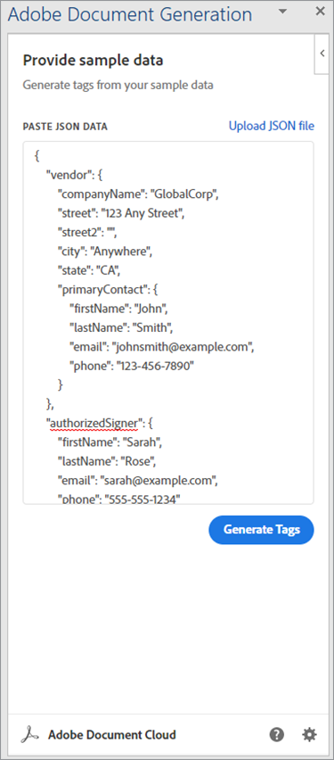
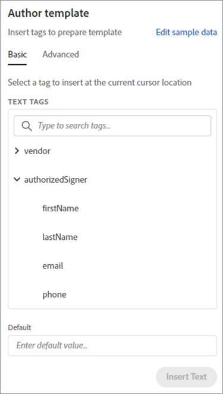
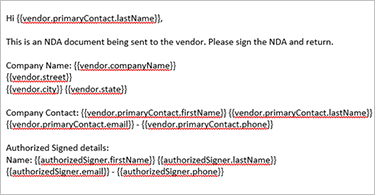
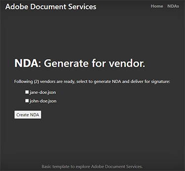
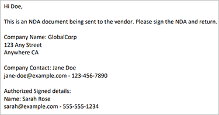

# Creating an NDA with Adobe Document Services APIs

Organizations collaborate with external contributors to build their services and products. A non-disclosure agreement (NDA) is an important of these collaborations. It binds all the parties from releasing any confidential information that might damage either entity.

The most widely used NDA format is a PDF document. Organizations prepare an NDA and send it to all parties. Then, once everyone has signed, they initiate the contract. In a high-velocity team, manual PDF creation slows the progress.

With Adobe Document Services, you can generate PDF documents on the fly using dynamic data. Document Services offers a suite of PDF tools, including Adobe Document Generation API to automate [NDA creation](https://www.adobe.io/apis/documentcloud/dcsdk/nda-creation.html).

This tutorial explains how to create a specialized Microsoft Word NDA template for your company. Adobe’s free add-in for Microsoft Word, Adobe Document Generation Tagger, inserts “tags” to input the dynamic values. You learn how to pass the JSON data to the template and create a dynamic PDF. The resulting PDF can be emailed or shown to your collaborators in their browser, depending on your business requirements and goals.

To follow this tutorial, you need experience with Node.js, JavaScript, Express.js, HTML, and CSS. There is a [sample demonstration](https://github.com/afzaal-ahmad-zeeshan/adobe-docugen-sample) for you to try. Download the source code, get your own [Document Services keys](https://opensource.adobe.com/pdftools-sdk-docs/release/latest/index.html#getcred), and begin.

## Creating the JSON model

The Microsoft Word template depends on the JSON model, so you create that first. For the tutorial, you use a basic JSON structure that contains company details, such as contact information.

```
{
"vendor": {
"companyName": "GlobalCorp",
"street": "123 Any Street",
"street2": "",
"city":"Anywhere",
"state":"CA",
"primaryContact": {
"firstName":"John",
"lastName":"Doe",
"email":"john-doe@example.com",
"phone":"123-456-7890"
}
},
"authorizedSigner": {
"firstName": "Sarah",
"lastName": "Rose",
"email": "sarah@example.com",
"phone":"555-555-1234"
}
}
```

You use this structure inside Microsoft Word to generate a template. This data can come from any data source, as long as it is in JSON format. For simplicity, you create multiple files inside the Node.js application, but your use case might require a database connection to pull vendor information.

## Creating the Microsoft Word template

Create the NDA template in a Microsoft Word document. Adobe PDF Services API expects the Microsoft Word document to contain tags where the service can inject values from JSON documents. Although the template is the same for all requests to Adobe, the dynamic data in JSON changes. These tags help create PDF documents for every vendor in this case, using a single Microsoft Word template and speeding up the process by automating NDA document generation.

You can install the [free](https://opensource.adobe.com/pdftools-sdk-docs/docgen/latest/wordaddin.html#add-in-demo) [Document Generation Tagger add-in](https://opensource.adobe.com/pdftools-sdk-docs/docgen/latest/wordaddin.html#add-in-demo) to Microsoft Word. If you are a part of an organization, you can request your Microsoft Office administrator to install the free add-in for everyone.

Once you have the add-in installed, you can find it in the Home tab under the Adobe category. To open the tab, select **Document Generation** :



Inside the tab, you can upload the sample JSON document. This document can be a sample because you only use it to create a Microsoft Word template.



Select **Generate Tags** to view items you can use inside your template. Here are the properties extracted from the JSON structure, ready for use in the template:



These are the features from the `authorizedSigner` field. Other fields are wrapped, and you can expand the view in Microsoft Word. The add-in offers advanced data options as well, such as tables, lists, calculated values, and more.

## Creating the tags

Feel free to create a new template or import an [existing template](https://www.adobe.io/apis/documentcloud/dcsdk/doc-generation.html#sample-blade) into Microsoft Word. Once you set up your document, add tags to each field by clicking the corresponding tokens in the add-in.

The following template in a Microsoft Word file:



This file contains several tags. When you run the program, these fields are filled with the vendor information.

Document Generation Tagger integrates with Adobe Sign API. Because of this integration, you can automatically create Sign text tags so the generated document can then be sent to Adobe Sign for signature.

## Generating the NDA for vendors

Inside the sample application, you prepared folders for the input and outputs. As mentioned earlier, you use JSON files, so that there are two files to show the available vendors in the system. The files are shown inside a form that prints on the browser:

```
<h1><b>NDA</b>: Generate for vendor.</h1>
<hr />
<p>Following ({{files.length}}) vendors are ready, select to generate NDA and deliver for signature:</p>
<form method="POST">
<ul>
{{#each files }}
<li><input type="checkbox" name="vendor" value="{{this}}" id="file-{{@index}}" /> <label for="file-{{@index}}">{{this}}</label></li>
{{/each}}
</ul>
<input type="submit" value="Create NDA" />
</form>
```

This code generates the following user interface (UI) in the browser:



When the administrator selects a person, the app uses Adobe PDF Services to generate the NDA on the go.
 
```
async function compileDocFile(json, inputFile, outputPdf) {
try {
// configurations
const credentials = adobe.Credentials
.serviceAccountCredentialsBuilder()
.fromFile("./src/pdftools-api-credentials.json")
.build();
// Capture the credential from app and show create the context
const executionContext = adobe.ExecutionContext.create(credentials);
// create the operation
const documentMerge = adobe.DocumentMerge,
documentMergeOptions = documentMerge.options,
options = new documentMergeOptions.DocumentMergeOptions(json, documentMergeOptions.OutputFormat.PDF);
const operation = documentMerge.Operation.createNew(options);
// Pass the content as input (stream)
const input = adobe.FileRef.createFromLocalFile(inputFile);
operation.setInput(input);
// Async create the PDF
let result = await operation.execute(executionContext);
await result.saveAsFile(outputPdf);
} catch (err) {
console.log('Exception encountered while executing operation', err);
}
}
```

Use this code inside the Express router:
 
```
// Create one report and send it back
try {
console.log(`[INFO] generating the report...`);
const fileContent = fs.readFileSync(`./public/documents/raw/${vendor}`, 'utf-8');
const parsedObject = JSON.parse(fileContent);
await pdf.compileDocFile(parsedObject, `./public/documents/template/Adobe-NDA-Sample.docx`, `./public/documents/processed/output.pdf`);
console.log(`[INFO] sending the report...`);
res.status(200).render("preview", { page: 'nda', filename: 'output.pdf' });
} catch(error) {
console.log(`[ERROR] ${JSON.stringify(error)}`);
res.status(500).render("crash", { error: error });
}
```

You can view [the complete sample code](https://github.com/afzaal-ahmad-zeeshan/adobe-docugen-sample) on GitHub.

This code uses a JSON document and the Microsoft Word template in the API call to the Adobe Document Services SDK. In the response, you receive the output and save it to the app’s file system. You can forward the generated document to your clients via email or show them a preview inside the browser using the free [Adobe PDF Embed API](https://www.adobe.io/apis/documentcloud/dcsdk/pdf-embed.html).

This call creates the following NDA document:



Adobe Document Services APIs inserts content to create a PDF document. Without these tools, you might have to write the code to process Office documents and work with raw PDF file formats. With the help of Adobe PDF Services, you can do all of these steps with a single API call.

Now use [Adobe Sign API](https://www.adobe.io/apis/documentcloud/sign.html) to request signatures on the NDAs and deliver the final, signed document to all parties. Adobe Sign notifies you [using a Webhook](https://www.adobe.io/apis/documentcloud/sign/docs.html#!adobedocs/adobe-sign/master/webhooks.md). Listening to this webhook, you can fetch the status of the NDA.

For a deeper explanation of the Adobe Sign process, [consult the documentation](https://www.adobe.io/apis/documentcloud/sign/docs.html) or read this in-depth blog post.

## Next steps

In this tutorial, the Adobe Document Generation Tagger is used to dynamically generate PDF documents using Microsoft Word templates and JSON data files. This add-in helps to[automatically create NDAs](https://www.adobe.io/apis/documentcloud/dcsdk/nda-creation.html) customized for each party, then gather signatures using Sign API.

You can use these techniques to dynamically create your own NDAs or other documents, freeing your team’s time to focus on productive work. Explore [Adobe Document Services](https://www.adobe.io/apis/documentcloud/dcsdk/pdf-tools.html) to find APIs and SDKs for your language and runtime of choice so you can add PDF functions directly to your applications to quickly create PDF documents. [Get started](https://www.adobe.io/apis/documentcloud/dcsdk/gettingstarted.html) with a six-month free trial then
[pay-as-you-go](https://www.adobe.io/apis/documentcloud/dcsdk/pdf-pricing.html) for only $0.05 per document transaction.
