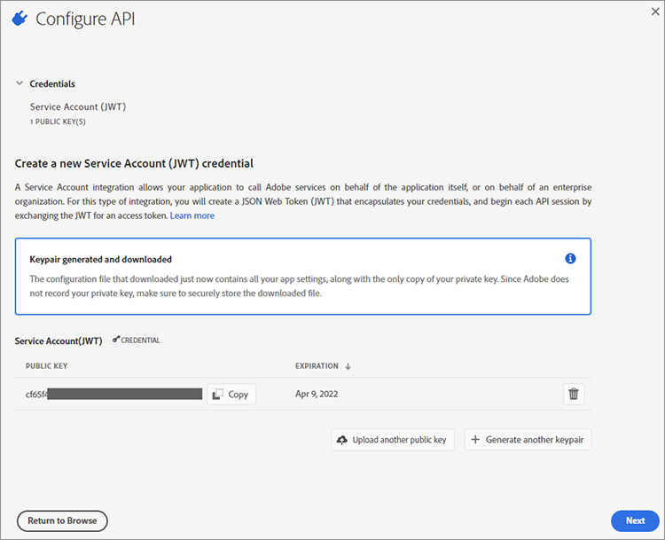
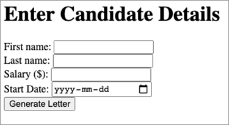
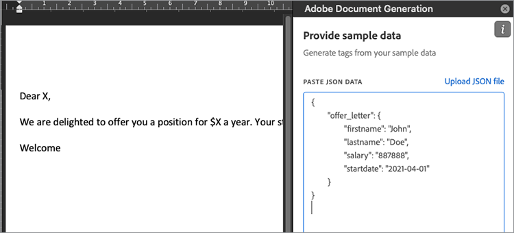

# Managing employee offer letters with Adobe Document Services APIs

Employee offer letters are one of the first experiences employees have with your organization. As a result, you want to make sure that your offer letters are on-brand, but you don’t want to have to build a letter in your word processor from scratch every time. Adobe Document Services APIs offer a fast, easy, and effective way to handle key parts of [generating and delivering offer letters to new employees](https://www.adobe.io/apis/documentcloud/dcsdk/employee-offer-letters.html).

This tutorial walks through setting up a Node Express project that displays a web form for a user to populate with employee details. These details use Document Services over the web to generate an offer letter as a PDF that can be delivered to a customer for their signature using Adobe Sign API.

## Getting started

[Node.js](https://nodejs.org/) is the programming platform. It comes with an enormous set of libraries, such as the Express web server. [Download Node.js](https://nodejs.org/en/download/) and follow the steps to install this great open-source development environment.

To use Adobe Document Generation API in Node.js, go to the [Document Generation API](https://www.adobe.io/apis/documentcloud/dcsdk/doc-generation.html) site to access your account or sign up for a new one. Your account is [free for six months then pay-as-you-go](https://www.adobe.io/apis/documentcloud/dcsdk/pdf-pricing.html) for just $0.05 per document transaction, so you can try it out risk-free then only pay as your company grows.

After signing into the [Adobe Developer Console](https://console.adobe.io/), click **Create New Project**. The project is named “Project 1” by default. Click the **Edit Project** button and change the name to “Offer Letter Generator.” In the center of the screen is a **Get Started With Your New Project** section. To enable security on your project, take the following steps:

Click **Add API**. You see a number of APIs to choose from. In the **Filter by Product** section, select **Document Cloud**, then click **Next**.

Now, generate credentials to access the API. The credentials are in the form of a JSON Web Token ([JWT](https://jwt.io/)): an open standard for secure communication. If you are familiar with JWT and have already generated keys, you can upload your public key here. Alternatively, proceed by selecting **Option 1** to have Adobe generate the keys for you.



Click the **Generate keypair** button. You get a config.zip file to download. Unzip the archive file. It contains two files: certificate_pub.crt and private.key. Make sure that the latter is kept secure, as it contains your private credentials and may be used to generate spurious documents if out of your control.

Click **Next**. No, enables access to the PDF Generation API. On the **Select product profiles** screen, check **Enterprise PDF Services Developer**, and click on the **Save configured API** button. Now you are ready to start using the API.

## Setting up the project

Set up a Node project to run your code. This example uses [Visual Studio Code](https://code.visualstudio.com/) (VS Code) as the editor. Make a folder called “letter-generator” and open it in VS Code. From the **File** menu, select **Terminal** \> **New Terminal** to open a shell in this folder. Check that Node is installed and on your path by entering the following:
 
```
node -v
```
 
You should see the version of Node you installed.

Now that you have your development environment installed, you can go ahead and create your project.

First, initialize the project using the Node Package Manager (npm). Type the following:

```
npm init
```
 
You are asked some questions about your Node project. You can skip most of these questions, but make sure the project name is “letter-generator” and the entry point is **index.js**. Select **Yes** to complete project initialization.

You now have a package.json file. Node uses this file to organize your project. Before you create index.js, you have to add Adobe libraries with the following
command:
 
```
npm install --save @adobe/documentservices-pdftools-node-sdk
```
 
There should be a new folder called node_modules added to your project. This folder is where all libraries (called dependencies in Node) are downloaded. The package.json file is also updated with a reference to Adobe PDF Services.

Now you want to install Express as your lightweight web framework. Enter the following command:
 
```
npm install express –save
```

As before, the dependencies section of package.json is updated accordingly.

## Creating an offer letter template

Now, in the project root, create a file called “app.js”. Let’s put the following starter code in there:
 
```
const express = require('express');
const bodyParser = require('body-parser');
const PDFToolsSdk = require('@adobe/documentservices-pdftools-node-sdk')
const path = require('path');
const app = express();
const port = 8000;
app.use(bodyParser.urlencoded({ extended: true }));
app.get('/', (req, res) => {
res.sendFile(path.join(__dirname + '/index.html'));
});
app.post('/', (req, res) => {
console.log('Got body:', req.body);
res.sendStatus(200);
});
app.listen(port, () => {
console.log(`Candidate offer letter app listening on port ${port}!`)
});
```

Notice the get route returns an **index.html** file. Let’s create an HTML file with that name and the following simple form. You can add CSS styles and other design elements later as you see fit. This form takes the candidate’s basic details for generating a welcome letter:
 
```
<!DOCTYPE html>
<html lang="en">
<head>
<meta charset="UTF-8">
<meta http-equiv="X-UA-Compatible" content="IE=edge">
<meta name="viewport" content="width=device-width, initial-scale=1.0">
<title>Offer Letter Generator</title>
</head>
<body>
<h1>Enter Candidate Details</h1>
<form action="" method="post">
<div>
<label for="firstname">First name: </label>
<input type="text" name="firstname" id="firstname" required>
</div>
<div>
<label for="lastname">Last name: </label>
<input type="text" name="lastname" id="lastname" required>
</div>
<div>
<label for="salary">Salary ($): </label>
<input type="number" name="salary" id="salary" required>
</div>
<div>
<label for="startdate">Start Date: </label>
<input type="date" name="startdate" id="startdate" required>
</div>
<div>
<input type="submit" value="Generate Letter">
</div>
</form>
</body>
</html>
```

Run the web server with the following command:
 
```
node app.js
```

You should see the message “Candidate offer letter app listening on port 8000”. If you open your browser to <http://localhost:8000/>, the form should look like the following:



Notice that the form posts to itself. If you fill in data and click **Generate Letter,** you should see the following information on the console:

```
Got body: { firstname: 'John',
lastname: 'Doe',
salary: '887888',
startdate: '2021-04-01' }
```
 
You replace this console logging with a web service call to Document Services. First, you must make a JSON-based model of the information. The format of this model looks like this:
 
```
{
    "offer_letter": {
    "firstname": "John",
    "lastname": "Doe",
    "salary": "887888",
    "startdate": "2021-04-01"
    }
}
```
 
You can make this model more elaborate if you wish, but for this tutorial, stick with this simple example. There is no validation on this form because this is outside the scope of this article. To convert your form body to the data model described above, change the app.post handler method to have the following code:
 
```
app.post('/', (req, res) => {
const docModel = {'offer_letter': req.body};
generateLetter(docModel);
res.sendStatus(200);
});
```

The first line puts your JSON data in the desired format. Now you pass this data to a generateLetter function. Stop your server and paste the following code at the end of app.js. This code takes a Word document as a template and fills in placeholders with information from a JSON document.

```
// Letter generation function
function generateLetter(jsonDataForMerge) {
try {
// Initial setup, create credentials instance.
const credentials = PDFToolsSdk.Credentials
.serviceAccountCredentialsBuilder()
.fromFile("pdftools-api-credentials.json")
.build();
// Create an ExecutionContext using credentials
const executionContext = PDFToolsSdk.ExecutionContext.create(credentials);
// Create a new DocumentMerge options instance
const documentMerge = PDFToolsSdk.DocumentMerge,
documentMergeOptions = documentMerge.options,
options = new documentMergeOptions.DocumentMergeOptions(jsonDataForMerge,
documentMergeOptions.OutputFormat.PDF);
// Create a new operation instance using the options instance
const documentMergeOperation = documentMerge.Operation.createNew(options)
// Set operation input document template from a source file.
const input = PDFToolsSdk.FileRef.createFromLocalFile(
'resources/OfferLetter-Template.docx');
documentMergeOperation.setInput(input);
// Execute the operation and Save the result to the specified location.
documentMergeOperation.execute(executionContext)
.then(result => result.saveAsFile('output/OfferLetter.pdf'))
.catch(err => {
if(err instanceof PDFToolsSdk.Error.ServiceApiError
|| err instanceof PDFToolsSdk.Error.ServiceUsageError) {
console.log(
'Exception encountered while executing operation', err);
} else {
console.log(
'Exception encountered while executing operation', err);
}
});
} catch (err) {
console.log('Exception encountered while executing operation', err);
}
}
```

There’s much code to unpack there. Let’s take the main part first: the `documentMergeOperation`. This section is where you take your JSON data and merge it with a Word Document template. You can use the [example on the Adobe site](https://www.adobe.io/apis/documentcloud/dcsdk/doc-generation.html#sample-blade) as a reference, but let’s make your own simple example. Open Word and create a new blank document. You can customize it as much as you like, but at least have something like this:

Dear X,

We are delighted to offer you a position for $X a year. Your starting date will be X.

Welcome

Save the document as “OfferLetter-Template.docx” in a folder called “resources” in the root of your project. Notice the three Xs in the document. Those Xs are temporary placeholders for your JSON information. Although you could use a special syntax to replace these placeholders, Adobe provides a Word Add-in that simplifies this task. To install  the Add-in, go to the Adobe [Document Generation Tagger Word Add-in](https://www.adobe.io/apis/documentcloud/dcsdk/docs.html?view=docgen-addin) site.

In your OfferLetter-Template, click the new **Document Generation** button. A side panel opens. Click **Get Started**. You are provided with a text area to paste in the sample JSON data. Copy the “offer-data” snippet of JSON from above into the text area. It should look like the following:



Click the **Generate Tags** button. You get a drop-down menu of tags to insert into the appropriate points in the document. Highlight the first X in the document and select **firstname**. Click **Insert Text** and “Dear X,” is changed to “Dear ```{{`offer_letter`.firstname}}```,”. This tag is the correct format for `documentMergeOperation`. Go ahead and add the remaining three tags at the appropriate Xs. Don’t forget to save OfferLetter-template.docx. It should look like this:

Dear ```{{`offer_letter`.firstname}} {{`offer_letter`.lastname}}```,

We are delighted to offer you a position for $ ```{{`offer_letter`.salary}}``` a year. Your starting date will be ```{{`offer_letter`.startdate}}```.

Welcome

Now the Word template has markup that matches the JSON format. For example, ```{{`offer_letter`.`firstname`}}``` at the start of Word document is replaced by the value in the "firstname" section of the JSON data.

Back to your `generateLetter` function. To secure your REST call, make a new file titled pdftools-api-credentials.json in the project root. Paste in the following JSON data and adjust it with details from the Service Account (JWT) section of your [Developer Console](https://console.adobe.io/).
 
```
{
"client_credentials": {
"client_id": "<YOUR_CLIENT_ID>",
"client_secret": "<YOUR_CLIENT_SECRET>"
},
"service_account_credentials": {
"organization_id": "<YOUR_ORGANIZATION_ID>",
"account_id": "<YOUR_TECHNICAL_ACCOUNT_ID>",
"private_key_file": "<PRIVATE_KEY_FILE_PATH>"
}
}
```
 
* The client ID, client secret, and organization ID can be copied directly from the **Credential details** section of the console.

* The account ID is the **Technical Account ID**.

* Copy the private.key file you generated earlier into the project and enter its name in the private_key_file section of the
 pdftools-api-credentials.json file. If you wish, you can put a path to the private key file here. Remember to keep it secure as it can be mis-used once out of your control.

To generate a PDF with the JSON data filled in, go back to your **Enter Candidate Details** web form and post some data. It takes a little while as the document has to be downloaded from Adobe, but you should have a file titled OfferLetter.pdf in a new folder titled output.

## Next steps

That’s it! This is just the beginning. If you study the Advanced section of the Document Generation tab of the Word Add-in, you notice that not all the placeholder markers are from the associated JSON data. You can also add Signature tags. These tags allow you to take the resulting document and upload it to [Adobe Sign](https://acrobat.adobe.com/ca/en/sign.html) for delivery and signing to the new employee. Read Getting Started with Adobe Sign API to learn how to do it. This process is similar because you are using REST calls secured with a JWT token.

The single document example provided above can be used as the basis for an application when an organization must [ramp up seasonal hiring](https://www.adobe.io/apis/documentcloud/dcsdk/employee-offer-letters.html) of employees across multiple locations. As demonstrated, the main flow is to take data from candidates through an online application. The data is used to populate the fields of an offer letter, and send it out for electronic signature.

Adobe Document Services is free to use for six months, then [pay-as-you-go](https://www.adobe.io/apis/documentcloud/dcsdk/pdf-pricing.html) at just $0.05 per document transaction, so you can try it and scale your offer letter workflow as your business grows. To [get started](https://www.adobe.io/apis/documentcloud/dcsdk/gettingstarted.html)
building your own templates, [sign up your developer account](https://www.adobe.io/).