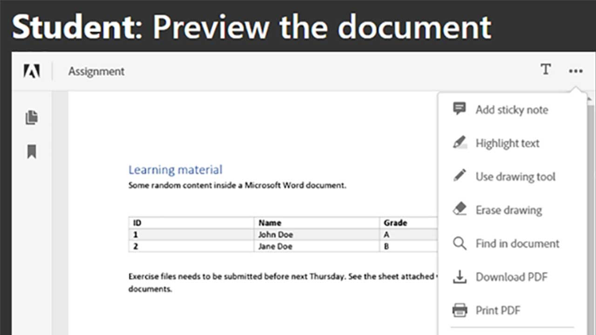
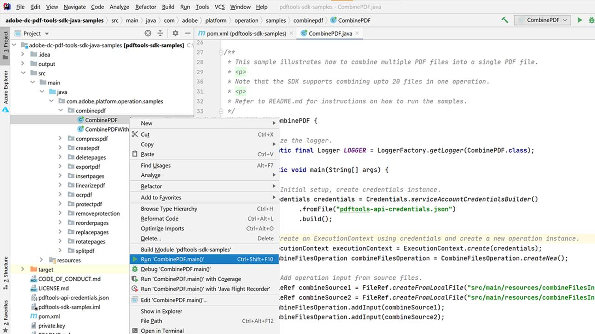
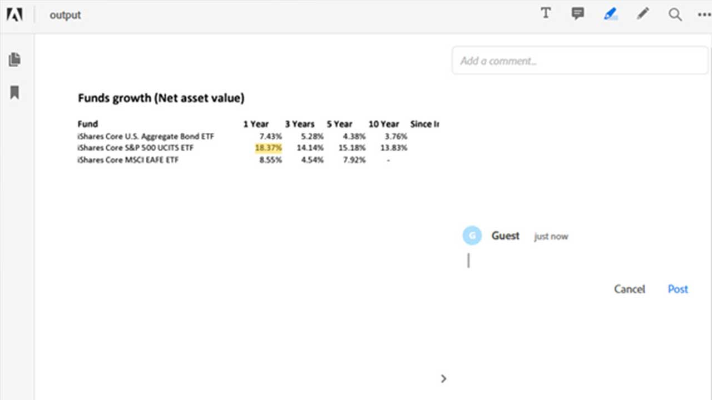

# Adobe Document Services API use cases

## What can the Adobe Document Services APIs do for me?

Learn how the Adobe Document Services APIs can change your business with these use cases.

<table style="table-layout:fixed">
<tr>
 <td>
   
    

   <a href="reportcreation.md"><strong>Report creation and editing with Adobe Document Services APIs</strong></a>
    

    <em>Learn how to generate PDF reports on your website for customers</em>
     
  </td>
  <td>
   
    

   <a href="jobposting.md"><strong>Job posting with Adobe Document Services APIs</strong></a>
    

    <em>Learn how to develop a smooth and consistent web experience for job applicants and employers</em>
     
  </td>
  <td>
   
    

   <a href="ddppdfembedapi.md"><strong>Student-Teacher collaboration with Adobe Document Services APIs</strong></a>
    

    <em>Learn how to create an online learning platform that enables teachers and students to easily share resources in PDF</em>
     
  </td>
</tr>
<tr>
   <td>
   
    

   <a href="ddppdfembedapi.md"><strong>Digital document publishing with Adobe PDF Embed API</strong></a>
    

    <em>Learn how to display embedded PDF documents inside web pages using Adobe PDF Embed API</em>
     
  </td>
  <td>
   
    

   <a href="signapi.md"><strong>Getting started with Adobe Sign API</strong></a>
    

    <em>Learn how to include Sign API in your application to gather signatures and other information</em>
     
  </td>
  <td>
   
    

   <a href="AgreementWorkflowsNodejs.md"><strong>Agreement workflows with Adobe Document Services APIs in Node.js</strong></a>
    

    <em>Adobe Document Services APIs easily incorporate PDF capabilities into your web applications</em>
     
  </td>
</tr>
<tr>
  <td>
   
    

   <a href="HRAgreementWorkflowsJava.md"><strong>HR document workflows with Adobe Document Services APIs in Java</strong></a>
    

    <em>Adobe Document Services APIs easily incorporate PDF capabilities into your HR web applications</em>
     
  </td>
 <td>
   
    

   <a href="FinanceWorkflowsJava.md"><strong>Managing financial document workflows with Adobe Document Services APIs in Java</strong></a>
    

    <em>Adobe Document Services provides all the necessary tools, services, and features to process and extract data from PDF financial documents</em>
     
  </td>
  <td>
    
    

     
  </td>
</tr>
</table>