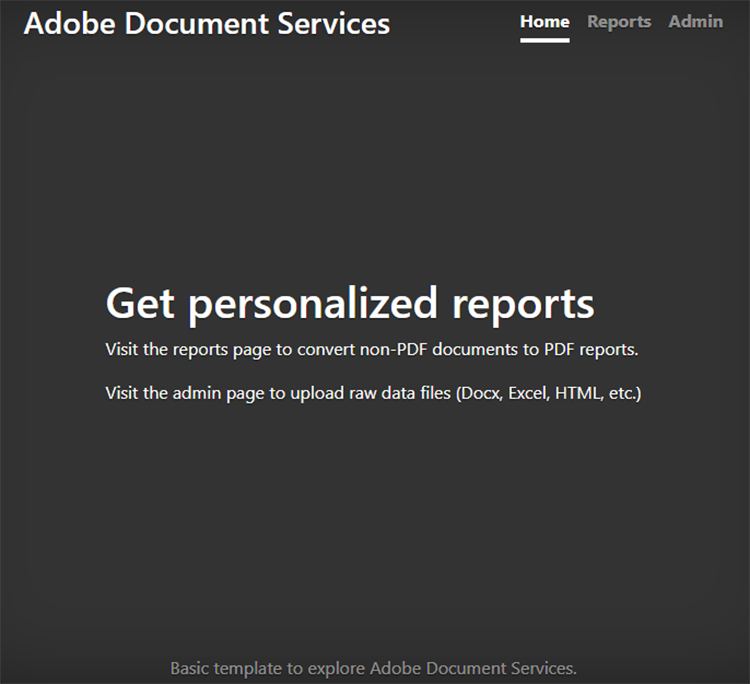
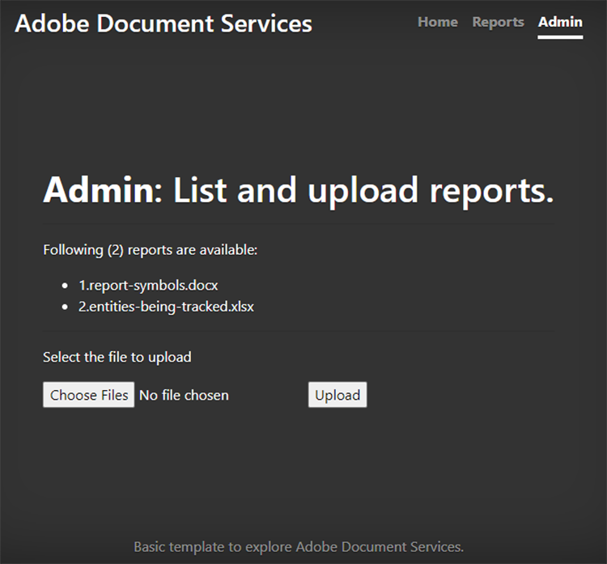
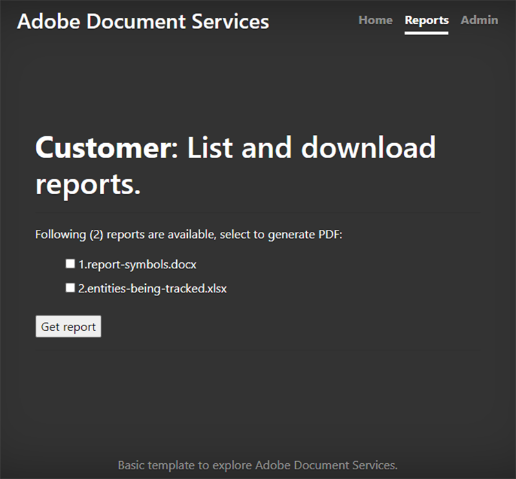
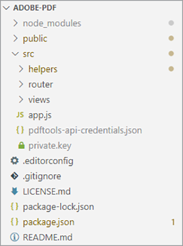
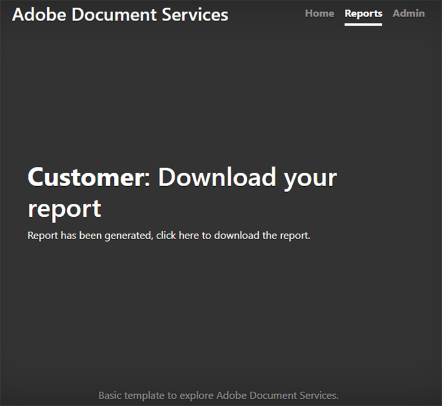
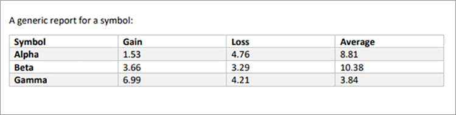

# Report creation and editing with Adobe Document Services APIs

Finance, education, marketing, and other industries use PDFs to share data with their customers and stakeholders. PDFs make it easy to share rich documents, with tables, graphics, and interactive content, in a format everyone can view. Adobe Document Services APIs help these companies generate shareable PDF reports from Microsoft Word, Microsoft Excel, graphics, and other diverse document formats.

Say you [run a social media tracking company](https://www.adobe.io/apis/documentcloud/dcsdk/report-creation-and-editing.html). Your customers log in to a password-protected part of your site to view their campaign analytics. Often, they want to share these statistics with their executives, shareholders, donors, or other stakeholders. Downloadable PDF documents are a great way for your customers to share numbers, graphs, and more.

By incorporating [PDF Services API](https://www.adobe.io/apis/documentcloud/dcsdk/pdf-tools.html) into your website, you can generate PDF reports on the go for each customer. You can create PDFs then combine them into a single, handy report for your customers to download and pass along to their stakeholders.

In this tutorial, learn how to use PDF Services SDK in a Node.js and Express.js environment (with just some JavaScript, HTML, and CSS) to quickly and easily add PDF-oriented functionality to an existing website. This website has a page where administrators upload reports, an area where customers view a list of available reports and select documents to convert to PDF, and helpful endpoints to download PDFs generated by the system.

## Campaign reports dashboard for customers

>[!NOTE]
>
>This tutorial is not about Node.js best practices or how to secure your web applications. Some areas of the website are exposed for public use, and document naming might be non-production-friendly. To discuss the best possible approach to design a system like this, consult your architects and engineers.

Here, you have a basic Express.js web application that has a customer reports area and an administrator section. This application can showcase reports for social media campaigns. For example, it can demonstrate the number of times an advertisement is clicked.



You can download this project from the [GitHub repository](https://github.com/afzaal-ahmad-zeeshan/express-adobe-pdf-tools).

Now, let us explore how to publish the reports.

## Uploading reports

To keep it simple, only use the file system-based uploading and processing here. In Express.js, you can use the fs module to list all the available files under a directory.

On the same page, enable the admin to upload report files to the server for customers to see. These files can be in many different formats, like Microsoft Word, Microsoft Excel, HTML, and [other data formats](https://opensource.adobe.com/pdftools-java-sdk-samples/apidocs/latest/com/adobe/platform/operation/pdfops/CreatePDFOperation.SupportedSourceFormat.html) including graphics files. The admin page looks like this:



>[!NOTE]
>
>Password protect your URLs or use the passport package from npm to secure your application behind the authentication and authorization layer.

When the administrator selects and uploads a file, it is moved to a public repository where other people can access it. You use the same repository to publish documents from the admin page and list the available marketing reports for customers. This code is:

```
router.get('/', (req, res) => {
try {
let files = fs.readdirSync('./public/documents/raw') // read the files
res.status(200).render("reports", { page: 'reports', files: files });
} catch (error) {
res.status(500).render("crash", { error: error });
}
});

```

This code lists all the files and renders a view of the file list.

## Selecting reports

On the user side, you have a form for customers to select the documents they want to include in their social media campaign report. For simplicity, on your example page, only show the document name and a checkbox to select the document. Customers can select a single report or multiple reports to combine in a single PDF document.

For a more advanced user interface, you might also show a preview of the report here.



## Generating a PDF report

Use the PDF Services SDK to create the PDF reports from your data inputs. The data (as shown in the screenshots above) can come from various data formats such as Microsoft Word, Microsoft Excel, HTML, graphics, and more. Start by installing the npm package for PDF Services SDK.

```
$ npm install --save @adobe/documentservices-pdftools-node-sdk
```

Before starting, you must have API credentials, [free from Adobe](https://opensource.adobe.com/pdftools-sdk-docs/release/latest/index.html#getcred). Use your Document Services account [free for six months then pay-as-you-go](https://www.adobe.io/apis/documentcloud/dcsdk/pdf-pricing.html) for just \$0.05 per document transaction.

Download the archive file and extract the JSON file for credentials and the private key. In the sample project, you place the file in the src directory.



Now that you have the credentials set up, you can write the PDF conversion task. For this demonstration, you have two operations you must perform in the application:

* Convert raw documents to PDF files

* Combine multiple PDF files in a single report

The overall procedure is similar for running any operation. The only difference is the service you use. In the following code, you convert the raw document to a PDF file:

```
async function createPdf(rawFile, outputPdf) {
try {
// configurations
const credentials = adobe.Credentials
.serviceAccountCredentialsBuilder()
.fromFile("./src/pdftools-api-credentials.json")
.build();
// Capture the credential from app and show create the context
const executionContext = adobe.ExecutionContext.create(credentials),
operation = adobe.CreatePDF.Operation.createNew();
// Pass the content as input (stream)
const input = adobe.FileRef.createFromLocalFile(rawFile);
operation.setInput(input);
// Async create the PDF
let result = await operation.execute(executionContext);
await result.saveAsFile(outputPdf);
} catch (err) {
console.log('Exception encountered while executing operation', err);
}
}
```

In the code above, you read the credentials and create the execution context. PDF Services SDK requires the execution context to authenticate your requests.

Then, you run the Create PDF operation that converts the raw documents to PDF format. Finally, you use the `` `outputPdf` `` parameter to copy the PDF report. In the code sample, you find this code under the src/helpers/pdf.js file. Later in this tutorial, you import the PDF module and call this method.

As demonstrated in the previous section, your customers can go to the following page to select the reports they want to convert to PDF:


When a customer selects one or more of these reports, you create the PDF file.

First, let’s see a single PDF file in action. When the user selects a single report, you only need to convert it to PDF and provide the download link.

```
try {
console.log(`[INFO] generating the report...`);
await pdf.createPdf(`./public/documents/raw/${reports}`, `./public/documents/processed/output.pdf`);
console.log(`[INFO] sending the report...`);
res.status(200).render("download", { page: 'reports', filename: 'output.pdf' });
} catch(error) {
console.log(`[ERROR] ${JSON.stringify(error)}`);
res.status(500).render("crash", { error: error });
}
```

This code creates a report and shares the download URL with the customer. Here is the output web page:



And here is the output PDF:



Customers can select multiple files to generate a combined report. When the customer selects more than one document, you perform two operations: the first creates a partial PDF for each document and the second combines them into a single PDF report.

```
async function combinePdf(pdfs, outputPdf) {
try {
// configurations
const credentials = adobe.Credentials
.serviceAccountCredentialsBuilder()
.fromFile("./src/pdftools-api-credentials.json")
.build();
// Capture the credential from app and show create the context
const executionContext = adobe.ExecutionContext.create(credentials),
operation = adobe.CombineFiles.Operation.createNew();
// Pass the PDF content as input (stream)
for (let pdf of pdfs) {
const source = adobe.FileRef.createFromLocalFile(pdf);
operation.addInput(source);
}
// Async create the PDF
let result = await operation.execute(executionContext);
await result.saveAsFile(outputPdf);
} catch (err) {
console.log('Exception encountered while executing operation', err);
}
}

```
 
This method is available under the src/helpers/pdf.js file and exposed as part of the module export.

```
try {
console.log(`[INFO] creating a batch report...`);
// Create a batch report and send it back
let partials = [];
for (let index in reports) {
const name = `partial-${index}-${reports[index]}`;
await pdf.createPdf(`./public/documents/raw/${reports[index]}`, `./public/documents/processed/${name}`);
partials.push(`./public/documents/processed/${name.replace('docx', 'pdf').replace('xlsx', 'pdf')}`);
}
await pdf.combinePdf(partials, `./public/documents/processed/output.pdf`);
console.log(`[INFO] sending the combined report...`);
res.status(200).render("download", { page: 'reports', filename: 'output.pdf' });
} catch(error) {
console.log(`[ERROR] ${JSON.stringify(error)}`);
res.status(500).render("crash", { error: error });
}
```

This code generates a compiled report for multiple input documents. The only added function is the `` `combinePdf` `` method that takes a list of PDF file path names and returns a single output PDF.

Now, your social media dashboard customers can select relevant reports from their account and download them as one handy PDF. This dashboard allows them to show management, and other stakeholders, their campaigns’ success with data, tables, and graphs in a universally easy-to-open format.

## Next steps

This tutorial walked through how to use PDF Services API to help customers download relevant reports as easy-to-share PDFs. You created a Node.js application to showcase the power of PDF Services API for PDF reporting and reading services. The application demonstrated how your customers to download a single report document or combine and merge multiple documents into a single PDF report.

This Adobe-powered application helps your [social media dashboard customers](https://www.adobe.io/apis/documentcloud/dcsdk/report-creation-and-editing.html) get and share the reports they need, without worrying if the recipients all have Microsoft Office or other software installed on their device. You can use the same techniques in your own application to help your users view, combine, and download documents. Or, check out Adobe’s many other APIs to add and track signatures and much more.

To get started, claim your free [Adobe Document Services](https://www.adobe.io/apis/documentcloud/dcsdk/gettingstarted.html) account, then create engaging reporting experiences for your employees and customers. Enjoy your account free for six months then [pay-as-you-go](https://www.adobe.io/apis/documentcloud/dcsdk/pdf-pricing.html)
as your marketing efforts expand, just \$0.05 per document transaction.
