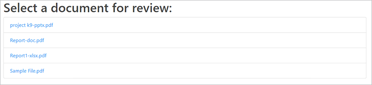

# Reviews and approvals with Adobe Document Services APIs

Remote cross-team collaboration became necessary for many companies during the COVID-19 pandemic, [sharing and reviewing digital documents](https://www.adobe.io/apis/documentcloud/dcsdk/reviews-and-approvals.html) presents a series of challenges for teams and cross-functional resources.

These challenges include sharing documents in different file formats, effectively reviewing and commenting on the content, and synchronizing with the most recent edits. Adobe Document Services APIs are designed to enable application developers to solve these challenges for their users.

This tutoral shows how to build a document review and approval workflow in a Node.js and Express web application. The code for this project is available [here](https://github.com/contentlab-io/adobe_reviews_and_approvals). To follow along with this tutorial, you just need some experience with Node.js.

The application has the following features:

* Convert different file types to PDF

* Enable file uploads

* Give users the ability to add comments and annotations

* Display the PDFs along with those comments

* Enable user profiles to identify comment authors

* Combine files into a final PDF that the users can download

## Creating Adobe API credentials

Before starting the code, you must [create new credentials](https://www.adobe.com/go/dcsdks_credentials) for Adobe PDF Embed API and Adobe PDF Services API. PDF Embed API is completely free to use. PDF Services API is free to use for six months, then you can switch to a [pay-as-you-go plan](https://www.adobe.io/apis/documentcloud/dcsdk/pdf-pricing.html) at just \$0.05 per document transaction.

When creating credentials for PDF Services API, select the **Create personalized code sample** option and select Node.js for the language. Save the ZIP file and extract pdftools-api-credentials.json and private.key to the root directory of your Node.js Express project.

## Setting up a project and dependencies

Set up your Node.js and Express project to serve static files from a folder named “public.” There are several ways to do this, depending on your preferences. To get up and running quickly, you can use the [Express app generator](https://expressjs.com/en/starter/generator.html). Or if you'd like to keep things simple, you can [start from scratch](https://expressjs.com/en/starter/hello-world.html) and keep your code in a single JavaScript file. In the sample project linked above, you're using the one-file approach and keeping all of your code in index.js.

Copy the `pdftools-api-credentials.json` and `private.key` files from the personalized code sample to the root directory of the project. Also, add them to the .gitignore file, if you have one, so your credential files are not accidentally sent to a repository.

Next, run `npm install @adobe/documentservices-pdftools-node-sdk` to install the Node.js SDK for PDF Services. Import this module and create the API credentials object inside your code (index.js in your sample project), after the rest of your dependency imports like this:

```
  const PDFToolsSdk = require( "@adobe/documentservices-pdftools-node-sdk" );

  // Create Credentials
  const credentials =  PDFToolsSdk.Credentials
      .serviceAccountCredentialsBuilder()
      .fromFile( "pdftools-api-credentials.json" )
      .build();
```

Your starting code should look like this:

```
  
  const express = require( "express" );
  const PDFToolsSdk = require( "@adobe/documentservices-pdftools-node-sdk" );

  // Create Credentials
  const credentials =  PDFToolsSdk.Credentials
      .serviceAccountCredentialsBuilder()
      .fromFile( "pdftools-api-credentials.json" )
      .build();

  const app = express();

  app.use( express.static( "public" ) );

  app.listen( 8889, function() {
      console.log( "Server started on port", 8889 );
  } );
```

Now you are ready to work with Document Services APIs.

## Converting a file to PDF

For the first part of the document workflow, the end-user must upload documents to share. To enable this, you add an upload function and consolidate the different document file formats into PDFs to prepare them for the review process.

Start by creating a function to convert documents to PDF based on the [example snippet for PDF Services API](https://www.adobe.io/apis/documentcloud/dcsdk/pdf-tools.html). This example also shows snippets for many other vital features, including optical character recognition (OCR), password protection and removal, and compression.

```
function fileToPDF( filename, outputFilename, callback ) {
      // Create an ExecutionContext using credentials and create a new operation
  instance.
      const executionContext = PDFToolsSdk.ExecutionContext.create( credentials ),
          createPdfOperation = PDFToolsSdk.CreatePDF.Operation.createNew();

      // Set operation input from a source file.
      const input = PDFToolsSdk.FileRef.createFromLocalFile( filename );
      createPdfOperation.setInput( input );

      // Execute the operation and Save the result to the specified location.
      createPdfOperation.execute( executionContext )
          .then( result => {
              result.saveAsFile( outputFilename );
              callback( outputFilename );
          } );
  }
```

You can now use this function to create PDFs from uploaded documents.

## Handling file uploads

Next, the server needs a file upload endpoint on the web server to receive and process the documents.

First, create a new folder within an uploads folder and name it “drafts.” You store the uploaded files and the converted PDF files here. Next, run `npm install express-fileupload' to install the Express-FileUpload module and add the middleware to Express in your code:

```
const fileUpload = require( "express-fileupload" );
app.use( fileUpload() );
```

Now, add an `/upload `endpoint and save the uploaded file inside the drafts folder using the same file name. Then, call the function you wrote previously to create a PDF file of the same document if it is not already in PDF format. You can generate a file name for the new PDF file based on the name of the original uploaded document:

```
// Create a PDF file from an uploaded file
app.post( "/upload", ( req, res ) => {
    if( !req.files || Object.keys( req.files ).length === 0 ) {
        return res.status( 400 ).send( "No files were uploaded." );
    }
    
    // Create PDF from the uploaded file
    let file = req.files.myFile;
    file.mv( __dirname + "/uploads/drafts/" + file.name, ( err ) => {
        if( err ) {
            return res.status( 500 ).send( err );
        }
        if( file.name.endsWith( ".pdf" ) ) {
            res.redirect( "/" );
        }
        else {
            // Convert to PDF
            fileToPDF( __dirname + "/uploads/drafts/" + file.name, __dirname + "/uploads/drafts/" + file.name.replace( /\./g, "-" ) + ".pdf", ( file ) => {
                res.redirect( "/" );
            } );
        }
    });
} );
```

## Creating an upload page

Now, to upload files from the web application, create an `index.html` web page inside the uploads folder. On the page, add a file upload form that sends the file to the /upload endpoint:

```
<form ref="uploadForm" 
	  action="/upload"
	  method="post" 
	  encType="multipart/form-data">
	  <input type="file" name="myFile" accept=".doc,.docx,.ppt,.pptx,.xls,.xlsx,.txt,.rtf,.bmp,.jpg,.gif,.tiff,.png">
	  <input type="submit" value="Upload File" />
  </form>
```


You can now upload documents to the Node.js server. The server saves the file inside the uploads/drafts folder and creates a PDF format version alongside it.

You are now ready to embed the uploaded documents, so use the PDF Embed API to enable users to add comments and annotations to the documents easily.

## Enumerating PDF files

As a typical document workflow can involve multiple documents, you must show a list of documents and link each to a new document review page in your app.

First, inside the server code, add a /files endpoint that gets and returns a list of all PDF files stored in the uploads/drafts folder:

```  
const fs = require( "fs" );

app.get( "/files", ( req, res ) =\> {

fs.readdir( \_\_dirname + "/uploads/drafts/", ( err, files ) =\> {

if( err ) {

return res.status( 500 ).send( err );using

}

return res.json( files.filter( f =\> f.endsWith( ".pdf" ) ) );

} );

} );

```

Add a `/download/:file` route that provides access to the uploaded PDF file for embedding into the webpage. Note that in a production application, you need to add authentication and authorization to ensure that the request is coming from a valid user and that the user is allowed to access the document.

```
app.get( "/download/:file", function( req, res ){
    // Note: In production code, this should check authentication and user access permissions
    res.download( __dirname + "/uploads/drafts/" + req.params[ "file" ] );
});
```

Update the index.html page with a file list element that fills at load time. Each item can link to a draft.html webpage, and you pass the file name to the page using query string parameters. 

>[!NOTE]
>
>You use jQuery to append each item, so you may need to load the jQuery library on your web page or append the element using a different method.

```
  <ul id="filelist">
	  <li>Loading documents...</li>
  </ul>

  ...

  <script>
	  // Load current files
	  fetch( "/files" )
	  .then( r => r.json() )
	  .then( files => {
		  if( files && files.length > 0 ) {
			  $( "#filelist" ).empty();
			  files.forEach( file => {
				  $( "#filelist" ).append( `<li><a
  href="/draft.html?file=${file}">${file}</a></li>` );
			  })
		  } else {
                  $("#filelist").append("<div>No documents found.</div>");
                }
	  });
  </script>
```



## Embedding a PDF

You are ready to embed and show PDF files inside your web application.

Create a new web page called “draft.html” and add a div element on the page for the embedded PDF:

```
  <div id="adobe-dc-view"></div>
```

Include the Document Services library:

```
  <script src="https://documentcloud.adobe.com/view-sdk/main.js"></script>
```

Inside a custom script tag, parse the file name from the query string parameters so that you know which file to embed on the page:

```

  <script type="text/javascript">
          let params = new URLSearchParams( window.location.search );
          let filename = params.get( "file" );
  </script>
```

Add a document event listener for the adobe_dc_view_sdk.ready event that loads the specified PDF file into an embedded view inside the div element. Use your client ID from the PDF Embed API credentials. You want to enable comments and annotations, so embed the view in FULL_WINDOW mode and set the showAnnotationsTools option to true.

```

  document.addEventListener( "adobe_dc_view_sdk.ready", () => { 
      var adobeDCView = new AdobeDC.View( { 
          clientId: "YOUR CLIENT ID HERE",
          divId: "adobe-dc-view",
          locale: "en-US",
      } );
      adobeDCView.previewFile( {
          content: { location: { url: "download/" + filename } },
          metaData: { fileName: "Draft Version.pdf" }
      }, {
          embedMode: "FULL_WINDOW",
          showAnnotationTools: true,
          showPageControls: true
      } );
  });
```

## Creating a user profile

By default, comments and annotations show as “Guest” in this view. You can set the current reviewer’s name for the comments and annotations by registering a user profile callback in the page code to the PDF view. The following is an example profile. In a full-fledged application that includes user authentication, the logged in user session’s profile information could be set in this manner to identify each commenter of the document in the review workflow.

```
  adobeDCView.registerCallback(
      AdobeDC.View.Enum.CallbackType.GET_USER_PROFILE_API,
      () => {
          return new Promise( ( resolve, reject ) => {
              resolve({
                  code: AdobeDC.View.Enum.ApiResponseCode.SUCCESS,
                  data: {
                      userProfile: {
                          name: "YOUR NAME",
                          firstName: "FIRST",
                          lastName: "LAST",
                          email: "document.editor@adobe.com"
                      }
                  }
              });
          });
      }
  );
```

Your profile identifies you as a specific user when you see and annotate any uploaded document using this web page.

## Saving document feedback

After a user comments on a document, they click **Save.** By default, this downloads the updated PDF file. Let’s change this action to update the current PDF file on the server.

Add a `/save` endpoint to the server code that overwrites the PDF file in the uploads/drafts folder:

```
  // Overwrite the PDF file with latest PDF changes and annotations
  app.post( "/save", ( req, res ) => {
      if( !req.files || Object.keys( req.files ).length === 0 ) {
          return res.status( 400 ).send( "No files were uploaded." );
      }

      let file = req.files.pdf;
      file.mv( __dirname + "/uploads/drafts/" + file.name, ( err ) => {
          if( err ) {
              return res.status( 500 ).send( err );
          }
          res.send( "File uploaded" );
      });
  } );
```

Register a PDF view callback for the SAVE_API that uploads the content to the /save endpoint. You can change the autoSaveFrequency value to enable your application to automatically save changes on a timer and include additional metadata to the currently embedded file on completion, if you want.

```
  adobeDCView.registerCallback(
      AdobeDC.View.Enum.CallbackType.SAVE_API,
      ( metaData, content, options ) => {
          return new Promise( ( resolve, reject ) => {
              let formData = new FormData();
              formData.append( "pdf", new Blob( [ content ] ), "drafts/" + filename
  );
              fetch( "/save", {
                  method: "POST",
                  body: formData
              }).then( resp => {
                  resolve({
                      code: AdobeDC.View.Enum.ApiResponseCode.SUCCESS,
                      data: {
                          /* Updated file metadata after successful save operation */
                          metaData: Object.assign( metaData, {} )
                      }
                  });
              });
          });
      },
      {
          autoSaveFrequency: 0,
          enableFocusPolling: false,
          showSaveButton: true
      }
  );
```

Comments and annotations on the draft documents now save on the server. You can [read more about how callbacks](https://www.adobe.com/devnet-docs/dcsdk_io/viewSDK/howtos_ui.html#callbacks-workflows) fit into your workflow. For instance, [status callbacks](https://www.adobe.com/devnet-docs/dcsdk_io/viewSDK/howtos_ui.html#status-callback) help handle file conflicts if multiple people want to review and comment on the same document simultaneously.

In the final step, you combine all the edited documents into one PDF file using the PDF Services API.

## Combining PDF files

The PDF combination code is like the PDF creation code but uses the CombineFiles operation and adds each file as input.

```
  function combineFilesToPDF( files, outputFilename, callback ) {
      // Create an ExecutionContext using credentials and create a new operation
  instance.
      const executionContext = PDFToolsSdk.ExecutionContext.create( credentials ),
          combineFilesOperation = PDFToolsSdk.CombineFiles.Operation.createNew();

      // Set operation inputs from source files.
      files.forEach( file => {
          const input = PDFToolsSdk.FileRef.createFromLocalFile( file );
          combineFilesOperation.addInput( input );
      } );

      // Execute the operation and Save the result to the specified location.
      combineFilesOperation.execute( executionContext )
          .then( result => {
              result.saveAsFile( outputFilename );
              callback( outputFilename );
          } );
 }
```

## Downloading the final PDF

Add an endpoint called /finalize that calls the function to combine all the PDF files inside the `uploads/drafts` folder into a `Final.pdf` file, then downloads it.

```
  app.get( "/finalize", ( req, res ) => {
      fs.readdir( __dirname + "/uploads/drafts/", ( err, files ) => {
          if( err ) {
              return res.status( 500 ).send( err );
          }
          combineFilesToPDF(
              files.filter( f => f.endsWith( ".pdf" ) ).map( f => __dirname + 
  "/uploads/drafts/" + f ),
              __dirname + "/uploads/Final.pdf", ( file ) => {
              res.download( file );
          } );
      } );
  } );
```

Finally, add a link in the main index.html web page to this /finalize endpoint. This enables users to download the result of the document workflow.

```
<a href="/finalize">Download final PDF</a>
```


## Next steps

This tutorial shows how Document Services APIs integrate a [document-sharing and review workflow](https://www.adobe.io/apis/documentcloud/dcsdk/reviews-and-approvals.html) into a web application. Using the application remote workers can easily share files and collaborate with their teammates, which is especially helpful to employees and contractors who work from home.

You can use these techniques to enable collaboration in your app or explore [PDF Services Node SDK Samples](https://github.com/adobe/pdftools-node-sdk-samples) and [PDF Embed API Samples](https://github.com/adobe/pdf-embed-api-samples) on GitHub for inspiration on how else to use Adobe’s APIs.

Ready to enable document sharing and review in your own app? Sign up your [Adobe Document Services](https://www.adobe.io/apis/documentcloud/dcsdk/gettingstarted.html) developer account. Access Adobe PDF Embed for free, and enjoy a six-month free trial of the other APIs. After your trial, you can [pay-as-you-go](https://www.adobe.io/apis/documentcloud/dcsdk/pdf-pricing.html) for just \$0.05 per document transaction as your business grows.
