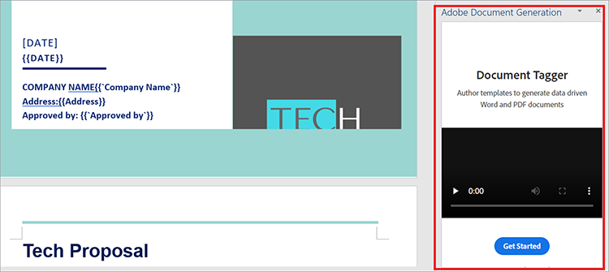
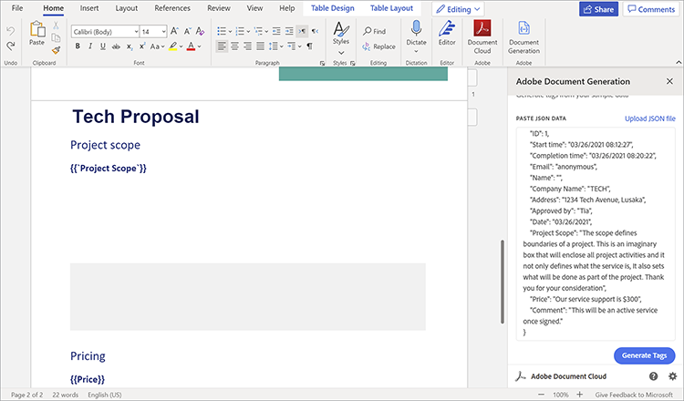
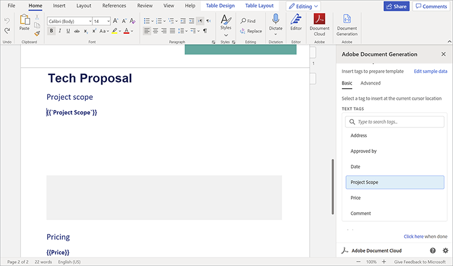
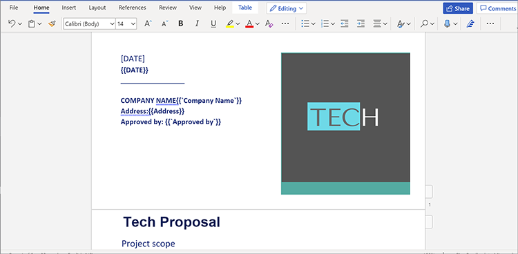
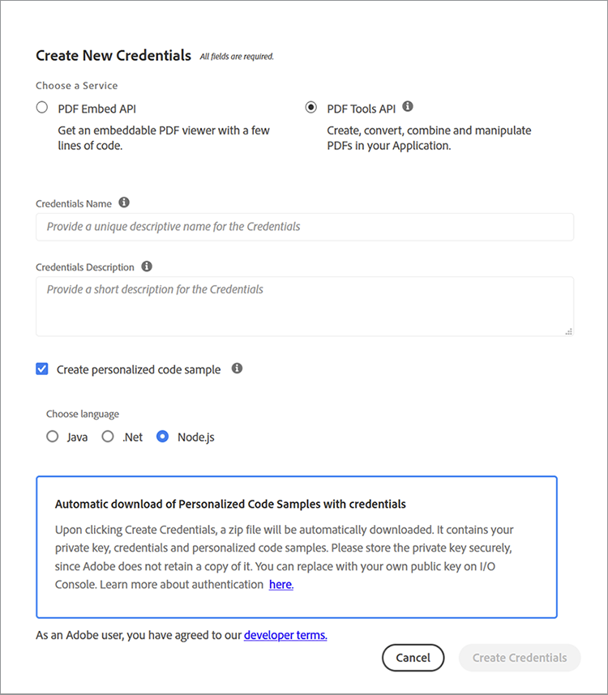

# Managing sales proposals and contracts


Sales proposals are the first step in a business’s journey towards customer acquisition. As with everything, first impressions last. So, your first interaction with customers set their expectations for your business. Your proposal must be concise, accurate, and convenient.

Contracts and proposals contain different types of data within their document structure. They contain both dynamic data (client name, quote amount, and so on) and static data (boilerplate text such as firm capabilities, team profiles, and standard SOW terms). Creating template documents, such as sales proposals, often involves monotonous tasks, like manually replacing project details in a boilerplate template. In this tutorial, you use dynamic data and workflows to build an efficient process for [creating sales proposals](https://www.adobe.io/apis/documentcloud/dcsdk/sales-proposals-and-contracts.html).

## What you can learn

In this hands-on tutorial, learn how to implement dynamic data and workflows using several tools, the most important of which are Adobe Document Services APIs. These APIs are used to make sales proposals and contracts more convenient for you and your business. This tutorial demonstrates hands-on techniques to show how to create, merge, and display PDF documents automatically. Performing these tasks manually is time-consuming and tedious. By taking advantage of Document Services APIs, you can shorten the time spent on these tasks.

## Relevant APIs and resources

* [Microsoft Word](https://www.office.com/)

* [Node.js](https://nodejs.org/en/)

* [npm](https://www.npmjs.com/get-npm)

* [Document Services APIs](https://www.adobe.io/apis/documentcloud/dcsdk/)

* [Adobe Document Generation API](https://www.adobe.io/apis/documentcloud/dcsdk/doc-generation.html)

* [Adobe Sign API](https://www.adobe.io/apis/documentcloud/sign.html)

* [Adobe Document Generation Tagger](https://opensource.adobe.com/pdftools-sdk-docs/docgen/latest/wordaddin.html#add-in-demo)

## Solving the problem

Now that you have the tools installed, you can start solving the problem. The proposals have both static content and dynamic content unique to each client. Bottlenecks occur because both types of data are necessary every time you make a proposal. It’s time-consuming to enter the static text, so you are going to automate it and only deal manually with the dynamic data from each client.

First, create a data capture form in [Microsoft Forms](https://www.office.com/launch/forms?auth=1) (or your preferred form builder). This form is for the dynamic data from clients that is added to a sales proposal. Fill this form with questions to get the details you need from clients — for example, company name, date, address, project scope, pricing, and additional comments. To build your own, use this [form](https://forms.office.com/Pages/ShareFormPage.aspx id=DQSIkWdsW0yxEjajBLZtrQAAAAAAAAAAAAN__rtiGj5UNElTR0pCQ09ZNkJRUlowSjVQWDNYUEg2RC4u&sharetoken=1AJeMavBAzzxuISRKmUy). The goal is for potential clients to fill in the form, then export their responses as JSON files, which are passed onto the next part of your workflow.

Some form builders only let you export data as CSV files. So, you might find it useful to [convert](http://csvjson.com/csv2json) the generated CSV file into a JSON file.

The static data is reused in every sales proposal. So, you can use a sales proposal template in Microsoft Word to provide the static text. You can use this [template](https://1drv.ms/w/s!AiqaN2pp7giKkmhVu2_2pId9MiPa?e=oeqoQ2), but you can create your own or use an [Adobe template](https://www.adobe.io/apis/documentcloud/dcsdk/doc-generation.html).

Now, you need something that takes both the dynamic data from clients in the JSON format and the static text in the Microsoft Word template to make a unique sales proposal for a client. The Document Services APIs are used to merge the two and generate a PDF that can be signed.

To make this work, you use tags. Tags are easy-to-use strings that can represent numbers, words, arrays, or even complex objects. Tags act as a placeholder for dynamic data, which in this case, is client data entered in the form. Once you insert tags into the template, you can map form fields from the JSON file to the Word template.

## Using tags

Open your sales proposal template and select the **Insert** tab. In the **Add-ins** group, select **Get Add-ins**. Then, select **Adobe Document Generation Add-In** to add it. Once added, you see the Document Generation Tagger on the **Home** tab in the **Adobe** group.

On the **Home** tab in the **Adobe** group, select **Document Generation** to get started tagging the document. A helpful demonstration video appears in a panel on the right side of the window.



Select **Get Started**. You are then asked to provide sample data. Paste in or upload the form response JSON file as shown below.



Select **Generate Tags** to get a list of fields from the JSON file you pasted or uploaded. The tags are shown below, on the right sidebar.



After generating the tags, you can insert them into the document. Tags are added to the document at the cursor’s location. As shown above, you should add the **Project Scope** tag right below the **Project scope** subtitle. This way, when a client enters the project’s scope in the form, their response goes below the **Project Scope** subtitle, replacing the tag you just added. After you’re done adding tags, part of your document should look like the screen capture below.



## Using the APIs

Go to the Document Services APIs [homepage](https://www.adobe.io/apis/documentcloud/dcsdk/doc-generation.html). To start using Document Services APIs, you need credentials for your application. Scroll down all the way and select **Start free trial** to create credentials. You can use these services [free for six months, then pay-as-you-go](https://www.adobe.io/apis/documentcloud/dcsdk/pdf-pricing.html) for just $0.05 per document transaction, so you only pay for what you need.

Select **PDF Services API** as your service of choice and fill in the other details as shown below.



Once you create your credentials, you get some code samples. Select your preferred language (this tutorial uses Node.js). Your API credentials are in a zip file. Extract the files to PDFToolsSDK-Node.jsSamples.

To start, create an empty folder called auto-doc\*\*.\*\* In the folder, run the following command to initialize a Node.js project: `npm init`. Name your project “auto-doc”*.*

In the folder ./PDFToolsSDK-Node.jsSamples/adobe-dc-pdf-tools-sdk-node-samples, there is a file called pdftools-api-credentials.json. Move it and private.key to the auto-doc folder. It contains your API credentials. Also, in the auto-doc folder, create a subfolder called “resources.” It holds the JSON formatted data received from clients whenever you generate a sales proposal. In the same folder, save the sales proposal template from Microsoft Word.

Now you are ready to make some magic! Because you’re using Node.js in this tutorial, you must install the Node.js Document Services SDK. To do so, in the auto-doc folder, run yarn add @adobe/documentservices-pdftools-node-sdk.

Now create a file called merge.js and paste the following code into it.
 
```
javascript
const PDFToolsSdk = require('@adobe/documentservices-pdftools-node-sdk'),
fs = require('fs');
try {
// Initial setup, create credentials instance.
const credentials = PDFToolsSdk.Credentials
.serviceAccountCredentialsBuilder()
.fromFile("pdftools-api-credentials.json")
.build();
// Setup input data for the document merge process
const jsonString = fs.readFileSync('resources/Proposal.json'),
jsonDataForMerge = JSON.parse(jsonString);
// Create an ExecutionContext using credentials
const executionContext = PDFToolsSdk.ExecutionContext.create(credentials);
// Create a new DocumentMerge options instance
const documentMerge = PDFToolsSdk.DocumentMerge,
documentMergeOptions = documentMerge.options,
options = new documentMergeOptions.DocumentMergeOptions(jsonDataForMerge, documentMergeOptions.OutputFormat.PDF);
// Create a new operation instance using the options instance
const documentMergeOperation = documentMerge.Operation.createNew(options)
// Set operation input document template from a source file.
const input = PDFToolsSdk.FileRef.createFromLocalFile('resources/Proposal.docx');
documentMergeOperation.setInput(input);
// Execute the operation and Save the result to the specified location.
documentMergeOperation.execute(executionContext)
.then(result => result.saveAsFile('output/Proposal.pdf'))
.catch(err => {
if (err instanceof PDFToolsSdk.Error.ServiceApiError
|| err instanceof PDFToolsSdk.Error.ServiceUsageError) {
console.log('Exception encountered while executing operation', err);
} else {
console.log('Exception encountered while executing operation', err);
}
});
} catch (err) {
console.log('Exception encountered while executing operation', err);
}
```
 
This code gets your JSON file from the Microsoft Form with the help of the tags you created using Document Services. It then merges the data with the sales proposal template you created in Microsoft Word to generate a brand-new PDF. The PDF is saved in the newly created ./output folder.

Also, the code uses [Adobe Sign API](https://www.adobe.io/apis/documentcloud/sign.html) to have both companies sign the generated sales proposal. Check out this blog post for a detailed explanation of this API.

## Next steps

You started out with an inefficient, tedious process that needed automation. You went from manually creating documents for every client to creating a streamlined workflow to automate and simplify [the sales proposal process](https://www.adobe.io/apis/documentcloud/dcsdk/sales-proposals-and-contracts.html).

Using Microsoft Forms, you got critical data from your clients that would go in their unique proposals. You created a sales proposal template in Microsoft Word to provide the static text that you didn’t want to recreate each time. You then used Document Services APIs to merge data from the form and the template to create a sales proposal PDF for your clients in a more efficient manner.

This hands-on tutorial is only a glimpse of what is possible with these APIs. To discover more solutions, visit the [Adobe Document Services](https://www.adobe.io/apis/documentcloud/dcsdk/gettingstarted.html) APIs page. Use all these tools are for free for six months. Then, pay just $0.05 per document transaction on the [pay-as-you-go](https://www.adobe.io/apis/documentcloud/dcsdk/pdf-pricing.html) plan, so you only pay as your team adds more prospects to your sales pipeline.
