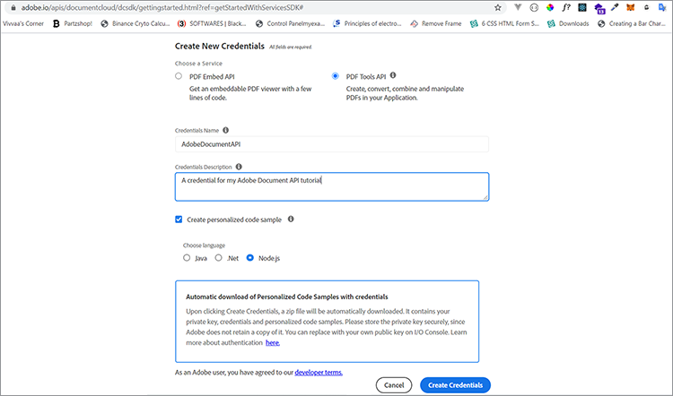
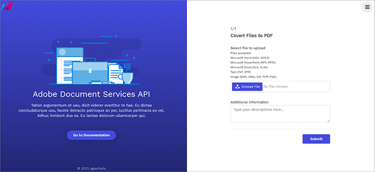
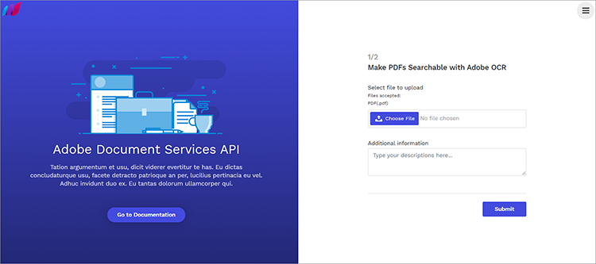
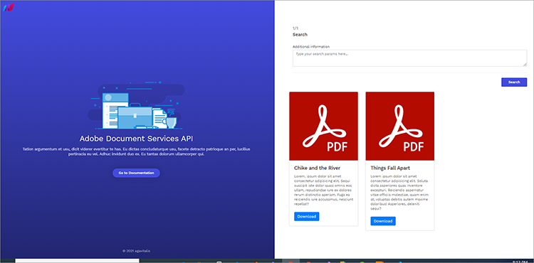

# Searching and indexing with Adobe Document Services APIs

Organizations must often digitize their hard copy documents and scanned files. Consider this [scenario](https://docs.google.com/document/d/11jZdVQAw-3fyE3Y-sIqFFTlZ4m02LsCC/edit. A law firm has thousands of legal contracts they have scanned to create digital files. They want to determine if any of those legal contracts have a particular clause or supplement they must revise. Accuracy is necessary for compliance purposes. The solution is taking inventory of the digital documents, making the text searchable, and creating an index to find this information.

The challenge of creating digital archives to retrieve information for editing or downstream operations is a nightmare for most organizations.

This tutorial explores how Adobe Document Services APIs' features and can easily be used to archive and digitize documents. You explore these features by building an Express NodeJS application, then integrating Document Services APIs for archiving, digitization, and document transformation.

To follow, you need [Node.js](https://nodejs.org/) installed and a basic understanding of Node.js and [ES6 syntax](https://www.w3schools.com/js/js_es6.asp). You can access the complete code for this application on [GitHub](https://github.com/agavitalis/AdobeDocumentServicesAPIs.git).

## Project setup

First, set up the folder structure for the application. You can retrieve the source code [here](https://github.com/agavitalis/AdobeDocumentAPI.git).

## Directory structure

Create a folder called AdobeDocumentServicesAPIs and open it in an editor of your choice. Create a basic NodeJS application with the ``  `npm init` `` command using this folder structure:
 
```
AdobeDocumentServicesAPIs
config
default.json
controllers
createPDFController.js
makeOCRController.js
searchController.js
models
document.js
output
.gitkeep
routes
web.js
services
upload.js
views
index.hbs
ocr.hbs
search.hbs
index.js
```
 
You are using MongoDB as a database for this application. Therefore, to configure, place your default database configurations in the config/ folder, by pasting the code snippet below into the default.json file of this folder, then add your database’s URL.
 
```
### config/default.json and config/dev.json
{ "DBHost": "YOUR_DB_URI" }
```
 
## Package installation

Now, install some packages using the npm install command as shown in the code snippet below:

 ```
    "name": "adobedocumentservicesapis",
    "version": "1.0.0",
    "description": "",
    "main": "index.js",
    "directories": {
    "test": "test"
    },
    "dependencies": {
    "body-parser": "^1.19.0",
    "config": "^3.3.6",
    "express": "^4.17.1",
    "hbs": "^4.1.1",
    "mongoose": "^5.12.1",
    "morgan": "^1.10.0",
    "multer": "^1.4.2",
    "path": "^0.12.7"
    },
    "devDependencies": {},
    "scripts": {
    "start": "set NODE_ENV=dev && node index.js"
    },
    "repository": {
    "type": "git",
    "url": "git+https://github.com/agavitalis/AdobeDocumentServicesAPIs.git"
    },
    "author": "Ogbonna Vitalis",
    "license": "ISC",
    "bugs": {
    "url": "https://github.com/agavitalis/AdobeDocumentServicesAPIs/issues"
    },
    "homepage": "https://github.com/agavitalis/AdobeDocumentServicesAPIs#readme"
    }
```

```
###bash
npm install express mongoose config body-parser morgan multer hbs path pdf-parse
Ensure that the content of your package.json file is similar to this code snippet:
###package.json
{
```
 
These code snippets install the application dependencies, including the Handlebars templating engine for the view. In the scripts tag, you configure the application’s runtime parameters.

## Integrating Document Services APIs

Document Services includes three APIs:

* Adobe PDF Services API

* Adobe PDF Embed API

* Adobe Document Generation API

These APIs automate the generation, manipulation, and transformation of PDF contents through a set of cloud-based web services.

To get the credentials you need, [register](https://www.adobe.com/go/dcsdks_credentials?ref=getStartedWithServicesSDK) and complete the workflow. PDF Embed API is free to use. PDF Services API and Document Generation API are free for six months. When your trial ends, simply [pay-as-you-go](https://www.adobe.io/apis/documentcloud/dcsdk/pdf-pricing.html) at just $0.05 per document transaction. You pay only as your company grows and processes more contracts.



Once you have completed the signup, a code sample is downloaded to your PC which contains your API credentials. Extract this code sample and place the private.key and pdftools-api-credentials.json files at the root directory of your application.

Now, install [PDF Services Node.js SDK](https://www.npmjs.com/package/@adobe/documentservices-pdftools-node-sdk) by running the `` `npm install --save @adobe/documentservices-pdftools-node-sdk ` `` command using the terminal in the root directory of the application.

## Creating a PDF

Document Services supports the creation of PDFs from Microsoft Office documents (Word, Excel, and PowerPoint) and other [supported file formats](https://opensource.adobe.com/pdftools-java-sdk-samples/apidocs/latest/com/adobe/platform/operation/pdfops/CreatePDFOperation.SupportedSourceFormat.html) like .txt, .rtf, .bmp, .jpg, .gif, .tiff, and .png.

To create PDF documents from the supported file formats, use this form to upload the documents. You can access the HTML and CSS files for the form on [GitHub](https://github.com/agavitalis/AdobeDocumentServicesAPIs.git).



Now, add the following code snippets to the controllers/createPDFController.js file. This code retrieves the document and transforms it into a PDF.

The original files and the transformed file are saved in a folder inside your application.

```
const PDFToolsSdk = require('@adobe/documentservices-pdftools-node-sdk');
/*
* GET / route to show the createPDF form.
*/
function createPDF(req, res) {
//catch any response on the url
let response = req.query.response
res.render('index', { response })
}
/*
* POST /createPDF to create a new PDF File.
*/
function createPDFPost(req, res) {
let filePath = req.file.path;
let fileName = req.file.filename;
try {
// Initial setup, create credentials instance.
const credentials = PDFToolsSdk.Credentials
.serviceAccountCredentialsBuilder()
.fromFile("pdftools-api-credentials.json")
.build();
// Create an ExecutionContext using credentials and create a new operation
instance.
const executionContext = PDFToolsSdk.ExecutionContext.create(credentials),
createPdfOperation = PDFToolsSdk.CreatePDF.Operation.createNew();
// Set operation input from a source file.
const input = PDFToolsSdk.FileRef.createFromLocalFile(filePath);
createPdfOperation.setInput(input);
// Execute the operation and Save the result to the specified location.
createPdfOperation.execute(executionContext)
.then((result) => {
result.saveAsFile('output/createPDFFromDOCX.pdf')
//download the file
res.redirect('/?response=PDF Successfully created')
})
.catch(err => {
if (err instanceof PDFToolsSdk.Error.ServiceApiError
|| err instanceof PDFToolsSdk.Error.ServiceUsageError) {
console.log('Exception encountered while executing operation',
err);
} else {
console.log('Exception encountered while executing operation',
err);
}
});
} catch (err) {
console.log('Exception encountered while executing operation', err);
}
}
//export all the functions
module.exports = { createPDF, createPDFPost };
```

This code snippet requires [PDF Services Node.js SDK](https://www.npmjs.com/package/@adobe/documentservices-pdftools-node-sdk). Use the functions:

* createPDF, which displays the upload document form

* createPDFPost, which transforms the uploaded document to a PDF

The transformed PDF documents are saved in the output directory, while the original file is saved in the uploads directory.

## Using text recognition

Optical character recognition (OCR) converts images and scanned documents to searchable files. You can convert Document Services APIs, images, and scanned documents to searchable PDFs. After performing an OCR operation, the file becomes editable and searchable. You can store the contents of the file in a data store for indexing and other uses.

Recall that searching and indexing scanned documents is critical for many organizations where file management and information processing are essential. The OCR feature eliminates these challenges.

To implement this feature, you must design an upload form similar to the one above. This time, you restrict the form to PDF files as you can use the OCR feature only on PDF documents.

Here is the upload form for this example:



Now, to manipulate the uploaded PDF and perform some OCR operations, add the code snippet below to the controllers/makeOCRController.js file. This code implements the OCR process on an uploaded file and then saves the file in your application’s file system.

```
const fs = require('fs')
const pdf = require('pdf-parse');
const mongoose = require('mongoose');
const Document = require('../models/document');
const PDFToolsSdk = require('@adobe/documentservices-pdftools-node-sdk');
/*
* GET /makeOCR route to show the makeOCR form.
*/
function makeOCR(req, res) {
//catch any response on the url
let response = req.query.response
res.render('ocr', { response })
}
/*
* POST /makeOCRPost to create a new PDF File.
*/
function makeOCRPost(req, res) {
let filePath = req.file.path;
let fileName = req.file.filename;
try {
// Initial setup, create credentials instance.
const credentials = PDFToolsSdk.Credentials
.serviceAccountCredentialsBuilder()
.fromFile("pdftools-api-credentials.json")
.build();
// Create an ExecutionContext using credentials and create a new operation
instance.
const executionContext = PDFToolsSdk.ExecutionContext.create(credentials),
ocrOperation = PDFToolsSdk.OCR.Operation.createNew();
// Set operation input from a source file.
const input = PDFToolsSdk.FileRef.createFromLocalFile(filePath);
ocrOperation.setInput(input);
// Execute the operation and Save the result to the specified location.
ocrOperation.execute(executionContext)
.then(async (result) => {
let newFileName = `createPDFFromDOCX-${Math.random() * 171}.pdf`;
await result.saveAsFile(`output/${newFileName}`);
let documentContent = fs.readFileSync(
require("path").resolve("./") + `\\output\\${newFileName}`
);
pdf(documentContent)
.then(function (data) {
//Creates a new document
var newDocument = new Document({
documentName: fileName,
documentDescription: description,
documentContent: data.text,
url: require("path").resolve("./") + `\\output\\${newFileName}`
});
//Save it into the DB.
newDocument.save((err, docs) => {
if (err) {
res.send(err);
} else {
//If no errors, send it back to the client
res.redirect(
"/makeOCR?response=OCR Operation Successfully performed on
the PDF File"
);
}
});
})
.catch(function (error) {
// handle exceptions
console.log(error);
});
})
.catch(err => {
if (err instanceof PDFToolsSdk.Error.ServiceApiError
|| err instanceof PDFToolsSdk.Error.ServiceUsageError) {
console.log('Exception encountered while executing operation',
err);
} else {
console.log('Exception encountered while executing operation',
err);
}
});
} catch (err) {
console.log('Exception encountered while executing operation', err);
}
}
//export all the functions
module.exports = { makeOCR, makeOCRPost };
```
 
You need the Document Services Node SDK and the mongoose, pdf-parse, and fs modules and your document model schema. These modules are necessary to save the content of the transformed file to a MongoDB database.

Now create two functions: makeOCR to display the uploaded form and then makeOCRPost for processing the uploaded document. Save the original form to a database, then save the transformed form to the output folder of your application.

The Adobe-provided credentials from the pdftools-api-credentials.json file are loaded in each case before transforming the file. 

>[!NOTE]
>
>The Document Service’s OCR feature supports only PDF documents.

Also, add the code snippet below to the Modes/Document.js file of your application.

In the code snippet, define a mongoose model and then describe the document’s properties to be saved in the database. Also, index the documentContent field to make searching for texts easy and efficient.
 
```
const mongoose = require("mongoose");
const Schema = mongoose.Schema;
//Document schema definition
var DocumentSchema = new Schema(
{
documentName: { type: String, required: false },
documentDescription: { type: String, required: false },
documentContent: { type: String, required: false },
url: { type: String, required: false },
status: {
type: String,
enum : ["active","inactive"],
default: "active"
}
},
{ timestamps: true }
);
//for text search
DocumentSchema.index({
documentContent: "text",
});
//Exports the DocumentSchema for use elsewhere.
module.exports = mongoose.model("document", DocumentSchema);
```
 
## Searching texts

Now you implement a simple search feature to enable users to perform some simple text searches. You also add download functionality to enable the download of PDF files.

This functionality requires a simple form and cards to display the search result. You can find the designs for the form and cards on [GitHub](https://github.com/agavitalis/AdobeDocumentServicesAPIs.git).

The screenshot below illustrates the search feature and the search results. You can download any of the search results.



To implement the search function, create a searchController.js file inside the controller folder of your application and paste the code snippet below:

```
const fs = require('fs')
const mongoose = require('mongoose');
const Document = require('../models/document');
/*
* GET / route to show the search form.
*/
function search(req, res) {
//catch any response on the url
let response = req.query.response
res.render('search', { response })
}
/*
* POST /searchPost to search the contents of your saved file.
*/
function searchPost(req, res) {
let searchString = req.body.searchString;
Document.aggregate([
{ $match: { $text: { $search: searchString } } },
{ $sort: { score: { $meta: "textScore" } } },
])
.then(function (documents) {
res.render('search', { documents })
})
.catch(function (error) {
let response = error
res.render('search', { response })
});
}
//export all the functions
module.exports = { search, searchPost, downloadPDF };
```

Now implement a download feature to enable downloading the documents returned from a user’s search.

## Downloading documents

Implementing a download feature is similar to what you have already done. Add the following code snippet after the searchPost function in the controllers/earchController.js file:
 
```
/*
* POST /downloadPDF To Download PDF Documents.
*/
async function downloadPDF(req, res) {
console.log("here")
let documentId = req.params.documentId
let document = await Document.findOne({_id:documentId});
res.download(download.link);
}
```
 
## Next steps

You integrated Document Services APIs into a Node.js application and also used the API to implement a document transformation that converts files to PDF. You added an OCR feature that makes pictures and scanned files searchable. Then, you saved the files to a folder so they can be downloaded.

Next, you added a search feature to search the documents converted to text by OCR. Finally, you implemented a download function to enable easy downloading of those files. Your completed application makes it much easier for a legal company to locate and process specific text.

Using Document Services for document transformation is highly recommended because of its robustness and ease of use compared to other services. You can quickly create an account to start enjoying the features of Document Services APIs for document transformation and management.

Now that you have a strong understanding of how to use Document Services APIs, you can further your skills with practice. You can clone the repository used in this tutorial and experiment with some of the skills you just learned. Even better, you can attempt to rebuild this application while exploring the unlimited possibilities of Document Services APIs.

Ready to enable document sharing and review in your own app? Sign up for your [Adobe Document Services](https://www.adobe.io/apis/documentcloud/dcsdk/gettingstarted.html)
developer account. Enjoy a six-month free trial, then [pay-as-you-go](https://www.adobe.io/apis/documentcloud/dcsdk/pdf-pricing.html) for just \$0.05 per document transaction as your business grows.
