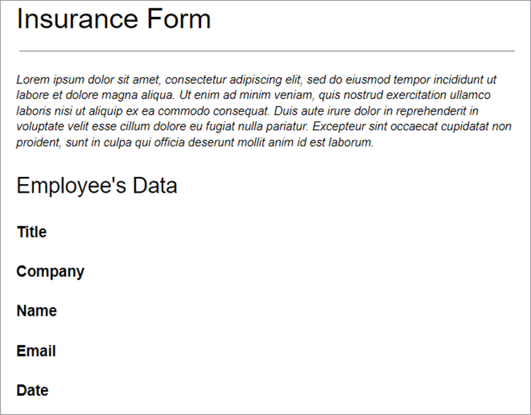
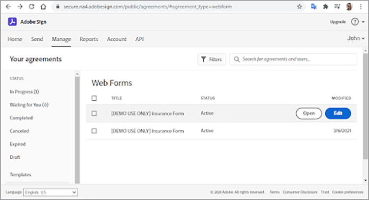
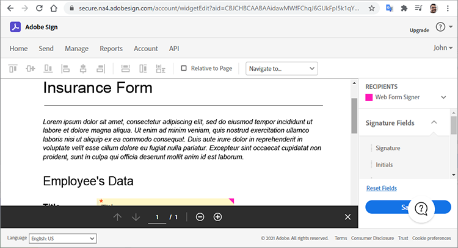
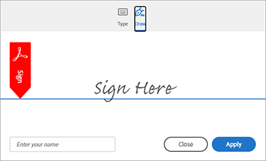

# Getting started with Adobe Sign API

[Adobe Sign API](https://www.adobe.io/apis/documentcloud/sign.html) is a great way to enhance the way you manage signed agreements. Developers can easily integrate their systems with Sign API, which provides a reliable, easy way to upload documents, send them for signing, send reminders, and collect e-signatures.

This tutorial explains how developers can use Sign API to enhance applications and workflows created with Adobe Document Services. Document Services includes [Adobe PDF Services API](https://www.adobe.io/apis/documentcloud/dcsdk/pdf-tools.html), [Adobe PDF Embed API](https://www.adobe.io/apis/documentcloud/viesdk) (free), and [Adobe Document Generation API](https://www.adobe.io/apis/documentcloud/dcsdk/doc-generation.html).

More specifically, learn how to include Sign API in your application to gather signatures and other information, such as employee information on an insurance form. Generic steps with simplified HTTP requests and responses are used. You can implement these requests in your favorite language. You can create a PDF using a combination of [Document Services APIs](https://www.adobe.io/apis/documentcloud/dcsdk/), upload it to the Sign API as a [transient](https://www.adobe.io/apis/documentcloud/sign/docs.html#!adobedocs/adobe-sign/master/overview/terminology.md) document, and request end-user signatures using the agreement or [widget](https://www.adobe.io/apis/documentcloud/sign/docs.html#!adobedocs/adobe-sign/master/overview/terminology.md) workflow.

## Creating a PDF document

Start by creating a Microsoft Word template and saving it as a PDF. Or, you can automate your pipeline using Document Generation API to upload a template created in Word and then generate a PDF document. Document Generation API is part of Document Services, [free for six months then pay-as-you-go for just or $0.05 per document transaction](https://www.adobe.io/apis/documentcloud/dcsdk/pdf-pricing.html).

In this example, the template is just a simple document with a few signer fields to fill in. Name the fields for now, then later insert the actual fields in this tutorial.



## Discovering the valid API access point

Before working with Sign API, [create a free developer account](https://acrobat.adobe.com/ca/en/sign/developer-form.html) to access the API, test your document exchange and execution, and test the emailing feature.

Adobe distributes Sign API around the globe in many deployment units called “shards.” Each shard serves a customer’s account, such as NA1, NA2, NA3, EU1, JP1, AU1, IN1, and others. The shard names correspond to geographic locations. These shards compose the base URI (access points) of the API endpoints.

To access Sign API, you must first discover the correct access point for your account, which can be api.na1.adobesign.com, api.na4.adobesign.com, api.eu1.adobesign.com, or others, depending on your location.

<br>&nbsp;

```
  GET /api/rest/v6/baseUris HTTP/1.1
  Host: https://api.adobesign.com
  Authorization: Bearer {YOUR-INTEGRATION-KEY-HERE}
  Accept: application/json

  Response Body (example):

  {
    "apiAccessPoint": "https://api.na4.adobesign.com/", 
    "webAccessPoint": "https://secure.na4.adobesign.com/" 
  }
```
<br>&nbsp;

In the above example, is a response with the value as the access point.

>[!IMPORTANT]
>
>In this case, all subsequent requests you make to Sign API must use that access point. If you use an access point that doesn’t serve your region, you get an error.

## Uploading a transient document

Adobe Sign enables you to create different flows that prepare documents for signatures or data collection. Regardless of your application’s flow, you must first upload a document, which remains available for only seven days. The subsequent API calls must then reference this temporary document.

The document uploads using a POST request to the `/transientDocuments` endpoint. The multipart request consists of the file name, a file stream, and the document file's MIME (media) type. The endpoint response contains an ID that identifies the document.

Additionally, your application can specify a callback URL for Adobe Sign to ping, notifying the app when the signature process is complete.

<br>&nbsp;

```
  POST /api/rest/v6/transientDocuments HTTP/1.1
  Host: {YOUR-API-ACCESS-POINT}
  Authorization: Bearer {YOUR-INTEGRATION-KEY-HERE}
  x-api-user: email:your-api-user@your-domain.com
  Content-Type: multipart/form-data
  File-Name: “Insurance Form.pdf”
  File: “[path]\Insurance Form.pdf”
  Accept: application/json

  Response Body (example):

  {
     "transientDocumentId": “3AAA...BRZuM”
  }
```

<br>&nbsp;

## Creating a Web Form

Web Forms (previously known as signing widgets) are hosted documents that anyone who has access can sign. Examples of Web Forms include signup sheets, waivers, and other documents that many people access and sign online.

To create a new Web Form using the Sign API, you must first upload a transient document. The POST request to the `/widgets` endpoint uses the returned `transientDocumentId` .

In this example, the Web Form is `ACTIVE`, but you can create it in one of three different states:

* DRAFT — to incrementally build the Web Form

* AUTHORING — to add or edit form fields in the Web Form

* ACTIVE — to immediately host the Web Form

The information on the form’s participants must also be defined. The `memberInfos` property contains data on the participants, such as email. Currently, this set does not support more than one member. But, since the email of the Web Form signer is unknown at the time of Web Form creation, the email should be left empty, like in the following example. The `role` property defines the role assumed by the members in `memberInfos` (such as the SIGNER and APPROVER).

<br>&nbsp;

```
  POST /api/rest/v6/widgets HTTP/1.1
  Host: {YOUR-API-ACCESS-POINT}
  Authorization: Bearer {YOUR-INTEGRATION-KEY-HERE}
  x-api-user: email:your-api-user@your-domain.com
  Content-Type: application/json

  Request Body:

  {
    "fileInfos": [
      {
      "transientDocumentId": "YOUR-TRANSIENT-DOCUMENT-ID"
      }
     ],
    "name": "Insurance Form",
      "widgetParticipantSetInfo": {
          "memberInfos": [{
              "email": ""
          }],
      "role": "SIGNER"
      },
      "state": "ACTIVE"
  }

  Response Body (example):

  {
     "id": “CBJ...PXoK2o”
  }
```

<br>&nbsp;

You can create a Web Form as `DRAFT` or `AUTHORING`, then change its state as the form passes through your application pipeline. To change a Web Form state, refer to the [PUT /widgets/{widgetId}/state](https://secure.na4.adobesign.com/public/docs/restapi/v6#!/widgets/updateWidgetState) endpoint.

## Reading the Web Form hosting URL

The next step is to discover the URL hosting the Web Form. The /widgets endpoint retrieves a list of Web Form data, including the hosted URL of the Web Form that you forward to your users, to collect signatures and other form data.

This endpoint returns a list, so you can locate the specific form by its id in the `userWidgetList` before getting the URL hosting the Web Form:

<br>&nbsp;

```
  GET /api/rest/v6/widgets HTTP/1.1
  Host: {YOUR-API-ACCESS-POINT}
  Authorization: Bearer {YOUR-INTEGRATION-KEY-HERE}
  Accept: application/json

  Response Body:

  {
    "userWidgetList": [
      {
        "id": "CBJCHB...FGf",
        "name": "Insurance Form",
        "groupId": "CBJCHB...W86",
        "javascript": "<script type='text/javascript' ...
        "modifiedDate": "2021-03-13T15:52:41Z",
        "status": "ACTIVE",
        "Url":
        "https://secure.na4.adobesign.com/public/esignWidget?wid=CBFCIB...Rag*",
        "hidden": false
      },
      {
        "id": "CBJCHB...I8_",
        "name": "Insurance Form",
        "groupId": "CBJCHBCAABAAyhgaehdJ9GTzvNRchxQEGH_H1ya0xW86",
        "javascript": "<script type='text/javascript' language='JavaScript'
        src='https://sec
        "modifiedDate": "2021-03-13T02:47:32Z",
        "status": "ACTIVE",
        "Url":
        "https://secure.na4.adobesign.com/public/esignWidget?wid=CBFCIB...AAB",
        "hidden": false
      },
      {
        "id": "CBJCHB...Wmc",
```

<br>&nbsp;

## Managing your Web Form

This form is a PDF document for users to fill in. However, you still need to tell the form’s editor which fields the users must fill in and where they are located within the document:


<br>&nbsp;

The document above doesn’t show the fields — yet. They are added while defining which fields collect the signer’s information, as well as their size and position.

Now, go to the [Web Forms](https://secure.na4.adobesign.com/public/agreements/#agreement_type=webform) tab on the “Your agreements” page and find the form you created.




<br>&nbsp;

Click **Edit** to open the document editing page. The available predefined fields are on the right panel.



<br>&nbsp;

The editor enables you to drag and drop text and signature fields. After you add all the necessary fields, you can resize and align them to polish your form. Finally, click **Save** to create the form.


## Sending a Web Form for signing

After finishing the Web Form, you must submit it so users can fill and sign it. Once you save the form, you can view and copy the URL and embedded code.

**Copy Web Form URL**: use this URL to send users to a hosted version of this agreement for review and signature. For example:

[https://secure.na4.adobesign.com/public/esignWidget?wid=CBFCIBAA3...babw\*](https://secure.na4.adobesign.com/public/esignWidget?wid=CBFCIBAA3AAABLblqZhCndYscuKcDMPiVfQlpaGPb-5D7ebE9NUTQ6x6jK7PIs8HCtTzr3HOx8U6D5qqbabw*)

**Copy Web Form embed code**: add the agreement to your website by copying this code and pasting it into your HTML.

For example:

<br>&nbsp;

```
<iframe
src="https://secure.na4.adobesign.com/public/esignWidget?wid=CBFC
...yx8*&hosted=false" width="100%" height="100%" frameborder="0"
style="border: 0;
overflow: hidden; min-height: 500px; min-width: 600px;"></iframe>
```

<br>&nbsp;


<br>&nbsp;

When your users access the hosted version of your form, they review the transient document first uploaded with the fields positioned as specified.


<br>&nbsp;

The user then fills in the fields and signs the form.


<br>&nbsp;

Next, your user signs the document with a previously stored signature, or with a new one.




<br>&nbsp;

When the user clicks **Apply**, Adobe instructs them to open their email and confirm the signature. The signature remains pending until the confirmation arrives.


<br>&nbsp;

This authentication adds multiple-factor authentication and strengthens signing process security.


## Reading completed Web Forms

Now it’s time to get the form data that users filled in. The `/widgets/{widgetId}/formData` endpoint retrieves data entered by the user into an interactive form when they signed the form.

<br>&nbsp;

```
GET /api/rest/v6/widgets/{widgetId}/formData HTTP/1.1
Host: {YOUR-API-ACCESS-POINT}
Authorization: Bearer {YOUR-INTEGRATION-KEY-HERE}
Accept: text/csv
```
<br>&nbsp;

The resulting CSV file stream contains form data.

<br>&nbsp;

```
Response Body:
"Agreement
name","completed","email","role","first","last","title","company","agreementId",
"email verified","web form signed/approved"
"Insurance Form","","myemail@email.com","SIGNER","John","Doe","My Job Title","My
Company Name","","","2021-03-07 19:32:59"
```
<br>&nbsp;

## Creating an agreement

As an alternative to Web Forms, you can create agreements. The following sections demonstrate some simple steps to manage agreements using the Sign API.

Sending a document to specified recipients for signing or approval creates an agreement. You can track the status and completion of an agreement using APIs.

You can create an agreement using a [transient document](https://helpx.adobe.com/sign/kb/how-to-send-an-agreement-through-REST-API.html), [library document](https://www.adobe.io/apis/documentcloud/sign/docs.html#!adobedocs/adobe-sign/master/samples/send_using_library_doc.md), or URL. In this example, the agreement is based on the `transientDocumentId`, just like the Web Form created earlier.

<br>&nbsp;

```
POST /api/rest/v6/agreements HTTP/1.1
Host: {YOUR-API-ACCESS-POINT}
Authorization: Bearer {YOUR-INTEGRATION-KEY-HERE}
x-api-user: email:your-api-user@your-domain.com
Content-Type: application/json
Accept: application/json
Request Body:
{
    "fileInfos": [
      {
      "transientDocumentId": "{transientDocumentId}"
      }
     ],
    "name": "{agreementName}",
    "participantSetsInfo": [
      {
      "memberInfos": [
          {
          "email": "{signerEmail}"
          }
        ],
        "order": 1,
        "role": "SIGNER"
      }
    ],
    "signatureType": "ESIGN",
    "state": "IN_PROCESS"
  }
```
<br>&nbsp;

In this example, the agreement is created as IN_PROCESS, but you can create it in one of three different states:

* DRAFT — to incrementally build the agreement before sending it out

* AUTHORING — to add or edit form fields in the agreement

* IN_PROCESS — to immediately send the agreement

To change an agreement state, use the `PUT /agreements/{agreementId}/state` endpoint to perform one of the allowed state transitions below:

* DRAFT to AUTHORING

* AUTHORING to IN_PROCESS

* IN_PROCESS to CANCELLED

The `participantSetsInfo` property above provides emails of people expected to participate in the agreement and which action they perform (sign, approve, acknowledge, and so on). In the example above, there is only one participant: the signer. Written signatures are limited to four per document.

Unlike Web Forms, when you create an agreement, Adobe automatically sends it out for signature. The endpoint returns the agreement’s unique identifier.

<br>&nbsp;

```
  Response Body:

  {
     id (string): The unique identifier of the agreement
  }
```
<br>&nbsp;

## Retrieving information about agreement members

Once you create an agreement, you can use the `/agreements/{agreementId}/members` endpoint to retrieve information about members of the agreement. For example, you can check whether a participant has signed the agreement.

<br>&nbsp;

```
GET /api/rest/v6/agreements/{agreementId}/members HTTP/1.1
Host: {YOUR-API-ACCESS-POINT}
Authorization: Bearer {YOUR-INTEGRATION-KEY-HERE}
Accept: application/json
```
<br>&nbsp;

The resulting JSON response body contains information about the participants.

<br>&nbsp;

```
  Response Body:

  {
     "participantSets":[
        {
           "memberInfos":[
              {
                 "id":"CBJ...xvM",
                 "email":"participant@email.com",
                 "self":false,
                 "securityOption":{
                    "authenticationMethod":"NONE"
                 },
                 "name":"John Doe",
                 "status":"ACTIVE",
                 "createdDate":"2021-03-16T03:48:39Z",
                 "userId":"CBJ...vPv"
              }
           ],
           "id":"CBJ...81x",
           "role":"SIGNER",
           "status":"WAITING_FOR_MY_SIGNATURE",
           "order":1
        }
     ],
```

<br>&nbsp;

## Sending agreement reminders

Depending on the business rules, a deadline may prevent participants from signing the agreement after a specific date. If the agreement has an expiration date, you can remind participants as that date approaches.

Based on the agreement members’ information you received after the call to the `/agreements/{agreementId}/members` endpoint in the last section, you can issue email reminders to all participants who still haven’t signed the agreement.

A POST request to the `/agreements/{agreementId}/reminders` endpoint creates a reminder for the specified participants of an agreement identified by the `agreementId` parameter.

<br>&nbsp;

```
POST /agreements/{agreementId}/reminders HTTP/1.1
Host: {YOUR-API-ACCESS-POINT}
Authorization: Bearer {YOUR-INTEGRATION-KEY-HERE}
x-api-user: email:your-api-user@your-domain.com
Content-Type: application/json
Accept: application/json
  Request Body:

  {
    "recipientParticipantIds": [{agreementMemberIdList}],
    "agreementId": "{agreementId}",
    "note": "This is a reminder that you haven’t signed the agreement yet.",
    "status": "ACTIVE"
  }

  Response Body:

  {
     id (string, optional): An identifier of the reminder resource created on the
     server. If provided in POST or PUT, it will be ignored
  }
```

<br>&nbsp;

Once you post the reminder, the users receive an email with the agreement's details and a link to the agreement.


## Reading completed agreements

Like Web Forms, you can read details on agreements that the recipients signed. The `/agreements/{agreementId}/formData` endpoint retrieves data entered by the user when they signed the Web Form.
<br>&nbsp;

```
GET /api/rest/v6/agreements/{agreementId}/formData HTTP/1.1
Host: {YOUR-API-ACCESS-POINT}
Authorization: Bearer {YOUR-INTEGRATION-KEY-HERE}
Accept: text/csv
Response Body:
"completed","email","role","first","last","title","company","agreementId"
"2021-03-16 18:11:45","myemail@email.com","SIGNER","John","Doe","My Job Title","My
Company Name","CBJCHBCAABAA5Z84zy69q_Ilpuy5DzUAahVfcNZillDt"
```
<br>&nbsp;

## Next steps

The Sign API enables you to manage documents, Web Forms, and agreements. The simplified yet complete workflows created using Web Forms and agreements, are done in a generic way that enables developers to implement them using any language.

For an overview of how Sign API works, you can find examples in the [API Usage Developer Guide](https://www.adobe.io/apis/documentcloud/sign/docs.html#!adobedocs/adobe-sign/master/api_usage.md). This documentation contains short articles on many of the steps followed throughout the article, and other related topics.

Adobe Sign API is available through several tiers of [single and multi user e-signature plans](https://acrobat.adobe.com/us/en/sign/pricing/plans.html), so you can choose a pricing model that best suits your needs. Now that you know how easy it is to incorporate Sign API into your apps, you may be interested in other features like [Adobe Sign Webhooks](https://www.adobe.io/apis/documentcloud/sign/docs.html#!adobedocs/adobe-sign/master/webhooks.md), a push-based programming model. Instead of requiring your app to perform frequent checks in Adobe Sign events, Webhooks enable you to register an HTTP URL for which Sign API executes a POST callback request whenever an event occurs. Webhooks enable robust programming by powering your application with real-time and instant updates.

Check out the [pay-as-you-go pricing](https://www.adobe.io/apis/documentcloud/dcsdk/pdf-pricing.html), for when your six-month free Adobe PDF Services API trial ends, and the free Adobe PDF Embed API.

To add exciting features like automatic document creation and document signing to your app, get started with [Adobe Document Services](https://www.adobe.io/apis/documentcloud/dcsdk/gettingstarted.html).
